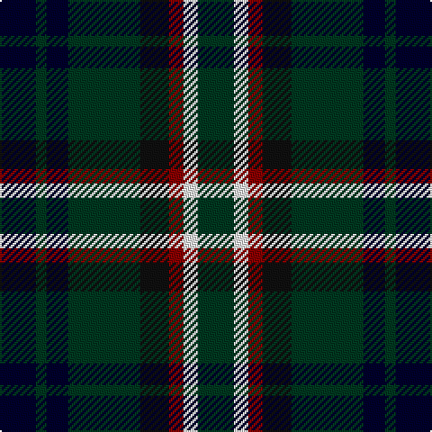

In pattern [GWRKGKGK](/patterns/gwrkgkgk/).

This was sourced from tartans-authority.  It is a [8 stripes tartan](/stripes/stripes8/).

Original link http://www.tartansauthority.com/tartan-ferret/display/4008/

## Thread count
DB/20 DG6 DB12 DG40 K16 DR8 W8 DG/20

## Palette
Each colour and its ΔE from the base-6 reference it is a variant of.

| Colour | Shade | Base | ΔE (OKLab) |
|---|---|---|---|
| DB | <code style="background-color:#00002C;">#00002C</code> `#00002C` | K <code style="background-color:#000000;">#000000</code> | 0.16 |
| DG | <code style="background-color:#003820;">#003820</code> `#003820` | G <code style="background-color:#006100;">#006100</code> | 0.15 |
| DR | <code style="background-color:#880000;">#880000</code> `#880000` | R <code style="background-color:#CC0000;">#CC0000</code> | 0.15 |
| K | <code style="background-color:#101010;">#101010</code> `#101010` | K <code style="background-color:#000000;">#000000</code> | 0.17 |
| W | <code style="background-color:#FCFCFC;">#FCFCFC</code> `#FCFCFC` | W <code style="background-color:#F7F7F7;">#F7F7F7</code> | 0.01 |

# Sample pattern

## Nearest tartans

The nearest existing variants by ΔTartan distance.

1. [BlackRock (Symmetrical)](/setts/s8/g10w4r4k8g20ka6g3ka10~g003820-k101010-ka00002c-r880000-wffffff~x2/) — ΔT 0.03
1. [Tennent (Personal)](/setts/s8/r1k7g7k7b7k7r1w1~b2c2c80-g006818-k101010-rc80000-wf8f8f8~x4/) — ΔT 0.75
1. [Forbes - 1947 (Lyon Court)](/setts/s7/b1k6b6k6g6k1w1~b2c2c80-g006818-k101010-wfcfcfc~x6/) — ΔT 1.03
1. [Forbes Ancient Clan Tartan Tartan Number: 212. Earliest known date: Logan 1831 Lord Lyon includes the word 'Ancient' in register entry. The Clan Forbes is said to originate from one Ochonochar, who slew a bear to gain possession of the Braes of Forbes in Aberdeenshire. The charter for the land was granted later in 1271. See products available Copyright © Blair Urquhart, Comrie, 2015](/setts/s7/b1k6b6k6g6k1w1~b2c2c80-g006818-k101010-we0e0e0~x2/) — ΔT 1.05
1. [Williamson/Smart (Personal)](/setts/s8/b10r3b10ra3k21g20k15ra3~b38409c-g006818-k101010-r888888-rac8002c~x2/) — ΔT 1.06
1. [Brodie Hunting Clan Tartan Tartan Number: 1334. Earliest known date: 1891 The Hunting Brodie first appears in Whyte's first edition of 1891, published by W. and A.K. Johnston, at which time it seems to have been a recent design. D.W. Stewart remarks in his book, 'Old And Rare..'(1893), "of late a green tartan has been sold as undress or hunting Brodie..." See products available Copyright © Blair Urquhart, Comrie, 2015](/setts/s7/r2b8g8k8y1k8r2~b2c2c80-g006818-k101010-rc80000-ye8c000~x2/) — ΔT 1.12
1. [Maitland](/setts/s9/g3b8g3k4g9y2b2y2r2~b000052-g11450d-k000000-raa0000-yaaaa00~x2/) — ΔT 1.19
1. [Maitland](/setts/s9/g3b8g3k4g9y2b2y2r2~b000052-g11450d-k000000-raa0000-yaaaa00/) — ΔT 1.19
1. [Scottish Tartan Society](/setts/s9/b20k10y3k7r4k7y3k8g20~b1c0070-g006818-k101010-r880000-yd09800~x2/) — ΔT 1.20
1. [Brodie Hunting](/setts/s7/r2b8g8k8y1g8r2~b00004c-g004c00-k000000-rc80000-yffc800/) — ΔT 1.20

## Neighbour map

Every grey dot is one of 15726 variants placed by the first two principal components of the ΔTartan feature space (44% of its variance). Red is this tartan; blue dots are its nearest — click one to open its page.

<svg viewBox="0 0 640 380" role="img" style="max-width:100%;height:auto;border:1px solid #e0e0e0;border-radius:4px;display:block" xmlns="http://www.w3.org/2000/svg"><image href="/nn/cloud.v1.png" width="640" height="380"/><a href="/setts/s8/g10w4r4k8g20ka6g3ka10~g003820-k101010-ka00002c-r880000-wffffff~x2/"><circle cx="199.8" cy="228.4" r="4" fill="#3465a4"><title>BlackRock (Symmetrical)</title></circle></a><a href="/setts/s8/r1k7g7k7b7k7r1w1~b2c2c80-g006818-k101010-rc80000-wf8f8f8~x4/"><circle cx="233.4" cy="229.4" r="4" fill="#3465a4"><title>Tennent (Personal)</title></circle></a><a href="/setts/s7/b1k6b6k6g6k1w1~b2c2c80-g006818-k101010-wfcfcfc~x6/"><circle cx="213.1" cy="252.0" r="4" fill="#3465a4"><title>Forbes - 1947 (Lyon Court)</title></circle></a><a href="/setts/s7/b1k6b6k6g6k1w1~b2c2c80-g006818-k101010-we0e0e0~x2/"><circle cx="219.3" cy="254.5" r="4" fill="#3465a4"><title>Forbes Ancient Clan Tartan Tartan Number: 212. Earliest known date: Logan 1831 Lord Lyon includes the word 'Ancient' in register entry. The Clan Forbes is said to originate from one Ochonochar, who slew a bear to gain possession of the Braes of Forbes in Aberdeenshire. The charter for the land was granted later in 1271. See products available Copyright © Blair Urquhart, Comrie, 2015</title></circle></a><a href="/setts/s8/b10r3b10ra3k21g20k15ra3~b38409c-g006818-k101010-r888888-rac8002c~x2/"><circle cx="169.9" cy="220.3" r="4" fill="#3465a4"><title>Williamson/Smart (Personal)</title></circle></a><a href="/setts/s7/r2b8g8k8y1k8r2~b2c2c80-g006818-k101010-rc80000-ye8c000~x2/"><circle cx="168.8" cy="224.8" r="4" fill="#3465a4"><title>Brodie Hunting Clan Tartan Tartan Number: 1334. Earliest known date: 1891 The Hunting Brodie first appears in Whyte's first edition of 1891, published by W. and A.K. Johnston, at which time it seems to have been a recent design. D.W. Stewart remarks in his book, 'Old And Rare..'(1893), &quot;of late a green tartan has been sold as undress or hunting Brodie...&quot; See products available Copyright © Blair Urquhart, Comrie, 2015</title></circle></a><a href="/setts/s9/g3b8g3k4g9y2b2y2r2~b000052-g11450d-k000000-raa0000-yaaaa00~x2/"><circle cx="131.0" cy="226.4" r="4" fill="#3465a4"><title>Maitland</title></circle></a><a href="/setts/s9/g3b8g3k4g9y2b2y2r2~b000052-g11450d-k000000-raa0000-yaaaa00/"><circle cx="131.0" cy="226.4" r="4" fill="#3465a4"><title>Maitland</title></circle></a><a href="/setts/s9/b20k10y3k7r4k7y3k8g20~b1c0070-g006818-k101010-r880000-yd09800~x2/"><circle cx="145.8" cy="213.1" r="4" fill="#3465a4"><title>Scottish Tartan Society</title></circle></a><a href="/setts/s7/r2b8g8k8y1g8r2~b00004c-g004c00-k000000-rc80000-yffc800/"><circle cx="150.7" cy="222.8" r="4" fill="#3465a4"><title>Brodie Hunting</title></circle></a><circle cx="200.8" cy="228.8" r="5" fill="#c00000"/></svg>

ID: /setts/s8/g10w4r4k8g20ka6g3ka10~g003820-k101010-ka00002c-r880000-wfcfcfc~x2/
