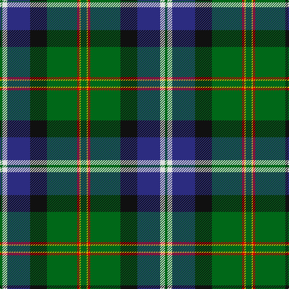

In pattern [GWBKGRYG](/patterns/gwbkgryg/).

This was sourced from house-of-tartan.  It is a [8 stripes tartan](/stripes/stripes8/).

Original link http://www.house-of-tartan.scotland.net/house/TartanViewjs.asp?colr=Def&tnam=922

## Thread count
G/4 LN8 DB38 K28 G50 R4 Y2 G/10

## Palette
Each colour and its ΔE from the base-6 reference it is a variant of.

| Colour | Shade | Base | ΔE (OKLab) |
|---|---|---|---|
| DB | <code style="background-color:#2C2C80;">#2C2C80</code> `#2C2C80` | B <code style="background-color:#2C4084;">#2C4084</code> | 0.05 |
| G | <code style="background-color:#006818;">#006818</code> `#006818` | G <code style="background-color:#006400;">#006400</code> | 0.02 |
| K | <code style="background-color:#101010;">#101010</code> `#101010` | K <code style="background-color:#000000;">#000000</code> | 0.17 |
| LN | <code style="background-color:#E0E0E0;">#E0E0E0</code> `#E0E0E0` | W <code style="background-color:#F4F4F0;">#F4F4F0</code> | 0.06 |
| R | <code style="background-color:#C80000;">#C80000</code> `#C80000` | R <code style="background-color:#C80000;">#C80000</code> | 0.00 |
| Y | <code style="background-color:#E8C000;">#E8C000</code> `#E8C000` | Y <code style="background-color:#E8C000;">#E8C000</code> | 0.00 |

# Sample pattern

## Nearest tartans

The nearest existing variants by ΔTartan distance.

1. [Dodd of Branford](/setts/s9/g8r4g40b16k16b8w2y4k2-b1c0070-g006818-k101010-r880000-wc0c0c0-yd09800/) — ΔT 0.67
1. [McGeachie (Personal)](/setts/s8/w2k12b18r24k24g64k12y2-b3850c8-g006818-k101010-rc80000-we0e0e0-ye8c000/) — ΔT 0.88
1. [Hogg Dress (Name)](/setts/s9/b34r3b8ba4b8k24g34k2w6-b4880a0-ba1c1c50-g006818-k101010-rc80000-we0e0e0/) — ΔT 0.90
1. [Nova Scotia](/setts/s9/w4b40g4ga4g4ga8g16y4r2-b304080-g003000-ga30a010-rc00000-we0e0e0-yf0c000/) — ΔT 0.91
1. [Jones (Name)](/setts/s7/r8w2g12ga50k16b30w4-b2c2c80-g5c6428-ga006818-k101010-rc80000-wc0c0c0/) — ΔT 0.92
1. [Brehat (Personal)](/setts/s11/g30b4r6w6ba6b3k14w14ba50g50w2-b780078-ba2c2c80-g006818-k101010-rc80000-we0e0e0/) — ΔT 0.93
1. [Tooth (Personal)](/setts/s8/g10y2r4g50k28b38w4g8-b2c2c80-g5c6428-k101010-r880000-wf8f8f8-ybc8c00/) — ΔT 0.94
1. [Birch Family Tartan Tartan Number: 2157. Earliest known date: 1993 The Birch family tartan was designed and produced by Mr Robin Birch of Connell Reid kiltmaker, Blairgowrie. The new sett has been recorded by the Scottish Tartans Society. See products available Copyright © Blair Urquhart, Comrie, 2015](/setts/s9/g6b8g46k20r4k20ba36k2w6-b780078-ba5c8ca8-g006818-k101010-rc8002c-we0e0e0/) — ΔT 0.94
1. [Wishart Hunting Family Tartan Tartan Number: 2104. Earliest known date: 1990 The Wisharts of Pittarrow and Logie Wishart were a lowland family dating from around the 12th Century. The family's origins are unknown, but the name Guiscard, Wiscard, Wishart, meaning 'cunning' is Norman-French. We have also sought to associate the Wishart tartan with that of another family by virtue of the marriage of a Sir John Wishart to Jean, daughter of William Douglas, 9th Earl of Angus in the 16th Century. The Wishart tartan combines the Wallace and Douglas tartans, in an original new sett which was designed by Dr David Wishart with the assistance of the Scottish College of Textiles in Galashiels. (D. Wishart, 1990) See products available Copyright © Blair Urquhart, Comrie, 2015](/setts/s7/k4b4g32ba4y2ba26w4-b2c2c80-ba202060-g006818-k101010-we0e0e0-ye8c000/) — ΔT 0.96
1. [Army Ranger](/setts/s9/b22ba12g50r2w4y2b50ba10w14-b003c64-ba1c1c1c-g004028-r960028-wf0e0c8-yd87c00/) — ΔT 0.97

## Neighbour map

Every grey dot is one of 15726 variants placed by the first two principal components of the ΔTartan feature space (44% of its variance). Red is this tartan; blue dots are its nearest — click one to open its page.

<svg viewBox="0 0 640 380" role="img" style="max-width:100%;height:auto;border:1px solid #e0e0e0;border-radius:4px;display:block" xmlns="http://www.w3.org/2000/svg"><image href="/nn/cloud.v1.png" width="640" height="380"/><a href="/setts/s9/g8r4g40b16k16b8w2y4k2-b1c0070-g006818-k101010-r880000-wc0c0c0-yd09800/"><circle cx="235.0" cy="132.3" r="4" fill="#3465a4"><title>Dodd of Branford</title></circle></a><a href="/setts/s8/w2k12b18r24k24g64k12y2-b3850c8-g006818-k101010-rc80000-we0e0e0-ye8c000/"><circle cx="207.0" cy="117.2" r="4" fill="#3465a4"><title>McGeachie (Personal)</title></circle></a><a href="/setts/s9/b34r3b8ba4b8k24g34k2w6-b4880a0-ba1c1c50-g006818-k101010-rc80000-we0e0e0/"><circle cx="176.1" cy="138.4" r="4" fill="#3465a4"><title>Hogg Dress (Name)</title></circle></a><a href="/setts/s9/w4b40g4ga4g4ga8g16y4r2-b304080-g003000-ga30a010-rc00000-we0e0e0-yf0c000/"><circle cx="226.0" cy="112.4" r="4" fill="#3465a4"><title>Nova Scotia</title></circle></a><a href="/setts/s7/r8w2g12ga50k16b30w4-b2c2c80-g5c6428-ga006818-k101010-rc80000-wc0c0c0/"><circle cx="204.3" cy="142.6" r="4" fill="#3465a4"><title>Jones (Name)</title></circle></a><a href="/setts/s11/g30b4r6w6ba6b3k14w14ba50g50w2-b780078-ba2c2c80-g006818-k101010-rc80000-we0e0e0/"><circle cx="197.1" cy="102.2" r="4" fill="#3465a4"><title>Brehat (Personal)</title></circle></a><a href="/setts/s8/g10y2r4g50k28b38w4g8-b2c2c80-g5c6428-k101010-r880000-wf8f8f8-ybc8c00/"><circle cx="253.1" cy="133.7" r="4" fill="#3465a4"><title>Tooth (Personal)</title></circle></a><a href="/setts/s9/g6b8g46k20r4k20ba36k2w6-b780078-ba5c8ca8-g006818-k101010-rc8002c-we0e0e0/"><circle cx="155.2" cy="125.7" r="4" fill="#3465a4"><title>Birch Family Tartan Tartan Number: 2157. Earliest known date: 1993 The Birch family tartan was designed and produced by Mr Robin Birch of Connell Reid kiltmaker, Blairgowrie. The new sett has been recorded by the Scottish Tartans Society. See products available Copyright © Blair Urquhart, Comrie, 2015</title></circle></a><a href="/setts/s7/k4b4g32ba4y2ba26w4-b2c2c80-ba202060-g006818-k101010-we0e0e0-ye8c000/"><circle cx="218.6" cy="146.4" r="4" fill="#3465a4"><title>Wishart Hunting Family Tartan Tartan Number: 2104. Earliest known date: 1990 The Wisharts of Pittarrow and Logie Wishart were a lowland family dating from around the 12th Century. The family's origins are unknown, but the name Guiscard, Wiscard, Wishart, meaning 'cunning' is Norman-French. We have also sought to associate the Wishart tartan with that of another family by virtue of the marriage of a Sir John Wishart to Jean, daughter of William Douglas, 9th Earl of Angus in the 16th Century. The Wishart tartan combines the Wallace and Douglas tartans, in an original new sett which was designed by Dr David Wishart with the assistance of the Scottish College of Textiles in Galashiels. (D. Wishart, 1990) See products available Copyright © Blair Urquhart, Comrie, 2015</title></circle></a><a href="/setts/s9/b22ba12g50r2w4y2b50ba10w14-b003c64-ba1c1c1c-g004028-r960028-wf0e0c8-yd87c00/"><circle cx="222.8" cy="130.2" r="4" fill="#3465a4"><title>Army Ranger</title></circle></a><circle cx="215.0" cy="129.3" r="5" fill="#c00000"/></svg>

ID: /setts/s8/g10y2r4g50k28b38w8g4-b2c2c80-g006818-k101010-rc80000-we0e0e0-ye8c000/
