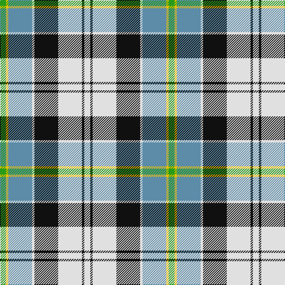

In pattern [GYBWKWKW](/patterns/gybwkwkw/).

This was sourced from tartans-authority.  It is a [8 stripes tartan](/stripes/stripes8/).

Original link http://www.tartansauthority.com/tartan-ferret/display/7423/

## Thread count
G/10 Y4 B40 LN4 K40 LN40 K4 LN/10

## Palette
Each colour and its ΔE from the base-6 reference it is a variant of.

| Colour | Shade | Base | ΔE (OKLab) |
|---|---|---|---|
| B | <code style="background-color:#5C8CA8;">#5C8CA8</code> `#5C8CA8` | B <code style="background-color:#2C4084;">#2C4084</code> | 0.23 |
| G | <code style="background-color:#289C18;">#289C18</code> `#289C18` | G <code style="background-color:#006400;">#006400</code> | 0.18 |
| K | <code style="background-color:#101010;">#101010</code> `#101010` | K <code style="background-color:#000000;">#000000</code> | 0.17 |
| LN | <code style="background-color:#E0E0E0;">#E0E0E0</code> `#E0E0E0` | W <code style="background-color:#F4F4F0;">#F4F4F0</code> | 0.06 |
| Y | <code style="background-color:#E8C000;">#E8C000</code> `#E8C000` | Y <code style="background-color:#E8C000;">#E8C000</code> | 0.00 |

# Sample pattern

## Nearest tartans

The nearest existing variants by ΔTartan distance.

1. [Ailsa Craig (District)](/setts/s8/r10w4b40y4k32w36k4w10-b7490a4-k101010-rc80000-wf8f8f8-ye8c000/) — ΔT 0.70
1. [Fraser Gathering Dress (1997)](/setts/s9/g4w48g4b10ga8g22ga4b24r4-b1c0070-g006818-ga003820-rc80000-we0e0e0/) — ΔT 0.71
1. [Hackett, William (Coatbridge) (Personal)](/setts/s8/k40w8r8w40g40w10g4ga4-g015c16-ga278f1c-k101010-rce1422-wffffff/) — ΔT 0.73
1. [Ailsa Craig](/setts/s8/r10w4ra40y4k32w36k4w10-k101010-rc80000-ra888888-wf8f8f8-ye8c000/) — ΔT 0.85
1. [MacRobart Dress (Personal)](/setts/s7/b16w66k30g34ba6g34ba6-b2c2c80-ba5c8ca8-g285800-k101010-we0e0e0/) — ΔT 0.87
1. [Barbour - Ancient](/setts/s7/w8k4w36k22b4g36y4-b202060-g606000-k101010-wfcfcfc-yfccc00/) — ΔT 0.91
1. [Vermont Dress](/setts/s8/g4w4g24b20w24r4g4y4-b202060-g006818-rc80000-we0e0e0-yd09800/) — ΔT 0.94
1. [John Hamilton Gray Commemorative Tartan Tartan Number: 1808. Earliest known date: pre 2003 One of the Fathers of the Confederation. Born Prince Edward Island in 1881. Premier in 1863. Died in 1887 See products available Copyright © Blair Urquhart, Comrie, 2015](/setts/s10/w8g14r6g24b30y10w40y10b7y4-b2c2c80-g006818-rc80000-we0e0e0-ye8c000/) — ΔT 0.97
1. [MacNaughton Dress Clan Tartan Tartan Number: 1434. Earliest known date: 1987 Registered 1987. See products available Copyright © Blair Urquhart, Comrie, 2015](/setts/s9/r4b4w52g50k28b26w52b4r4-b2c2c80-g006818-k101010-rc80000-we0e0e0/) — ΔT 1.01
1. [Ainslie, Lake](/setts/s7/b12w20g20r4y6r2b6-b2c2c80-g006818-rc80000-wfcfcfc-ye8c000/) — ΔT 1.01

## Neighbour map

Every grey dot is one of 15726 variants placed by the first two principal components of the ΔTartan feature space (44% of its variance). Red is this tartan; blue dots are its nearest — click one to open its page.

<svg viewBox="0 0 640 380" role="img" style="max-width:100%;height:auto;border:1px solid #e0e0e0;border-radius:4px;display:block" xmlns="http://www.w3.org/2000/svg"><image href="/nn/cloud.v1.png" width="640" height="380"/><a href="/setts/s8/r10w4b40y4k32w36k4w10-b7490a4-k101010-rc80000-wf8f8f8-ye8c000/"><circle cx="113.4" cy="150.1" r="4" fill="#3465a4"><title>Ailsa Craig (District)</title></circle></a><a href="/setts/s9/g4w48g4b10ga8g22ga4b24r4-b1c0070-g006818-ga003820-rc80000-we0e0e0/"><circle cx="133.6" cy="136.4" r="4" fill="#3465a4"><title>Fraser Gathering Dress (1997)</title></circle></a><a href="/setts/s8/k40w8r8w40g40w10g4ga4-g015c16-ga278f1c-k101010-rce1422-wffffff/"><circle cx="119.5" cy="154.4" r="4" fill="#3465a4"><title>Hackett, William (Coatbridge) (Personal)</title></circle></a><a href="/setts/s8/r10w4ra40y4k32w36k4w10-k101010-rc80000-ra888888-wf8f8f8-ye8c000/"><circle cx="115.2" cy="149.5" r="4" fill="#3465a4"><title>Ailsa Craig</title></circle></a><a href="/setts/s7/b16w66k30g34ba6g34ba6-b2c2c80-ba5c8ca8-g285800-k101010-we0e0e0/"><circle cx="111.5" cy="175.7" r="4" fill="#3465a4"><title>MacRobart Dress (Personal)</title></circle></a><a href="/setts/s7/w8k4w36k22b4g36y4-b202060-g606000-k101010-wfcfcfc-yfccc00/"><circle cx="128.0" cy="161.0" r="4" fill="#3465a4"><title>Barbour - Ancient</title></circle></a><a href="/setts/s8/g4w4g24b20w24r4g4y4-b202060-g006818-rc80000-we0e0e0-yd09800/"><circle cx="107.8" cy="180.9" r="4" fill="#3465a4"><title>Vermont Dress</title></circle></a><a href="/setts/s10/w8g14r6g24b30y10w40y10b7y4-b2c2c80-g006818-rc80000-we0e0e0-ye8c000/"><circle cx="81.4" cy="155.1" r="4" fill="#3465a4"><title>John Hamilton Gray Commemorative Tartan Tartan Number: 1808. Earliest known date: pre 2003 One of the Fathers of the Confederation. Born Prince Edward Island in 1881. Premier in 1863. Died in 1887 See products available Copyright © Blair Urquhart, Comrie, 2015</title></circle></a><a href="/setts/s9/r4b4w52g50k28b26w52b4r4-b2c2c80-g006818-k101010-rc80000-we0e0e0/"><circle cx="164.5" cy="142.6" r="4" fill="#3465a4"><title>MacNaughton Dress Clan Tartan Tartan Number: 1434. Earliest known date: 1987 Registered 1987. See products available Copyright © Blair Urquhart, Comrie, 2015</title></circle></a><a href="/setts/s7/b12w20g20r4y6r2b6-b2c2c80-g006818-rc80000-wfcfcfc-ye8c000/"><circle cx="69.6" cy="172.6" r="4" fill="#3465a4"><title>Ainslie, Lake</title></circle></a><circle cx="117.1" cy="154.8" r="5" fill="#c00000"/></svg>

ID: /setts/s8/g10y4b40w4k40w40k4w10-b5c8ca8-g289c18-k101010-we0e0e0-ye8c000/
