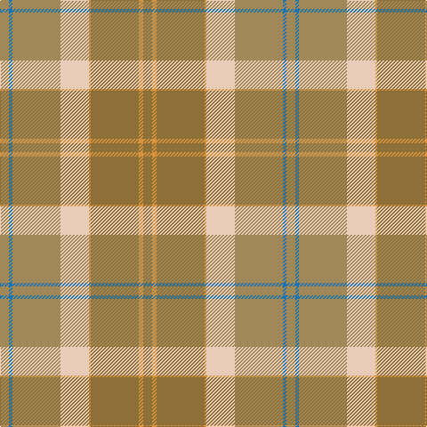

In pattern [GYGYWYBY](/patterns/gygywyby/).

This was sourced from register-of-tartans.  It is a [8 stripes tartan](/stripes/stripes8/).

Original link https://www.tartanregister.gov.uk/tartanDetails.aspx?ref=659

## Attestations

This cloth appears in 3 source records; the oldest owns this page.

- 01/01/2003 — Cladish (register-of-tartans, [record](https://www.tartanregister.gov.uk/tartanDetails.aspx?ref=659))
- pre 2003 — Cladish (Fashion) (tartans-authority, [record](http://www.tartansauthority.com/tartan-ferret/display/6011/))
- undated — Cladish Weavers Tartan Tartan Number: 6011. Earliest known date: pre 2003 From the Marton Mills Keighly range (5.5oz polyester/cotton). See products available Copyright © Blair Urquhart, Comrie, 2015 (house-of-tartan, [record](http://www.house-of-tartan.scotland.net/house/TartanViewjs.asp?colr=Def&tnam=6011))

## Thread count
LT/10 O5 LT54 O2 LR32 LTa54 B4 LTa/10

## Palette
Each colour and its ΔE from the base-6 reference it is a variant of.

| Colour | Shade | Base | ΔE (OKLab) |
|---|---|---|---|
| B | <code style="background-color:#1474B4;">#1474B4</code> `#1474B4` | B <code style="background-color:#2C4084;">#2C4084</code> | 0.15 |
| LR | <code style="background-color:#E8CCB8;">#E8CCB8</code> `#E8CCB8` | W <code style="background-color:#F4F4F0;">#F4F4F0</code> | 0.11 |
| LT | <code style="background-color:#8C7038;">#8C7038</code> `#8C7038` | G <code style="background-color:#006400;">#006400</code> | 0.18 |
| LTa | <code style="background-color:#A08858;">#A08858</code> `#A08858` | Y <code style="background-color:#E8C000;">#E8C000</code> | 0.21 |
| O | <code style="background-color:#DC943C;">#DC943C</code> `#DC943C` | Y <code style="background-color:#E8C000;">#E8C000</code> | 0.12 |

# Sample pattern

ID: /setts/s8/g10y5g54y2w32ya54b4ya10-b1474b4-g8c7038-we8ccb8-ydc943c-yaa08858/
