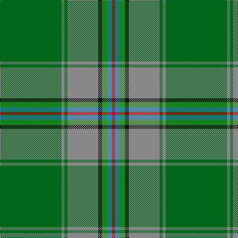

In pattern [GRGRKGBR](/patterns/grgrkgbr/).

This was sourced from tartans-authority.  It is a [8 stripes tartan](/stripes/stripes8/).

Original link http://www.tartansauthority.com/tartan-ferret/display/3110/

## Thread count
Ga/124 N6 Ga6 N62 K8 G10 B10 R/6

## Palette
Each colour and its ΔE from the base-6 reference it is a variant of.

| Colour | Shade | Base | ΔE (OKLab) |
|---|---|---|---|
| B | <code style="background-color:#2888C4;">#2888C4</code> `#2888C4` | B <code style="background-color:#2C4084;">#2C4084</code> | 0.21 |
| G | <code style="background-color:#289C18;">#289C18</code> `#289C18` | G <code style="background-color:#006400;">#006400</code> | 0.18 |
| Ga | <code style="background-color:#006818;">#006818</code> `#006818` | G <code style="background-color:#006400;">#006400</code> | 0.02 |
| K | <code style="background-color:#101010;">#101010</code> `#101010` | K <code style="background-color:#000000;">#000000</code> | 0.17 |
| N | <code style="background-color:#888888;">#888888</code> `#888888` | R <code style="background-color:#C80000;">#C80000</code> | 0.24 |
| R | <code style="background-color:#C80000;">#C80000</code> `#C80000` | R <code style="background-color:#C80000;">#C80000</code> | 0.00 |

# Sample pattern

## Nearest tartans

The nearest existing variants by ΔTartan distance.

1. [Shiach (Personal)](/setts/s8/g90k8r4g8r4k8b42ra10-b506878-g006818-k101010-re87878-rac80000/) — ΔT 1.10
1. [Muskoka (District)](/setts/s8/w4g10b20g40r2y4ra4y2-b5c8ca8-g408060-rc80000-raa00000-we0e0e0-ye8c000/) — ΔT 1.25
1. [Muskoka](/setts/s8/w4g10b24g42r3ga4ra4y2-b5480b0-g008000-ga908000-rc00000-ra800000-we0e0e0-yf0c000/) — ΔT 1.35
1. [Elbrick Hunting (Personal)](/setts/s8/g12b44g12ga40y2g90ba2w10-b5c8ca8-ba2888c4-g006818-ga604000-we0e0e0-ye8c000/) — ΔT 1.47
1. [Hannigan of Dirleton](/setts/s8/b8g8ga4w6g54ga60y2r6-b800080-g008000-ga505020-rc00020-we0e0e0-yf0c000/) — ΔT 1.48
1. [Glasgow High (School)](/setts/s8/g12y6b84w8ga36y4b24r6-b506878-g604000-ga006038-rc8002c-we0e0e0-ye8c000/) — ΔT 1.49
1. [Walsh (Name)](/setts/s12/w2g24ga2k4r4k2ga32ra2ga32g2k2y2-g289c18-ga007440-k101010-rb468ac-rac80000-we0e0e0-ye8c000/) — ΔT 1.52
1. [MacClure Hunting Clan/Family Tartan Tartan Number: 3331. Earliest known date: pre 2002 Designed by Phil Smith for all MacClures. (note by Phil Smith Sept 2004) and originally woven by D C Dalgliesh. MacClures and MacLures are a sept of MacLeod. See products available Copyright © Blair Urquhart, Comrie, 2015](/setts/s12/k8y4g8ga24g8b16g8k8g60r8g8k4-b003c64-g006818-ga603800-k101010-rcc4438-yb8b8b8/) — ΔT 1.55
1. [Crieff & Strathearn #1](/setts/s7/g110b14r48g24ba8y6ba8-b2c2c80-ba003c64-g006818-r880000-ye8c000/) — ΔT 1.58
1. [Muskoka Canadian Tartan Tartan Number: 1799. Earliest known date: pre 2003 A note in the Highland Society of London collection reads, 'Murray (Tullibardine) This piece of cloth was made in 1794'. The sample is woven at 54 threads to the inch. The full sett measures 15 and one quarter inches. (A. Nisbet, 1988). See products available Copyright © Blair Urquhart, Comrie, 2015](/setts/s8/w4g10b24g42r3y4ra4y2-b5c8ca8-g006818-rc80000-ra880000-we0e0e0-ye8c000/) — ΔT 1.59

## Neighbour map

Every grey dot is one of 15726 variants placed by the first two principal components of the ΔTartan feature space (44% of its variance). Red is this tartan; blue dots are its nearest — click one to open its page.

<svg viewBox="0 0 640 380" role="img" style="max-width:100%;height:auto;border:1px solid #e0e0e0;border-radius:4px;display:block" xmlns="http://www.w3.org/2000/svg"><image href="/nn/cloud.v1.png" width="640" height="380"/><a href="/setts/s8/g90k8r4g8r4k8b42ra10-b506878-g006818-k101010-re87878-rac80000/"><circle cx="365.0" cy="148.3" r="4" fill="#3465a4"><title>Shiach (Personal)</title></circle></a><a href="/setts/s8/w4g10b20g40r2y4ra4y2-b5c8ca8-g408060-rc80000-raa00000-we0e0e0-ye8c000/"><circle cx="357.6" cy="145.6" r="4" fill="#3465a4"><title>Muskoka (District)</title></circle></a><a href="/setts/s8/w4g10b24g42r3ga4ra4y2-b5480b0-g008000-ga908000-rc00000-ra800000-we0e0e0-yf0c000/"><circle cx="297.9" cy="119.1" r="4" fill="#3465a4"><title>Muskoka</title></circle></a><a href="/setts/s8/g12b44g12ga40y2g90ba2w10-b5c8ca8-ba2888c4-g006818-ga604000-we0e0e0-ye8c000/"><circle cx="340.8" cy="121.0" r="4" fill="#3465a4"><title>Elbrick Hunting (Personal)</title></circle></a><a href="/setts/s8/b8g8ga4w6g54ga60y2r6-b800080-g008000-ga505020-rc00020-we0e0e0-yf0c000/"><circle cx="301.1" cy="123.8" r="4" fill="#3465a4"><title>Hannigan of Dirleton</title></circle></a><a href="/setts/s8/g12y6b84w8ga36y4b24r6-b506878-g604000-ga006038-rc8002c-we0e0e0-ye8c000/"><circle cx="363.2" cy="144.3" r="4" fill="#3465a4"><title>Glasgow High (School)</title></circle></a><a href="/setts/s12/w2g24ga2k4r4k2ga32ra2ga32g2k2y2-g289c18-ga007440-k101010-rb468ac-rac80000-we0e0e0-ye8c000/"><circle cx="321.5" cy="113.3" r="4" fill="#3465a4"><title>Walsh (Name)</title></circle></a><a href="/setts/s12/k8y4g8ga24g8b16g8k8g60r8g8k4-b003c64-g006818-ga603800-k101010-rcc4438-yb8b8b8/"><circle cx="302.4" cy="143.7" r="4" fill="#3465a4"><title>MacClure Hunting Clan/Family Tartan Tartan Number: 3331. Earliest known date: pre 2002 Designed by Phil Smith for all MacClures. (note by Phil Smith Sept 2004) and originally woven by D C Dalgliesh. MacClures and MacLures are a sept of MacLeod. See products available Copyright © Blair Urquhart, Comrie, 2015</title></circle></a><a href="/setts/s7/g110b14r48g24ba8y6ba8-b2c2c80-ba003c64-g006818-r880000-ye8c000/"><circle cx="383.9" cy="170.3" r="4" fill="#3465a4"><title>Crieff &amp; Strathearn #1</title></circle></a><a href="/setts/s8/w4g10b24g42r3y4ra4y2-b5c8ca8-g006818-rc80000-ra880000-we0e0e0-ye8c000/"><circle cx="288.4" cy="113.8" r="4" fill="#3465a4"><title>Muskoka Canadian Tartan Tartan Number: 1799. Earliest known date: pre 2003 A note in the Highland Society of London collection reads, 'Murray (Tullibardine) This piece of cloth was made in 1794'. The sample is woven at 54 threads to the inch. The full sett measures 15 and one quarter inches. (A. Nisbet, 1988). See products available Copyright © Blair Urquhart, Comrie, 2015</title></circle></a><circle cx="359.7" cy="135.2" r="5" fill="#c00000"/></svg>

ID: /setts/s8/g124r6g6r62k8ga10b10ra6-b2888c4-g006818-ga289c18-k101010-r888888-rac80000/
