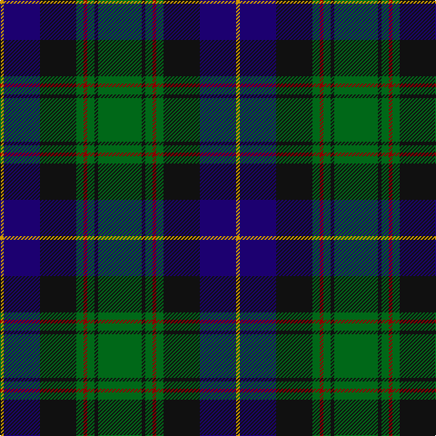

In pattern [GKGRGKBY](/patterns/gkgrgkby/).

This was sourced from register-of-tartans.  It is a [8 stripes tartan](/stripes/stripes8/).

Original link https://www.tartanregister.gov.uk/tartanDetails.aspx?ref=1558

## Attestations

This cloth appears in 2 source records; the oldest owns this page.

- 01/04/1993 — Guelph, City Of (register-of-tartans, [record](https://www.tartanregister.gov.uk/tartanDetails.aspx?ref=1558))
- 1993 — Guelph, City Of (District) (tartans-authority, [record](http://www.tartansauthority.com/tartan-ferret/display/2186/))

## Thread count
DY/4 DB40 K40 G8 DR4 G8 K4 G/48

## Palette
Each colour and its ΔE from the base-6 reference it is a variant of.

| Colour | Shade | Base | ΔE (OKLab) |
|---|---|---|---|
| DB | <code style="background-color:#1C0070;">#1C0070</code> `#1C0070` | B <code style="background-color:#2A418A;">#2A418A</code> | 0.14 |
| DR | <code style="background-color:#880000;">#880000</code> `#880000` | R <code style="background-color:#CC0000;">#CC0000</code> | 0.15 |
| DY | <code style="background-color:#D09800;">#D09800</code> `#D09800` | Y <code style="background-color:#F2BF00;">#F2BF00</code> | 0.12 |
| G | <code style="background-color:#006818;">#006818</code> `#006818` | G <code style="background-color:#006100;">#006100</code> | 0.02 |
| K | <code style="background-color:#101010;">#101010</code> `#101010` | K <code style="background-color:#000000;">#000000</code> | 0.17 |

# Sample pattern

## Nearest tartans

The nearest existing variants by ΔTartan distance.

1. [MacCaskill Family Tartan Tartan Number: 1152. Earliest known date: 1951 Miss M.MacDougal of the Inverness Museum wrote (7th September 1951) :- ''Herewith pattern of the MacAskill which Messrs Pringle made at the request of an old man of this name. As you can see it is a variant of the MacLeod...?" . . . wherein the colors of stripes and their guards are reversed. Designed for a farmer - Kenneth MacAskill, Milton of Leys. See products available Copyright © Blair Urquhart, Comrie, 2015](/setts/s7/k2r1g15k15b15y1k2x2~b2c2c80-g006818-k101010-rc80000-ye8c000/) — ΔT 0.63
1. [Paterson (Personal)](/setts/s7/g3b12w1k12g13r2g2x2~b2c2c80-g006818-k101010-rc80000-wfcfcfc/) — ΔT 0.66
1. [MacThomas Clan Tartan Tartan Number: 407. Earliest known date: 1975 Designed by David Thomas - former director of the Strathmore Woollen Co. in Forfar who still (in 2011) weave this tartan. Adopted by Clan Society in 1975, and registered with Lord Lyon in 1979. See products available Copyright © Blair Urquhart, Comrie, 2015](/setts/s7/b3r2b22k11g24w2g3x2~b2c2c80-g006818-k101010-ra00048-wc49cd8/) — ΔT 0.70
1. [Rhun (Fashion)](/setts/s7/r12b68w7k39g75r6g6~b1c1c50-g006818-k101010-rc80000-we0e0e0/) — ΔT 0.71
1. [Fraser Gathering, Green (1997)](/setts/s9/r2b12g2ga11g4b5ga2g24w2x2~b1c0070-g003820-ga006818-rc80000-wfcfcfc/) — ΔT 0.72
1. [MacPhedran/MacFadzean](/setts/s7/g3b12w1k12g13r2g2x2~b2c2c80-g285800-k101010-rc80000-wc0c0c0/) — ΔT 0.76
1. [MacLeod Small Clan Tartan Tartan Number: 15833. Earliest known date: See products available Copyright © Blair Urquhart, Comrie, 2015](/setts/s7/r1k1g7k5b10k1y1x2~b2c2c80-g006818-k101010-rc80000-ye8c000/) — ΔT 0.78
1. [Scottish Chamber Orchestra, The](/setts/s9/w3b20k3b2k5b2k3g15r2x2~b003c64-g5c6428-k101010-rc80000-w00fcfc/) — ΔT 0.79
1. [Mantle (Personal)](/setts/s8/g3b16w2k14g18r3g2r3x2~b2c2c80-g006818-k101010-r880000-we0e0e0/) — ΔT 0.82
1. [Fraser Gathering Hunting Trade Tartan Tartan Number: 2363. Earliest known date: 1997 Unknown until House of Edgar published their own Old and Rare. See products available Copyright © Blair Urquhart, Comrie, 2015](/setts/s9/r2b12g2ga11g4b5ga2g24w2x2~b202060-g003820-ga289c18-rc80000-we0e0e0/) — ΔT 0.86

## Neighbour map

Every grey dot is one of 15726 variants placed by the first two principal components of the ΔTartan feature space (44% of its variance). Red is this tartan; blue dots are its nearest — click one to open its page.

<svg viewBox="0 0 640 380" role="img" style="max-width:100%;height:auto;border:1px solid #e0e0e0;border-radius:4px;display:block" xmlns="http://www.w3.org/2000/svg"><image href="/nn/cloud.v1.png" width="640" height="380"/><a href="/setts/s7/k2r1g15k15b15y1k2x2~b2c2c80-g006818-k101010-rc80000-ye8c000/"><circle cx="219.2" cy="182.3" r="4" fill="#3465a4"><title>MacCaskill Family Tartan Tartan Number: 1152. Earliest known date: 1951 Miss M.MacDougal of the Inverness Museum wrote (7th September 1951) :- ''Herewith pattern of the MacAskill which Messrs Pringle made at the request of an old man of this name. As you can see it is a variant of the MacLeod...?&quot; . . . wherein the colors of stripes and their guards are reversed. Designed for a farmer - Kenneth MacAskill, Milton of Leys. See products available Copyright © Blair Urquhart, Comrie, 2015</title></circle></a><a href="/setts/s7/g3b12w1k12g13r2g2x2~b2c2c80-g006818-k101010-rc80000-wfcfcfc/"><circle cx="197.5" cy="190.6" r="4" fill="#3465a4"><title>Paterson (Personal)</title></circle></a><a href="/setts/s7/b3r2b22k11g24w2g3x2~b2c2c80-g006818-k101010-ra00048-wc49cd8/"><circle cx="230.6" cy="189.4" r="4" fill="#3465a4"><title>MacThomas Clan Tartan Tartan Number: 407. Earliest known date: 1975 Designed by David Thomas - former director of the Strathmore Woollen Co. in Forfar who still (in 2011) weave this tartan. Adopted by Clan Society in 1975, and registered with Lord Lyon in 1979. See products available Copyright © Blair Urquhart, Comrie, 2015</title></circle></a><a href="/setts/s7/r12b68w7k39g75r6g6~b1c1c50-g006818-k101010-rc80000-we0e0e0/"><circle cx="193.7" cy="179.5" r="4" fill="#3465a4"><title>Rhun (Fashion)</title></circle></a><a href="/setts/s9/r2b12g2ga11g4b5ga2g24w2x2~b1c0070-g003820-ga006818-rc80000-wfcfcfc/"><circle cx="247.9" cy="177.5" r="4" fill="#3465a4"><title>Fraser Gathering, Green (1997)</title></circle></a><a href="/setts/s7/g3b12w1k12g13r2g2x2~b2c2c80-g285800-k101010-rc80000-wc0c0c0/"><circle cx="217.6" cy="197.7" r="4" fill="#3465a4"><title>MacPhedran/MacFadzean</title></circle></a><a href="/setts/s7/r1k1g7k5b10k1y1x2~b2c2c80-g006818-k101010-rc80000-ye8c000/"><circle cx="192.9" cy="190.3" r="4" fill="#3465a4"><title>MacLeod Small Clan Tartan Tartan Number: 15833. Earliest known date: See products available Copyright © Blair Urquhart, Comrie, 2015</title></circle></a><a href="/setts/s9/w3b20k3b2k5b2k3g15r2x2~b003c64-g5c6428-k101010-rc80000-w00fcfc/"><circle cx="218.2" cy="173.3" r="4" fill="#3465a4"><title>Scottish Chamber Orchestra, The</title></circle></a><a href="/setts/s8/g3b16w2k14g18r3g2r3x2~b2c2c80-g006818-k101010-r880000-we0e0e0/"><circle cx="171.3" cy="191.2" r="4" fill="#3465a4"><title>Mantle (Personal)</title></circle></a><a href="/setts/s9/r2b12g2ga11g4b5ga2g24w2x2~b202060-g003820-ga289c18-rc80000-we0e0e0/"><circle cx="234.2" cy="170.5" r="4" fill="#3465a4"><title>Fraser Gathering Hunting Trade Tartan Tartan Number: 2363. Earliest known date: 1997 Unknown until House of Edgar published their own Old and Rare. See products available Copyright © Blair Urquhart, Comrie, 2015</title></circle></a><circle cx="216.6" cy="182.9" r="5" fill="#c00000"/></svg>

ID: /setts/s8/g12k1g2r1g2k10b10y1x4~b1c0070-g006818-k101010-r880000-yd09800/
