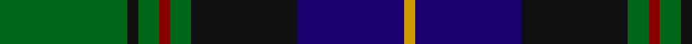
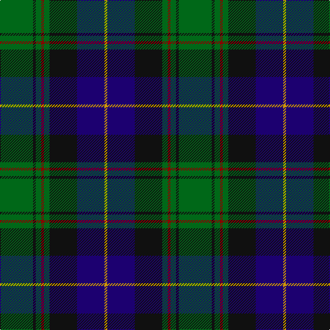

In pattern [GKGRGKBY](/stripes/gkgrgkby/).

This was sourced from register-of-tartans.  It is a [8 stripe tartan](/stripes/stripes8/).

Original link https://www.tartanregister.gov.uk/tartanDetails.aspx?ref=1558

## Attestations

This cloth appears in 2 source records; the oldest owns this page.

- 01/04/1993 — Guelph, City Of (register-of-tartans, [record](https://www.tartanregister.gov.uk/tartanDetails.aspx?ref=1558))
- 1993 — Guelph, City Of (District) (tartans-authority, [record](http://www.tartansauthority.com/tartan-ferret/display/2186/))

## Register references

External register numbers recorded for this tartan.

- Scottish Register of Tartans: [1558](https://www.tartanregister.gov.uk/tartanDetails.aspx?ref=1558)
- Scottish Tartans Authority (ITI): 2186
- Scottish Tartans World Register: 2186

## Thread count
G/48 K4 G8 DR4 G8 K40 DB40 DY/4

## Palette
Each colour and the base-6 reference it is a variant of.

| Colour | Shade | Base |
|---|---|---|
| DB | <code style="background-color:#1C0070;">#1C0070</code> `oklch(26.3% 0.162 277.1)` <small>#1C0070</small> | B <code style="background-color:#2A418A;">#2A418A</code> |
| DR | <code style="background-color:#880000;">#880000</code> `oklch(39.4% 0.162 29.2)` <small>#880000</small> | R <code style="background-color:#CC0000;">#CC0000</code> |
| DY | <code style="background-color:#D09800;">#D09800</code> `oklch(71.4% 0.147 82.1)` <small>#D09800</small> | Y <code style="background-color:#F2BF00;">#F2BF00</code> |
| G | <code style="background-color:#006818;">#006818</code> `oklch(45.0% 0.142 145.0)` <small>#006818</small> | G <code style="background-color:#006100;">#006100</code> |
| K | <code style="background-color:#101010;">#101010</code> `oklch(17.3% 0.000 89.9)` <small>#101010</small> | K <code style="background-color:#000000;">#000000</code> |

# Sample pattern

## Nearest tartans

The nearest existing variants by ΔTartan distance, with this tartan at the top so the swatches line up against it.

ΔTartan

Tartan

Sett

—

<a href="/ttd/edit/#slug=g12k1g2r1g2k10db10lo1~x4">Guelph, City Of</a> <a class="nn-out" href="/setts/s8/g12k1g2r1g2k10db10lo1~x4/" title="open its dictionary page">↗</a>

0.66

<a href="/ttd/edit/#slug=g3db12w1k12g13r2g2~x2">Paterson (Personal)</a> <a class="nn-out" href="/setts/s7/g3db12w1k12g13r2g2~x2/" title="open its dictionary page">↗</a>

0.70

<a href="/ttd/edit/#slug=db3m2db22k11g24lp2g3~x2">MacThomas Clan Tartan Tartan Number: 407. Earliest known date: 1975 Designed by David Thomas - former director of the Strathmore Woollen Co. in Forfar who still (in 2011) weave this tartan. Adopted by Clan Society in 1975, and registered with Lord Lyon in 1979. See products available Copyright © Blair Urquhart, Comrie, 2015</a> <a class="nn-out" href="/setts/s7/db3m2db22k11g24lp2g3~x2/" title="open its dictionary page">↗</a>

0.71

<a href="/ttd/edit/#slug=r12db68w7k39g75r6g6">Rhun (Fashion)</a> <a class="nn-out" href="/setts/s7/r12db68w7k39g75r6g6/" title="open its dictionary page">↗</a>

0.72

<a href="/ttd/edit/#slug=r2db12dg2g11dg4db5g2dg24w2~x2">Fraser Gathering, Green (1997)</a> <a class="nn-out" href="/setts/s9/r2db12dg2g11dg4db5g2dg24w2~x2/" title="open its dictionary page">↗</a>

0.77

<a href="/ttd/edit/#slug=dg3db12lb1k12dg13r2dg2~x2">MacPhedran/MacFadzean</a> <a class="nn-out" href="/setts/s7/dg3db12lb1k12dg13r2dg2~x2/" title="open its dictionary page">↗</a>

0.78

<a href="/ttd/edit/#slug=r1k1g7k5db10k1ly1~x2">MacLeod Small Clan Tartan Tartan Number: 15833. Earliest known date: See products available Copyright © Blair Urquhart, Comrie, 2015</a> <a class="nn-out" href="/setts/s7/r1k1g7k5db10k1ly1~x2/" title="open its dictionary page">↗</a>

0.79

<a href="/ttd/edit/#slug=lt3dt20k3dt2k5dt2k3y15r2~x2">Scottish Chamber Orchestra, The</a> <a class="nn-out" href="/setts/s9/lt3dt20k3dt2k5dt2k3y15r2~x2/" title="open its dictionary page">↗</a>

0.82

<a href="/ttd/edit/#slug=r3g2r3g18k14w2db16g3~x2">Mantle (Personal)</a> <a class="nn-out" href="/setts/s8/r3g2r3g18k14w2db16g3~x2/" title="open its dictionary page">↗</a>

0.86

<a href="/ttd/edit/#slug=r2g10k12n1k2n14k1n1g2~x2">MacWilliams Wedding Personal Tartan Tartan Number: 7667. Earliest known date: 2008 Designed by Bisell McWilliams for his wedding. Details from Matt Newsome. See products available Copyright © Blair Urquhart, Comrie, 2015</a> <a class="nn-out" href="/setts/s9/r2g10k12n1k2n14k1n1g2~x2/" title="open its dictionary page">↗</a>

0.87

<a href="/ttd/edit/#slug=g5db24g7k10g24ly2db2ly2r2~x2">Maitland Chief</a> <a class="nn-out" href="/setts/s9/g5db24g7k10g24ly2db2ly2r2~x2/" title="open its dictionary page">↗</a>

## Neighbour map

Every grey dot is one of 14299 variants placed by the first two principal components of the ΔTartan feature space (44% of its variance). Red is this tartan; blue dots are its nearest — click one to open its page.

<svg viewBox="0 0 640 380" role="img" style="max-width:100%;height:auto;border:1px solid #e0e0e0;border-radius:4px;display:block" xmlns="http://www.w3.org/2000/svg"><image href="/nn/cloud.v1.png" width="640" height="380"/><a href="/setts/s7/g3db12w1k12g13r2g2~x2/"><circle cx="200.8" cy="194.5" r="4" fill="#3465a4"><title>Paterson (Personal)</title></circle></a><a href="/setts/s7/db3m2db22k11g24lp2g3~x2/"><circle cx="233.8" cy="194.8" r="4" fill="#3465a4"><title>MacThomas Clan Tartan Tartan Number: 407. Earliest known date: 1975 Designed by David Thomas - former director of the Strathmore Woollen Co. in Forfar who still (in 2011) weave this tartan. Adopted by Clan Society in 1975, and registered with Lord Lyon in 1979. See products available Copyright © Blair Urquhart, Comrie, 2015</title></circle></a><a href="/setts/s7/r12db68w7k39g75r6g6/"><circle cx="196.9" cy="183.3" r="4" fill="#3465a4"><title>Rhun (Fashion)</title></circle></a><a href="/setts/s9/r2db12dg2g11dg4db5g2dg24w2~x2/"><circle cx="251.2" cy="183.0" r="4" fill="#3465a4"><title>Fraser Gathering, Green (1997)</title></circle></a><a href="/setts/s7/dg3db12lb1k12dg13r2dg2~x2/"><circle cx="220.5" cy="203.4" r="4" fill="#3465a4"><title>MacPhedran/MacFadzean</title></circle></a><a href="/setts/s7/r1k1g7k5db10k1ly1~x2/"><circle cx="196.3" cy="194.4" r="4" fill="#3465a4"><title>MacLeod Small Clan Tartan Tartan Number: 15833. Earliest known date: See products available Copyright © Blair Urquhart, Comrie, 2015</title></circle></a><a href="/setts/s9/lt3dt20k3dt2k5dt2k3y15r2~x2/"><circle cx="221.5" cy="177.9" r="4" fill="#3465a4"><title>Scottish Chamber Orchestra, The</title></circle></a><a href="/setts/s8/r3g2r3g18k14w2db16g3~x2/"><circle cx="174.6" cy="195.8" r="4" fill="#3465a4"><title>Mantle (Personal)</title></circle></a><a href="/setts/s9/r2g10k12n1k2n14k1n1g2~x2/"><circle cx="199.7" cy="166.4" r="4" fill="#3465a4"><title>MacWilliams Wedding Personal Tartan Tartan Number: 7667. Earliest known date: 2008 Designed by Bisell McWilliams for his wedding. Details from Matt Newsome. See products available Copyright © Blair Urquhart, Comrie, 2015</title></circle></a><a href="/setts/s9/g5db24g7k10g24ly2db2ly2r2~x2/"><circle cx="241.8" cy="173.1" r="4" fill="#3465a4"><title>Maitland Chief</title></circle></a><circle cx="220.1" cy="187.8" r="5" fill="#c00000"/></svg>

ID: /setts/s8/g12k1g2r1g2k10db10lo1~x4/
