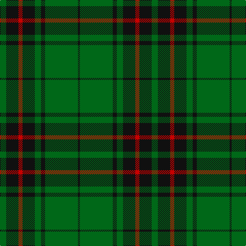

In pattern [GKRKGKGK](/patterns/gkrkgkgk/).

This was sourced from register-of-tartans.  It is a [8 stripes tartan](/stripes/stripes8/).

Original link https://www.tartanregister.gov.uk/tartanDetails.aspx?ref=1405

## Attestations

This cloth appears in 2 source records; the oldest owns this page.

- 01/01/1983 — Glenbarr (register-of-tartans, [record](https://www.tartanregister.gov.uk/tartanDetails.aspx?ref=1405))
- pre 2007 — Glenbarr (Corporate) (tartans-authority, [record](http://www.tartansauthority.com/tartan-ferret/display/7366/))

## Thread count
G/12 K24 R8 K24 G12 K8 G64 K/4

## Palette
Each colour and its ΔE from the base-6 reference it is a variant of.

| Colour | Shade | Base | ΔE (OKLab) |
|---|---|---|---|
| G | <code style="background-color:#006818;">#006818</code> `#006818` | G <code style="background-color:#006400;">#006400</code> | 0.02 |
| K | <code style="background-color:#101010;">#101010</code> `#101010` | K <code style="background-color:#000000;">#000000</code> | 0.17 |
| R | <code style="background-color:#C80000;">#C80000</code> `#C80000` | R <code style="background-color:#C80000;">#C80000</code> | 0.00 |

# Sample pattern

ID: /setts/s8/g12k24r8k24g12k8g64k4-g006818-k101010-rc80000/
