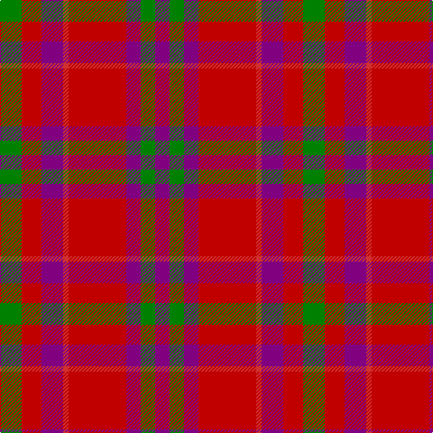

In pattern [BGBRRBRG](/stripes/bgbrrbrg/).

This was sourced from weddslist.  It is a [8 stripe tartan](/stripes/stripes8/).

Original link http://www.weddslist.com/cgi-bin/tartans/pg.pl?source=sts

## Thread count
G/24 Ra22 P24 R6 Ra64 P16 G16 P/16

## Palette
Each colour and the base-6 reference it is a variant of.

| Colour | Shade | Base |
|---|---|---|
| G | <code style="background-color:#008000;">#008000</code> `oklch(52.0% 0.177 142.5)` <small>#008000</small> | G <code style="background-color:#006100;">#006100</code> |
| P | <code style="background-color:#800080;">#800080</code> `oklch(42.1% 0.193 328.4)` <small>#800080</small> | B <code style="background-color:#2A418A;">#2A418A</code> |
| R | <code style="background-color:#D03030;">#D03030</code> `oklch(56.4% 0.196 26.2)` <small>#D03030</small> | R <code style="background-color:#CC0000;">#CC0000</code> |
| Ra | <code style="background-color:#C00000;">#C00000</code> `oklch(50.7% 0.208 29.2)` <small>#C00000</small> | R <code style="background-color:#CC0000;">#CC0000</code> |

# Sample pattern

## Nearest tartans

The nearest existing variants by ΔTartan distance.

1. [Fiddes](/setts/s8/dg12r11dp12r3r32dp8dg8dp8~x2/) — ΔT 0.81
1. [Sidney (Nova Scotia) Canadian Tartan Tartan Number: 1291. Earliest known date: 1986 The Falkirk Tartan. An ornamental twill weave check of natural light and dark wool was discovered at Falkirk in the neck of a jar containing Roman coins. The find is thought to have been buried about 260 A.D. The black and white check is woven today as the Shepherd tartan. See products available Copyright © Blair Urquhart, Comrie, 2015](/setts/s8/r16o2r11o6k4w2k4o16~x2/) — ΔT 1.12
1. [St Andrews](/setts/s8/r11db1r11db1w10o11db1o11~x2/) — ΔT 1.17
1. [Drumlithie, Rock and Wheel](/setts/s11/r2p3r2r15p3g19p20r15p3r2r2~x2/) — ΔT 1.21
1. [Moray of Abercairney #2](/setts/s5/r8r1dg4r1db4~x2/) — ΔT 1.21
1. [MacNab #3](/setts/s7/dg6r2r2dg4r2r12k1~x2/) — ΔT 1.22
1. [Drumlithie Rock and Wheel Tartan Tartan Number: 1414. Earliest known date: pre 2003 tba See products available Copyright © Blair Urquhart, Comrie, 2015](/setts/s11/r2dp3r2r15dp3g19dp20r15dp3r2r2~x2/) — ΔT 1.22
1. [MacBean/MacElvain](/setts/s7/k2r12db6r3dg12r4db1~x2/) — ΔT 1.23
1. [MacQuarrie #6](/setts/s7/r6dg16r4db12r16t1r2~x2/) — ΔT 1.24
1. [Drumlithie](/setts/s11/r2dp3r2r15dp2g20dp20r15dp3r2r2~x2/) — ΔT 1.28

## Neighbour map

Every grey dot is one of 14299 variants placed by the first two principal components of the ΔTartan feature space (44% of its variance). Red is this tartan; blue dots are its nearest — click one to open its page.

<svg viewBox="0 0 640 380" role="img" style="max-width:100%;height:auto;border:1px solid #e0e0e0;border-radius:4px;display:block" xmlns="http://www.w3.org/2000/svg"><image href="/nn/cloud.v1.png" width="640" height="380"/><a href="/setts/s8/dg12r11dp12r3r32dp8dg8dp8~x2/"><circle cx="248.2" cy="197.5" r="4" fill="#3465a4"><title>Fiddes</title></circle></a><a href="/setts/s8/r16o2r11o6k4w2k4o16~x2/"><circle cx="236.5" cy="202.4" r="4" fill="#3465a4"><title>Sidney (Nova Scotia) Canadian Tartan Tartan Number: 1291. Earliest known date: 1986 The Falkirk Tartan. An ornamental twill weave check of natural light and dark wool was discovered at Falkirk in the neck of a jar containing Roman coins. The find is thought to have been buried about 260 A.D. The black and white check is woven today as the Shepherd tartan. See products available Copyright © Blair Urquhart, Comrie, 2015</title></circle></a><a href="/setts/s8/r11db1r11db1w10o11db1o11~x2/"><circle cx="217.7" cy="198.1" r="4" fill="#3465a4"><title>St Andrews</title></circle></a><a href="/setts/s11/r2p3r2r15p3g19p20r15p3r2r2~x2/"><circle cx="244.9" cy="173.7" r="4" fill="#3465a4"><title>Drumlithie, Rock and Wheel</title></circle></a><a href="/setts/s5/r8r1dg4r1db4~x2/"><circle cx="239.8" cy="231.3" r="4" fill="#3465a4"><title>Moray of Abercairney #2</title></circle></a><a href="/setts/s7/dg6r2r2dg4r2r12k1~x2/"><circle cx="297.8" cy="191.4" r="4" fill="#3465a4"><title>MacNab #3</title></circle></a><a href="/setts/s11/r2dp3r2r15dp3g19dp20r15dp3r2r2~x2/"><circle cx="251.1" cy="176.1" r="4" fill="#3465a4"><title>Drumlithie Rock and Wheel Tartan Tartan Number: 1414. Earliest known date: pre 2003 tba See products available Copyright © Blair Urquhart, Comrie, 2015</title></circle></a><a href="/setts/s7/k2r12db6r3dg12r4db1~x2/"><circle cx="260.0" cy="198.1" r="4" fill="#3465a4"><title>MacBean/MacElvain</title></circle></a><a href="/setts/s7/r6dg16r4db12r16t1r2~x2/"><circle cx="285.2" cy="190.3" r="4" fill="#3465a4"><title>MacQuarrie #6</title></circle></a><a href="/setts/s11/r2dp3r2r15dp2g20dp20r15dp3r2r2~x2/"><circle cx="250.8" cy="173.8" r="4" fill="#3465a4"><title>Drumlithie</title></circle></a><circle cx="264.9" cy="205.4" r="5" fill="#c00000"/></svg>

ID: /setts/s8/g12r11p12r3r32p8g8p8~x2/
