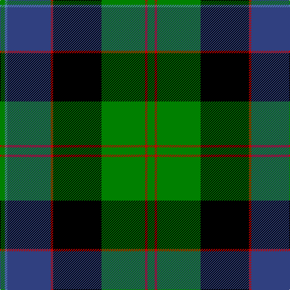

In pattern [GBBRKGRG](/patterns/gbbrkgrg/).

This was sourced from weddslist.  It is a [8 stripes tartan](/stripes/stripes8/).

Original link http://www.weddslist.com/cgi-bin/tartans/pg.pl?source=sts

## Thread count
G/8 Ba4 B72 R4 K80 G72 R4 G/12

## Palette
Each colour and its ΔE from the base-6 reference it is a variant of.

| Colour | Shade | Base | ΔE (OKLab) |
|---|---|---|---|
| B | <code style="background-color:#304080;">#304080</code> `#304080` | B <code style="background-color:#2C4084;">#2C4084</code> | 0.01 |
| Ba | <code style="background-color:#5480B0;">#5480B0</code> `#5480B0` | B <code style="background-color:#2C4084;">#2C4084</code> | 0.20 |
| G | <code style="background-color:#008000;">#008000</code> `#008000` | G <code style="background-color:#006400;">#006400</code> | 0.09 |
| K | <code style="background-color:#000000;">#000000</code> `#000000` | K <code style="background-color:#000000;">#000000</code> | 0.00 |
| R | <code style="background-color:#C00000;">#C00000</code> `#C00000` | R <code style="background-color:#C80000;">#C80000</code> | 0.02 |

# Sample pattern

## Nearest tartans

The nearest existing variants by ΔTartan distance.

1. [Ogilvie, of Inverquharity](/setts/s8/b56y2b4k52g48k2g4r6-b304080-g008000-k000000-rc00000-yf0c000/) — ΔT 0.61
1. [Whitson](/setts/s8/w8k2g36k34b26r2b6r2-b304080-g008000-k000000-rc00000-we0e0e0/) — ΔT 0.70
1. [MacCaskill](/setts/s7/k4r2g30k30b30y2k4-b304080-g008000-k000000-rc00000-yf0c000/) — ΔT 0.71
1. [Black Gold](/setts/s9/g6k6g6k36b56w2ga44k4g4-b3c5070-g604000-ga008b45-k000000-wffffff/) — ΔT 0.74
1. [Ogilvie 1](/setts/s9/b48y4k16g32k2g6k2g6r8-b304080-g008000-k000000-rc00000-yf0c000/) — ΔT 0.81
1. [Colquhoun](/setts/s7/b8k4b32w2k16g48r8-b304080-g008000-k000000-rc00000-we0e0e0/) — ΔT 0.89
1. [MacDonell of Glengarry](/setts/s11/b32r10b60r4k66g60r10g4r4g14w4-b304080-g008000-k000000-rc00000-we0e0e0/) — ΔT 0.98
1. [Clerke of Ulva](/setts/s11/b6g6k8g28k8g6k28ba36r2ba8r4-b5480b0-ba304080-g008000-k000000-r900030/) — ΔT 0.99
1. [Baird](/setts/s8/r7g3r2g33k31b31k3b3-b304080-g008000-k000000-r900030/) — ΔT 1.03
1. [Ogilvy Hunting](/setts/s9/b48y4k16g32k2g6k2g6r8-b00004c-g004c00-k000000-rc80000-yffc800/) — ΔT 1.03

## Neighbour map

Every grey dot is one of 15726 variants placed by the first two principal components of the ΔTartan feature space (44% of its variance). Red is this tartan; blue dots are its nearest — click one to open its page.

<svg viewBox="0 0 640 380" role="img" style="max-width:100%;height:auto;border:1px solid #e0e0e0;border-radius:4px;display:block" xmlns="http://www.w3.org/2000/svg"><image href="/nn/cloud.v1.png" width="640" height="380"/><a href="/setts/s8/b56y2b4k52g48k2g4r6-b304080-g008000-k000000-rc00000-yf0c000/"><circle cx="195.2" cy="126.2" r="4" fill="#3465a4"><title>Ogilvie, of Inverquharity</title></circle></a><a href="/setts/s8/w8k2g36k34b26r2b6r2-b304080-g008000-k000000-rc00000-we0e0e0/"><circle cx="137.8" cy="143.2" r="4" fill="#3465a4"><title>Whitson</title></circle></a><a href="/setts/s7/k4r2g30k30b30y2k4-b304080-g008000-k000000-rc00000-yf0c000/"><circle cx="173.4" cy="165.8" r="4" fill="#3465a4"><title>MacCaskill</title></circle></a><a href="/setts/s9/g6k6g6k36b56w2ga44k4g4-b3c5070-g604000-ga008b45-k000000-wffffff/"><circle cx="184.1" cy="120.4" r="4" fill="#3465a4"><title>Black Gold</title></circle></a><a href="/setts/s9/b48y4k16g32k2g6k2g6r8-b304080-g008000-k000000-rc00000-yf0c000/"><circle cx="204.9" cy="124.5" r="4" fill="#3465a4"><title>Ogilvie 1</title></circle></a><a href="/setts/s7/b8k4b32w2k16g48r8-b304080-g008000-k000000-rc00000-we0e0e0/"><circle cx="208.1" cy="146.8" r="4" fill="#3465a4"><title>Colquhoun</title></circle></a><a href="/setts/s11/b32r10b60r4k66g60r10g4r4g14w4-b304080-g008000-k000000-rc00000-we0e0e0/"><circle cx="152.6" cy="132.6" r="4" fill="#3465a4"><title>MacDonell of Glengarry</title></circle></a><a href="/setts/s11/b6g6k8g28k8g6k28ba36r2ba8r4-b5480b0-ba304080-g008000-k000000-r900030/"><circle cx="142.3" cy="142.6" r="4" fill="#3465a4"><title>Clerke of Ulva</title></circle></a><a href="/setts/s8/r7g3r2g33k31b31k3b3-b304080-g008000-k000000-r900030/"><circle cx="174.1" cy="168.1" r="4" fill="#3465a4"><title>Baird</title></circle></a><a href="/setts/s9/b48y4k16g32k2g6k2g6r8-b00004c-g004c00-k000000-rc80000-yffc800/"><circle cx="219.7" cy="135.6" r="4" fill="#3465a4"><title>Ogilvy Hunting</title></circle></a><circle cx="184.0" cy="141.5" r="5" fill="#c00000"/></svg>

ID: /setts/s8/g12r4g72k80r4b72ba4g8-b304080-ba5480b0-g008000-k000000-rc00000/
