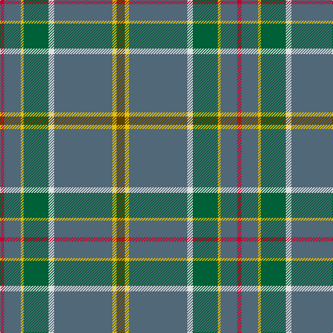

In pattern [GYBWGYBR](/patterns/gybwgybr/).

This was sourced from tartans-authority.  It is a [8 stripes tartan](/stripes/stripes8/).

Original link http://www.tartansauthority.com/tartan-ferret/display/7480/

## Attestations

This cloth appears in 2 source records; the oldest owns this page.

- July 2007 — Glasgow High (School) (tartans-authority, [record](http://www.tartansauthority.com/tartan-ferret/display/7480/))
- undated — Glasgow High School (register-of-tartans, [record](https://www.tartanregister.gov.uk/tartanDetails.aspx?ref=5522))

## Thread count
R/6 N24 Y4 G36 LN8 N84 Y6 T/12

## Palette
Each colour and its ΔE from the base-6 reference it is a variant of.

| Colour | Shade | Base | ΔE (OKLab) |
|---|---|---|---|
| G | <code style="background-color:#006038;">#006038</code> `#006038` | G <code style="background-color:#006400;">#006400</code> | 0.06 |
| LN | <code style="background-color:#E0E0E0;">#E0E0E0</code> `#E0E0E0` | W <code style="background-color:#F4F4F0;">#F4F4F0</code> | 0.06 |
| N | <code style="background-color:#506878;">#506878</code> `#506878` | B <code style="background-color:#2C4084;">#2C4084</code> | 0.14 |
| R | <code style="background-color:#C8002C;">#C8002C</code> `#C8002C` | R <code style="background-color:#C80000;">#C80000</code> | 0.03 |
| T | <code style="background-color:#604000;">#604000</code> `#604000` | G <code style="background-color:#006400;">#006400</code> | 0.14 |
| Y | <code style="background-color:#E8C000;">#E8C000</code> `#E8C000` | Y <code style="background-color:#E8C000;">#E8C000</code> | 0.00 |

# Sample pattern

## Nearest tartans

The nearest existing variants by ΔTartan distance.

1. [Muskoka (District)](/setts/s8/w4g10b20g40r2y4ra4y2-b5c8ca8-g408060-rc80000-raa00000-we0e0e0-ye8c000/) — ΔT 0.92
1. [Kansai St Andrews Society (Corp)](/setts/s10/b66w4r6w4ba28ra6g30b40r4b6-b506878-ba2c2c80-g30644c-rc80000-rae87878-wfcfcfc/) — ΔT 1.09
1. [Canuck Place](/setts/s9/w2b4y30b6y52r48y6ra4ya2-b1c1c50-r9c8098-ra901c38-we0e0e0-y889c5c-yabc8c00/) — ΔT 1.31
1. [Bressuire (District)](/setts/s7/r4g16y4g12r16b60w4-b506878-g006818-r880000-we0e0e0-ybc8c00/) — ΔT 1.38
1. [Nickel Lodge, Centennial](/setts/s9/g36y2g4y2g4b12w8r2ga12-b304080-g808080-ga008000-r806050-we0e0e0-yf0c000/) — ΔT 1.39
1. [Carbon (Corporate)](/setts/s9/b68k4b18r20k3w3k10wa8y4-b5c5c5c-k101010-r888888-we0e0e0-wac0c0c0-yfcb464/) — ΔT 1.40
1. [Portree, Check](/setts/s12/g76b8g16r4g8w6g8ra28ba14g4ba8w4-b304080-ba505050-g808080-r906030-ra802040-we0e0e0/) — ΔT 1.42
1. [Edinburgh Fire (Corporate)](/setts/s7/y8g16r16b84w4b4ra4-b506078-g604000-rc80000-racc4438-we0e0e0-ye8c000/) — ΔT 1.43
1. [State Seal of Arkansas (Fashion)](/setts/s10/b98y6g26b24r8b10k14ga52b8r4-b003c64-g604000-ga5c6428-k101010-rc80000-ybc8c00/) — ΔT 1.44
1. [Wagland](/setts/s7/r6b12y4b30g24ga78w6-b304080-g004010-ga407040-rc00000-we0e0e0-yf0c000/) — ΔT 1.44

## Neighbour map

Every grey dot is one of 15726 variants placed by the first two principal components of the ΔTartan feature space (44% of its variance). Red is this tartan; blue dots are its nearest — click one to open its page.

<svg viewBox="0 0 640 380" role="img" style="max-width:100%;height:auto;border:1px solid #e0e0e0;border-radius:4px;display:block" xmlns="http://www.w3.org/2000/svg"><image href="/nn/cloud.v1.png" width="640" height="380"/><a href="/setts/s8/w4g10b20g40r2y4ra4y2-b5c8ca8-g408060-rc80000-raa00000-we0e0e0-ye8c000/"><circle cx="357.6" cy="145.6" r="4" fill="#3465a4"><title>Muskoka (District)</title></circle></a><a href="/setts/s10/b66w4r6w4ba28ra6g30b40r4b6-b506878-ba2c2c80-g30644c-rc80000-rae87878-wfcfcfc/"><circle cx="327.8" cy="149.0" r="4" fill="#3465a4"><title>Kansai St Andrews Society (Corp)</title></circle></a><a href="/setts/s9/w2b4y30b6y52r48y6ra4ya2-b1c1c50-r9c8098-ra901c38-we0e0e0-y889c5c-yabc8c00/"><circle cx="380.6" cy="131.2" r="4" fill="#3465a4"><title>Canuck Place</title></circle></a><a href="/setts/s7/r4g16y4g12r16b60w4-b506878-g006818-r880000-we0e0e0-ybc8c00/"><circle cx="329.2" cy="177.1" r="4" fill="#3465a4"><title>Bressuire (District)</title></circle></a><a href="/setts/s9/g36y2g4y2g4b12w8r2ga12-b304080-g808080-ga008000-r806050-we0e0e0-yf0c000/"><circle cx="282.8" cy="126.1" r="4" fill="#3465a4"><title>Nickel Lodge, Centennial</title></circle></a><a href="/setts/s9/b68k4b18r20k3w3k10wa8y4-b5c5c5c-k101010-r888888-we0e0e0-wac0c0c0-yfcb464/"><circle cx="359.8" cy="112.5" r="4" fill="#3465a4"><title>Carbon (Corporate)</title></circle></a><a href="/setts/s12/g76b8g16r4g8w6g8ra28ba14g4ba8w4-b304080-ba505050-g808080-r906030-ra802040-we0e0e0/"><circle cx="378.3" cy="120.5" r="4" fill="#3465a4"><title>Portree, Check</title></circle></a><a href="/setts/s7/y8g16r16b84w4b4ra4-b506078-g604000-rc80000-racc4438-we0e0e0-ye8c000/"><circle cx="405.7" cy="126.4" r="4" fill="#3465a4"><title>Edinburgh Fire (Corporate)</title></circle></a><a href="/setts/s10/b98y6g26b24r8b10k14ga52b8r4-b003c64-g604000-ga5c6428-k101010-rc80000-ybc8c00/"><circle cx="353.7" cy="141.2" r="4" fill="#3465a4"><title>State Seal of Arkansas (Fashion)</title></circle></a><a href="/setts/s7/r6b12y4b30g24ga78w6-b304080-g004010-ga407040-rc00000-we0e0e0-yf0c000/"><circle cx="276.8" cy="150.8" r="4" fill="#3465a4"><title>Wagland</title></circle></a><circle cx="363.2" cy="144.3" r="5" fill="#c00000"/></svg>

ID: /setts/s8/g12y6b84w8ga36y4b24r6-b506878-g604000-ga006038-rc8002c-we0e0e0-ye8c000/
