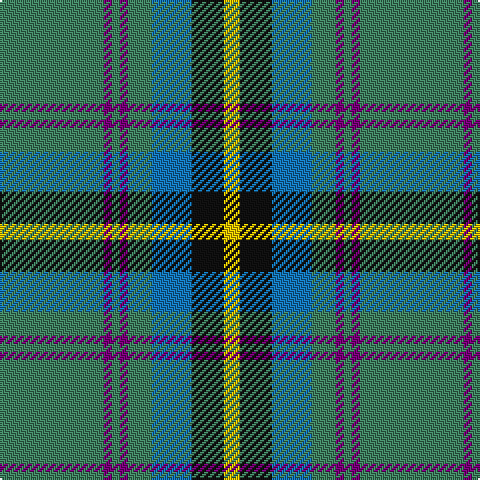

In pattern [GBGBGBKY](/stripes/gbgbgbky/).

This was sourced from register-of-tartans.  It is a [8 stripe tartan](/stripes/stripes8/).

Original link https://www.tartanregister.gov.uk/tartanDetails.aspx?ref=577

## Also known as

This cloth is also recorded under:

- Carrick Hunting
- Carrick, hunting

## Attestations

This cloth appears in 2 source records; the oldest owns this page.

- 01/01/1930 — Carrick Hunting (Personal) (register-of-tartans, [record](https://www.tartanregister.gov.uk/tartanDetails.aspx?ref=577))
- 1930 — Carrick Htg (Clan) (tartans-authority, [record](http://www.tartansauthority.com/tartan-ferret/display/721/))

## Register references

External register numbers recorded for this tartan.

- Scottish Register of Tartans: [577](https://www.tartanregister.gov.uk/tartanDetails.aspx?ref=577)
- Scottish Tartans Authority (ITI): 721
- Scottish Tartans World Register: 721

## Thread count
G/52 P4 G4 P4 G12 B20 K16 Y/8

## Palette
Each colour and the base-6 reference it is a variant of.

| Colour | Shade | Base |
|---|---|---|
| B | <code style="background-color:#1474B4;">#1474B4</code> `oklch(54.0% 0.129 245.1)` <small>#1474B4</small> | B <code style="background-color:#2A418A;">#2A418A</code> |
| G | <code style="background-color:#408060;">#408060</code> `oklch(54.8% 0.084 160.1)` <small>#408060</small> | G <code style="background-color:#006100;">#006100</code> |
| K | <code style="background-color:#101010;">#101010</code> `oklch(17.3% 0.000 89.9)` <small>#101010</small> | K <code style="background-color:#000000;">#000000</code> |
| P | <code style="background-color:#780078;">#780078</code> `oklch(40.2% 0.185 328.4)` <small>#780078</small> | B <code style="background-color:#2A418A;">#2A418A</code> |
| Y | <code style="background-color:#E8C000;">#E8C000</code> `oklch(81.9% 0.168 93.7)` <small>#E8C000</small> | Y <code style="background-color:#F2BF00;">#F2BF00</code> |

# Sample pattern

## Nearest tartans

The nearest existing variants by ΔTartan distance.

1. [Bahamas](/setts/s8/n8ly2n22dg6r2lb10dg12n3~x2/) — ΔT 0.94
1. [Carrick Hunting District Tartan Tartan Number: 721. Earliest known date: 1930 This sample comes from the MacGregor-Hastie collection which forms the basis of the cloth archive of the Scottish Tartans Society. Some of the samples, including this one, were unmarked. One can assume that the sample dates between 1930 and 1950. See products available Copyright © Blair Urquhart, Comrie, 2015](/setts/s8/g13dp1g1dp1g3db5k4ly2~x2/) — ΔT 0.98
1. [Boucherville (Tartan de..) District Tartan Tartan Number: 2119. Earliest known date: 1990 From the notes accompanying the petition for accreditation. "Les symboles ont cette remarquable propriete de reunir en une expression imagee des notions diverses. Ils refletent l'histoire, les croyances, les idealogies et les aspirations de groupes humains habitant un territoire precis. Les tisserands, c'est nous tous....!" See products available Copyright © Blair Urquhart, Comrie, 2015](/setts/s9/g20ly2o5w4g2o2g2o2db6~x2/) — ΔT 1.02
1. [Allanton (Fashion)](/setts/s6/t4g16ly2db7t28w4~x2/) — ΔT 1.06
1. [Wynberg Boys' High School](/setts/s9/w4r13g54dg22k4y20g48r13w4/) — ΔT 1.07
1. [Tennessee](/setts/s10/r2db10w1m1g1r1g6m1g10w1~x2/) — ΔT 1.07
1. [MacConnell](/setts/s10/db22g6db5t2g22r6g5r4g9w3~x2/) — ΔT 1.08
1. [Montreat](/setts/s11/lo2n10k2r5k2n19k2n19g17k2lo2~x2/) — ΔT 1.11
1. [Donegal Irish County Tartan Tartan Number: 2247. Earliest known date: 1996 One of a series of Irish District tartans designed by Polly Wittering of the House of Edgar, with colours reminiscent of the Country with soft warm colours dominating. See products available Copyright © Blair Urquhart, Comrie, 2015](/setts/s10/lo3g17n3g3n3k5n18r2n8r2~x2/) — ΔT 1.12
1. [MacWilliam](/setts/s8/dy2g12k10r1b16r2b16r1~x4/) — ΔT 1.13

## Neighbour map

Every grey dot is one of 14299 variants placed by the first two principal components of the ΔTartan feature space (44% of its variance). Red is this tartan; blue dots are its nearest — click one to open its page.

<svg viewBox="0 0 640 380" role="img" style="max-width:100%;height:auto;border:1px solid #e0e0e0;border-radius:4px;display:block" xmlns="http://www.w3.org/2000/svg"><image href="/nn/cloud.v1.png" width="640" height="380"/><a href="/setts/s8/n8ly2n22dg6r2lb10dg12n3~x2/"><circle cx="249.2" cy="195.7" r="4" fill="#3465a4"><title>Bahamas</title></circle></a><a href="/setts/s8/g13dp1g1dp1g3db5k4ly2~x2/"><circle cx="289.3" cy="173.1" r="4" fill="#3465a4"><title>Carrick Hunting District Tartan Tartan Number: 721. Earliest known date: 1930 This sample comes from the MacGregor-Hastie collection which forms the basis of the cloth archive of the Scottish Tartans Society. Some of the samples, including this one, were unmarked. One can assume that the sample dates between 1930 and 1950. See products available Copyright © Blair Urquhart, Comrie, 2015</title></circle></a><a href="/setts/s9/g20ly2o5w4g2o2g2o2db6~x2/"><circle cx="258.4" cy="163.8" r="4" fill="#3465a4"><title>Boucherville (Tartan de..) District Tartan Tartan Number: 2119. Earliest known date: 1990 From the notes accompanying the petition for accreditation. &quot;Les symboles ont cette remarquable propriete de reunir en une expression imagee des notions diverses. Ils refletent l'histoire, les croyances, les idealogies et les aspirations de groupes humains habitant un territoire precis. Les tisserands, c'est nous tous....!&quot; See products available Copyright © Blair Urquhart, Comrie, 2015</title></circle></a><a href="/setts/s6/t4g16ly2db7t28w4~x2/"><circle cx="281.5" cy="189.8" r="4" fill="#3465a4"><title>Allanton (Fashion)</title></circle></a><a href="/setts/s9/w4r13g54dg22k4y20g48r13w4/"><circle cx="267.3" cy="162.0" r="4" fill="#3465a4"><title>Wynberg Boys' High School</title></circle></a><a href="/setts/s10/r2db10w1m1g1r1g6m1g10w1~x2/"><circle cx="247.3" cy="162.6" r="4" fill="#3465a4"><title>Tennessee</title></circle></a><a href="/setts/s10/db22g6db5t2g22r6g5r4g9w3~x2/"><circle cx="246.6" cy="180.2" r="4" fill="#3465a4"><title>MacConnell</title></circle></a><a href="/setts/s11/lo2n10k2r5k2n19k2n19g17k2lo2~x2/"><circle cx="286.2" cy="171.3" r="4" fill="#3465a4"><title>Montreat</title></circle></a><a href="/setts/s10/lo3g17n3g3n3k5n18r2n8r2~x2/"><circle cx="249.0" cy="184.4" r="4" fill="#3465a4"><title>Donegal Irish County Tartan Tartan Number: 2247. Earliest known date: 1996 One of a series of Irish District tartans designed by Polly Wittering of the House of Edgar, with colours reminiscent of the Country with soft warm colours dominating. See products available Copyright © Blair Urquhart, Comrie, 2015</title></circle></a><a href="/setts/s8/dy2g12k10r1b16r2b16r1~x4/"><circle cx="274.5" cy="180.7" r="4" fill="#3465a4"><title>MacWilliam</title></circle></a><circle cx="293.4" cy="171.5" r="5" fill="#c00000"/></svg>

ID: /setts/s8/g13dp1g1dp1g3b5k4ly2~x4/
