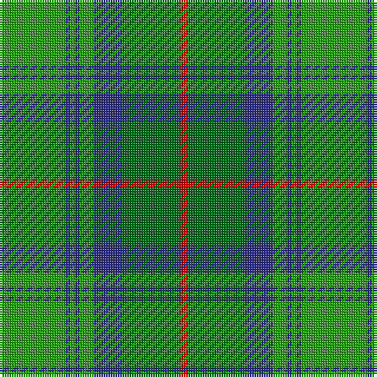

In pattern [GBGBGBGR](/patterns/gbgbgbgr/).

This was sourced from house-of-tartan.  It is a [8 stripes tartan](/stripes/stripes8/).

Original link http://www.house-of-tartan.scotland.net/house/TartanViewjs.asp?colr=Def&tnam=706

## Thread count
Ga/28 DB2 Ga2 DB2 Ga6 DB12 G24 R/4

## Palette
Each colour and its ΔE from the base-6 reference it is a variant of.

| Colour | Shade | Base | ΔE (OKLab) |
|---|---|---|---|
| DB | <code style="background-color:#2C2C80;">#2C2C80</code> `#2C2C80` | B <code style="background-color:#2A418A;">#2A418A</code> | 0.06 |
| G | <code style="background-color:#006818;">#006818</code> `#006818` | G <code style="background-color:#006100;">#006100</code> | 0.02 |
| Ga | <code style="background-color:#289C18;">#289C18</code> `#289C18` | G <code style="background-color:#006100;">#006100</code> | 0.19 |
| R | <code style="background-color:#C80000;">#C80000</code> `#C80000` | R <code style="background-color:#CC0000;">#CC0000</code> | 0.01 |

# Sample pattern

## Nearest tartans

The nearest existing variants by ΔTartan distance.

1. [Valley, of the Green. (The )](/setts/s7/b4g26ga8b8ga8gb3b2~b5480b0-g003000-ga008000-gb30a010~x2/) — ΔT 0.84
1. [Cranstoun](/setts/s8/g14b1g1b1g3b6ga12r2~b304080-g30a010-ga008000-rc00000~x2/) — ΔT 0.88
1. [Dalwhinnie](/setts/s9/g70y6ya28ga56ya5ga11ya5ga11r12~g004c00-ga288028-rc80000-yffd700-yaa0a0a0/) — ΔT 1.22
1. [Dalwhinnie Trade Tartan Tartan Number: 1018. Earliest known date: 1982 Reconstructed and woven by Don Rankin from illustration. Sample in STS collection. See products available Copyright © Blair Urquhart, Comrie, 2015](/setts/s9/g70y6r28ga56r5ga11r5ga11ya12~g003820-ga289c18-r888888-ye8c000-yad87c00/) — ΔT 1.24
1. [Valley of the Green (The ) Canadian Tartan Tartan Number: 148. Earliest known date: 1968 Specimen from Miss K Sinclair 1968 See products available Copyright © Blair Urquhart, Comrie, 2015](/setts/s7/b4g26ga8b8ga8gb3b2~b5c8ca8-g003820-ga006818-gb289c18~x2/) — ΔT 1.25
1. [Dalwhinnie (Fashion)](/setts/s9/g70y6ya28ga56ya5ga11ya5ga11r12~g004c00-ga288028-rc80000-ye8c000-yaa0a0a0/) — ΔT 1.25
1. [Dalwhinnie](/setts/s9/g70y6ga28gb56ga5gb11ga5gb11ya12~g003000-ga808080-gb008000-yf0c000-yaff8500/) — ΔT 1.30
1. [Cork](/setts/s9/g28r12g4b20y2b3y2b3g7~b304080-g008000-rc00000-yf0c000~x2/) — ΔT 1.33
1. [Leatherneck, U.S.Marine Corps](/setts/s8/g28r2g2r2g8b24ga3r2~b304080-g008000-ga908000-rc00000~x2/) — ΔT 1.36
1. [New World Irish (Fashion)](/setts/s8/w9g2ga2w3ga18k2g33y2~g005834-ga006818-k101010-we0e0e0-yd87c00~x2/) — ΔT 1.37

## Neighbour map

Every grey dot is one of 15726 variants placed by the first two principal components of the ΔTartan feature space (44% of its variance). Red is this tartan; blue dots are its nearest — click one to open its page.

<svg viewBox="0 0 640 380" role="img" style="max-width:100%;height:auto;border:1px solid #e0e0e0;border-radius:4px;display:block" xmlns="http://www.w3.org/2000/svg"><image href="/nn/cloud.v1.png" width="640" height="380"/><a href="/setts/s7/b4g26ga8b8ga8gb3b2~b5480b0-g003000-ga008000-gb30a010~x2/"><circle cx="249.6" cy="205.8" r="4" fill="#3465a4"><title>Valley, of the Green. (The )</title></circle></a><a href="/setts/s8/g14b1g1b1g3b6ga12r2~b304080-g30a010-ga008000-rc00000~x2/"><circle cx="278.6" cy="196.2" r="4" fill="#3465a4"><title>Cranstoun</title></circle></a><a href="/setts/s9/g70y6ya28ga56ya5ga11ya5ga11r12~g004c00-ga288028-rc80000-yffd700-yaa0a0a0/"><circle cx="219.5" cy="163.9" r="4" fill="#3465a4"><title>Dalwhinnie</title></circle></a><a href="/setts/s9/g70y6r28ga56r5ga11r5ga11ya12~g003820-ga289c18-r888888-ye8c000-yad87c00/"><circle cx="200.3" cy="157.0" r="4" fill="#3465a4"><title>Dalwhinnie Trade Tartan Tartan Number: 1018. Earliest known date: 1982 Reconstructed and woven by Don Rankin from illustration. Sample in STS collection. See products available Copyright © Blair Urquhart, Comrie, 2015</title></circle></a><a href="/setts/s7/b4g26ga8b8ga8gb3b2~b5c8ca8-g003820-ga006818-gb289c18~x2/"><circle cx="275.9" cy="216.2" r="4" fill="#3465a4"><title>Valley of the Green (The ) Canadian Tartan Tartan Number: 148. Earliest known date: 1968 Specimen from Miss K Sinclair 1968 See products available Copyright © Blair Urquhart, Comrie, 2015</title></circle></a><a href="/setts/s9/g70y6ya28ga56ya5ga11ya5ga11r12~g004c00-ga288028-rc80000-ye8c000-yaa0a0a0/"><circle cx="223.6" cy="165.7" r="4" fill="#3465a4"><title>Dalwhinnie (Fashion)</title></circle></a><a href="/setts/s9/g70y6ga28gb56ga5gb11ga5gb11ya12~g003000-ga808080-gb008000-yf0c000-yaff8500/"><circle cx="203.7" cy="159.6" r="4" fill="#3465a4"><title>Dalwhinnie</title></circle></a><a href="/setts/s9/g28r12g4b20y2b3y2b3g7~b304080-g008000-rc00000-yf0c000~x2/"><circle cx="272.0" cy="175.9" r="4" fill="#3465a4"><title>Cork</title></circle></a><a href="/setts/s8/g28r2g2r2g8b24ga3r2~b304080-g008000-ga908000-rc00000~x2/"><circle cx="338.9" cy="183.2" r="4" fill="#3465a4"><title>Leatherneck, U.S.Marine Corps</title></circle></a><a href="/setts/s8/w9g2ga2w3ga18k2g33y2~g005834-ga006818-k101010-we0e0e0-yd87c00~x2/"><circle cx="267.4" cy="146.8" r="4" fill="#3465a4"><title>New World Irish (Fashion)</title></circle></a><circle cx="263.2" cy="189.6" r="5" fill="#c00000"/></svg>

ID: /setts/s8/g14b1g1b1g3b6ga12r2~b2c2c80-g289c18-ga006818-rc80000~x2/
