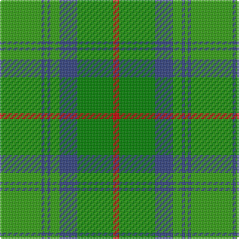

In pattern [GBGBGBGR](/stripes/gbgbgbgr/).

This was sourced from weddslist.  It is a [8 stripe tartan](/stripes/stripes8/).

Original link http://www.weddslist.com/cgi-bin/tartans/pg.pl?source=sts

## Attestations

This cloth appears in 2 source records; the oldest owns this page.

- undated — Cranstoun (weddslist, [record](http://www.weddslist.com/cgi-bin/tartans/pg.pl?source=sts))
- undated — Cranstoun Clan Tartan Tartan Number: 706. Earliest known date: 1842 References: The Setts No: 35. W & A K Johnston, 1906. D.C.Stewart (The Setts of the Scottish Tartans, 1950) would have the light green and dark green transposed but this does not correspond to the Vestiarium Scoticum, the only known source for the tartan. The VS version is shown. See products available Copyright © Blair Urquhart, Comrie, 2015 (house-of-tartan, [record](http://www.house-of-tartan.scotland.net/house/TartanViewjs.asp?colr=Def&tnam=706))

## Thread count
G/28 B2 G2 B2 G6 B12 Ga24 R/4

## Palette
Each colour and the base-6 reference it is a variant of.

| Colour | Shade | Base |
|---|---|---|
| B | <code style="background-color:#304080;">#304080</code> `oklch(39.4% 0.109 270.2)` <small>#304080</small> | B <code style="background-color:#2A418A;">#2A418A</code> |
| G | <code style="background-color:#30A010;">#30A010</code> `oklch(61.9% 0.195 140.5)` <small>#30A010</small> | G <code style="background-color:#006100;">#006100</code> |
| Ga | <code style="background-color:#008000;">#008000</code> `oklch(52.0% 0.177 142.5)` <small>#008000</small> | G <code style="background-color:#006100;">#006100</code> |
| R | <code style="background-color:#C00000;">#C00000</code> `oklch(50.7% 0.208 29.2)` <small>#C00000</small> | R <code style="background-color:#CC0000;">#CC0000</code> |

# Sample pattern

## Nearest tartans

The nearest existing variants by ΔTartan distance, with this tartan at the top so the swatches line up against it.

ΔTartan

Tartan

Sett

—

<a href="/ttd/edit/#slug=g14db1g1db1g3db6g12r2~x2">Cranstoun</a> <a class="nn-out" href="/setts/s8/g14db1g1db1g3db6g12r2~x2/" title="open its dictionary page">↗</a>

1.22

<a href="/ttd/edit/#slug=r3g2g32g32g2w3~x2">Galloway Hunting</a> <a class="nn-out" href="/setts/s6/r3g2g32g32g2w3~x2/" title="open its dictionary page">↗</a>

1.40

<a href="/ttd/edit/#slug=dg70ly6lr28g56lr5g11lr5g11r12">Dalwhinnie</a> <a class="nn-out" href="/setts/s9/dg70ly6lr28g56lr5g11lr5g11r12/" title="open its dictionary page">↗</a>

1.43

<a href="/ttd/edit/#slug=g2lo1g12lb6g12r1~x4">City of Vancouver (Commemorative)</a> <a class="nn-out" href="/setts/s6/g2lo1g12lb6g12r1~x4/" title="open its dictionary page">↗</a>

1.46

<a href="/ttd/edit/#slug=g18w1g4w1lo4g1lo2g12r2g4~x2">Michigan, State of (District)</a> <a class="nn-out" href="/setts/s10/g18w1g4w1lo4g1lo2g12r2g4~x2/" title="open its dictionary page">↗</a>

1.49

<a href="/ttd/edit/#slug=t12g2t2g2t2dy8g8dy1~x2">Universal Ancient International Tartan Tartan Number: 136. Earliest known date: Canada This design is different in warp and weft. The display gives the general appearance only. Produced to celebrate American tourism is Scotland. The colours are taken from the flags of the two nations and the Atlantic Ocean that separates them. See products available Copyright © Blair Urquhart, Comrie, 2015</a> <a class="nn-out" href="/setts/s8/t12g2t2g2t2dy8g8dy1~x2/" title="open its dictionary page">↗</a>

1.51

<a href="/ttd/edit/#slug=g14t2g2t2g3t6g12r2~x2">Cranston</a> <a class="nn-out" href="/setts/s8/g14t2g2t2g3t6g12r2~x2/" title="open its dictionary page">↗</a>

1.55

<a href="/ttd/edit/#slug=t4dg26g8t8g8g3t2~x2">Valley, of the Green. (The )</a> <a class="nn-out" href="/setts/s7/t4dg26g8t8g8g3t2~x2/" title="open its dictionary page">↗</a>

1.69

<a href="/ttd/edit/#slug=t12dg2t2dg2t2dy8g8dy1~x2">Universal Ancient</a> <a class="nn-out" href="/setts/s8/t12dg2t2dg2t2dy8g8dy1~x2/" title="open its dictionary page">↗</a>

1.71

<a href="/ttd/edit/#slug=dg70ly6o28g56o5g11o5g11lo12">Dalwhinnie Trade Tartan Tartan Number: 1018. Earliest known date: 1982 Reconstructed and woven by Don Rankin from illustration. Sample in STS collection. See products available Copyright © Blair Urquhart, Comrie, 2015</a> <a class="nn-out" href="/setts/s9/dg70ly6o28g56o5g11o5g11lo12/" title="open its dictionary page">↗</a>

1.74

<a href="/ttd/edit/#slug=g20ly2o5w4g2o2g2o2b6~x2">Boucherville</a> <a class="nn-out" href="/setts/s9/g20ly2o5w4g2o2g2o2b6~x2/" title="open its dictionary page">↗</a>

## Neighbour map

Every grey dot is one of 14299 variants placed by the first two principal components of the ΔTartan feature space (44% of its variance). Red is this tartan; blue dots are its nearest — click one to open its page.

<svg viewBox="0 0 640 380" role="img" style="max-width:100%;height:auto;border:1px solid #e0e0e0;border-radius:4px;display:block" xmlns="http://www.w3.org/2000/svg"><image href="/nn/cloud.v1.png" width="640" height="380"/><a href="/setts/s6/r3g2g32g32g2w3~x2/"><circle cx="342.7" cy="206.2" r="4" fill="#3465a4"><title>Galloway Hunting</title></circle></a><a href="/setts/s9/dg70ly6lr28g56lr5g11lr5g11r12/"><circle cx="222.1" cy="170.4" r="4" fill="#3465a4"><title>Dalwhinnie</title></circle></a><a href="/setts/s6/g2lo1g12lb6g12r1~x4/"><circle cx="246.3" cy="214.5" r="4" fill="#3465a4"><title>City of Vancouver (Commemorative)</title></circle></a><a href="/setts/s10/g18w1g4w1lo4g1lo2g12r2g4~x2/"><circle cx="280.8" cy="156.1" r="4" fill="#3465a4"><title>Michigan, State of (District)</title></circle></a><a href="/setts/s8/t12g2t2g2t2dy8g8dy1~x2/"><circle cx="265.0" cy="221.6" r="4" fill="#3465a4"><title>Universal Ancient International Tartan Tartan Number: 136. Earliest known date: Canada This design is different in warp and weft. The display gives the general appearance only. Produced to celebrate American tourism is Scotland. The colours are taken from the flags of the two nations and the Atlantic Ocean that separates them. See products available Copyright © Blair Urquhart, Comrie, 2015</title></circle></a><a href="/setts/s8/g14t2g2t2g3t6g12r2~x2/"><circle cx="270.7" cy="251.0" r="4" fill="#3465a4"><title>Cranston</title></circle></a><a href="/setts/s7/t4dg26g8t8g8g3t2~x2/"><circle cx="252.8" cy="210.6" r="4" fill="#3465a4"><title>Valley, of the Green. (The )</title></circle></a><a href="/setts/s8/t12dg2t2dg2t2dy8g8dy1~x2/"><circle cx="254.6" cy="218.9" r="4" fill="#3465a4"><title>Universal Ancient</title></circle></a><a href="/setts/s9/dg70ly6o28g56o5g11o5g11lo12/"><circle cx="203.3" cy="161.5" r="4" fill="#3465a4"><title>Dalwhinnie Trade Tartan Tartan Number: 1018. Earliest known date: 1982 Reconstructed and woven by Don Rankin from illustration. Sample in STS collection. See products available Copyright © Blair Urquhart, Comrie, 2015</title></circle></a><a href="/setts/s9/g20ly2o5w4g2o2g2o2b6~x2/"><circle cx="271.9" cy="170.5" r="4" fill="#3465a4"><title>Boucherville</title></circle></a><circle cx="281.1" cy="203.5" r="5" fill="#c00000"/></svg>

ID: /setts/s8/g14db1g1db1g3db6g12r2~x2/
