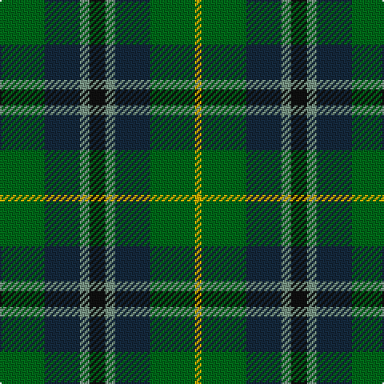

This page is one **sett** — a single exact thread-count. It belongs to the [tartan](/tartans/g14dt11y3k5y3dt11g14ly2/)
(the same proportion at any scale), whose colour order is pattern [GBGKGBGY](/stripes/gbgkgbgy/).

Sourced from register-of-tartans.  It is a [8 stripe tartan](/stripes/stripes8/).

Original link https://www.tartanregister.gov.uk/tartanDetails.aspx?ref=4687

## Register references

External register numbers recorded for this tartan.

- Scottish Register of Tartans: [4687](https://www.tartanregister.gov.uk/tartanDetails.aspx?ref=4687)
- Scottish Tartans Authority (ITI): 5601

## Thread count
G/28 DN22 LG6 K10 LG6 DN22 G28 Y/4

## Palette

Palette: <strong>Tartan Register</strong>
<table><thead><tr><th>Colour</th><th>Threads</th><th>Shade</th><th>Base</th><th>OKLCh</th></tr></thead><tbody><tr><td>G/</td><td style="text-align:right;font-variant-numeric:tabular-nums">28</td><td><code style="background-color:#006818;">#006818</code> <small style="color:#888">#006818</small></td><td>G <code style="background-color:#006100;">#006100</code></td><td><small style="color:#888">oklch(45.0% 0.142 145.0)</small></td></tr><tr><td>DN</td><td style="text-align:right;font-variant-numeric:tabular-nums">22</td><td><code style="background-color:#14283C;">#14283C</code> <small style="color:#888">#14283C</small></td><td>B <code style="background-color:#2A418A;">#2A418A</code></td><td><small style="color:#888">oklch(27.1% 0.046 249.9)</small></td></tr><tr><td>LG</td><td style="text-align:right;font-variant-numeric:tabular-nums">6</td><td><code style="background-color:#789484;">#789484</code> <small style="color:#888">#789484</small></td><td>G <code style="background-color:#006100;">#006100</code></td><td><small style="color:#888">oklch(64.0% 0.040 160.0)</small></td></tr><tr><td>K</td><td style="text-align:right;font-variant-numeric:tabular-nums">10</td><td><code style="background-color:#101010;">#101010</code> <small style="color:#888">#101010</small></td><td>K <code style="background-color:#000000;">#000000</code></td><td><small style="color:#888">oklch(17.3% 0.000 89.9)</small></td></tr><tr><td>LG</td><td style="text-align:right;font-variant-numeric:tabular-nums">6</td><td><code style="background-color:#789484;">#789484</code> <small style="color:#888">#789484</small></td><td>G <code style="background-color:#006100;">#006100</code></td><td><small style="color:#888">oklch(64.0% 0.040 160.0)</small></td></tr><tr><td>DN</td><td style="text-align:right;font-variant-numeric:tabular-nums">22</td><td><code style="background-color:#14283C;">#14283C</code> <small style="color:#888">#14283C</small></td><td>B <code style="background-color:#2A418A;">#2A418A</code></td><td><small style="color:#888">oklch(27.1% 0.046 249.9)</small></td></tr><tr><td>G</td><td style="text-align:right;font-variant-numeric:tabular-nums">28</td><td><code style="background-color:#006818;">#006818</code> <small style="color:#888">#006818</small></td><td>G <code style="background-color:#006100;">#006100</code></td><td><small style="color:#888">oklch(45.0% 0.142 145.0)</small></td></tr><tr><td>Y/</td><td style="text-align:right;font-variant-numeric:tabular-nums">4</td><td><code style="background-color:#D8B000;">#D8B000</code> <small style="color:#888">#D8B000</small></td><td>Y <code style="background-color:#F2BF00;">#F2BF00</code></td><td><small style="color:#888">oklch(77.1% 0.158 92.3)</small></td></tr></tbody></table>

# Sample pattern

## Nearest tartans

The nearest existing variants by ΔTartan distance, with this tartan at the top so the swatches line up against it.

ΔTartan

Tartan

Sett

—

<a href="/ttd/edit/#slug=g14dt11y3k5y3dt11g14ly2~x2">Wilson's No.122</a> <a class="nn-out" href="/setts/s8/g14dt11y3k5y3dt11g14ly2~x2/" title="open its dictionary page">↗</a>

0.98

<a href="/ttd/edit/#slug=g28db9dg18w3dg18db9g28r3~x2">Simple Technology</a> <a class="nn-out" href="/setts/s8/g28db9dg18w3dg18db9g28r3~x2/" title="open its dictionary page">↗</a>

1.01

<a href="/ttd/edit/#slug=g10db42r5dg42g42ly5g10">New Mexico</a> <a class="nn-out" href="/setts/s7/g10db42r5dg42g42ly5g10/" title="open its dictionary page">↗</a>

1.16

<a href="/ttd/edit/#slug=g31dg7lo3dg14g8db18dp5~x2">Reidy Wedding</a> <a class="nn-out" href="/setts/s7/g31dg7lo3dg14g8db18dp5~x2/" title="open its dictionary page">↗</a>

1.20

<a href="/ttd/edit/#slug=g15r3t15r8g15ly2db4~x2">Rotary International</a> <a class="nn-out" href="/setts/s7/g15r3t15r8g15ly2db4~x2/" title="open its dictionary page">↗</a>

1.21

<a href="/ttd/edit/#slug=g31ly4g6k19db18t9~x2">Lanarkshire</a> <a class="nn-out" href="/setts/s6/g31ly4g6k19db18t9~x2/" title="open its dictionary page">↗</a>

1.22

<a href="/ttd/edit/#slug=g21k6t3g11k17db17k3~x2">MacCallum</a> <a class="nn-out" href="/setts/s7/g21k6t3g11k17db17k3~x2/" title="open its dictionary page">↗</a>

1.23

<a href="/ttd/edit/#slug=db19g7db7t2g20k9g6k4g10w3~x2">O'Connell, William (Name)</a> <a class="nn-out" href="/setts/s10/db19g7db7t2g20k9g6k4g10w3~x2/" title="open its dictionary page">↗</a>

1.25

<a href="/ttd/edit/#slug=n33k16g17o3g17k16n15k3w3~x2">Dove (Personal)</a> <a class="nn-out" href="/setts/s9/n33k16g17o3g17k16n15k3w3~x2/" title="open its dictionary page">↗</a>

1.27

<a href="/ttd/edit/#slug=n5g3n1db8n10g5k1g5n1b2~x4">Berkshire #1 (District)</a> <a class="nn-out" href="/setts/s10/n5g3n1db8n10g5k1g5n1b2~x4/" title="open its dictionary page">↗</a>

1.27

<a href="/ttd/edit/#slug=g11w1g11k9dg6dp3~x4">Hibernian Football Club (Corporate)</a> <a class="nn-out" href="/setts/s6/g11w1g11k9dg6dp3~x4/" title="open its dictionary page">↗</a>

## Neighbour map

Every grey dot is one of 14299 variants placed by the first two principal components of the ΔTartan feature space (44% of its variance). Red is this tartan; blue dots are its nearest — click one to open its page.

<svg viewBox="0 0 640 380" role="img" style="max-width:100%;height:auto;border:1px solid #e0e0e0;border-radius:4px;display:block" xmlns="http://www.w3.org/2000/svg"><image href="/nn/cloud.v1.png" width="640" height="380"/><a href="/setts/s8/g28db9dg18w3dg18db9g28r3~x2/"><circle cx="252.9" cy="239.9" r="4" fill="#3465a4"><title>Simple Technology</title></circle></a><a href="/setts/s7/g10db42r5dg42g42ly5g10/"><circle cx="187.9" cy="218.1" r="4" fill="#3465a4"><title>New Mexico</title></circle></a><a href="/setts/s7/g31dg7lo3dg14g8db18dp5~x2/"><circle cx="245.7" cy="231.1" r="4" fill="#3465a4"><title>Reidy Wedding</title></circle></a><a href="/setts/s7/g15r3t15r8g15ly2db4~x2/"><circle cx="205.9" cy="226.5" r="4" fill="#3465a4"><title>Rotary International</title></circle></a><a href="/setts/s6/g31ly4g6k19db18t9~x2/"><circle cx="165.2" cy="232.1" r="4" fill="#3465a4"><title>Lanarkshire</title></circle></a><a href="/setts/s7/g21k6t3g11k17db17k3~x2/"><circle cx="205.9" cy="262.1" r="4" fill="#3465a4"><title>MacCallum</title></circle></a><a href="/setts/s10/db19g7db7t2g20k9g6k4g10w3~x2/"><circle cx="224.6" cy="205.5" r="4" fill="#3465a4"><title>O'Connell, William (Name)</title></circle></a><a href="/setts/s9/n33k16g17o3g17k16n15k3w3~x2/"><circle cx="179.8" cy="203.4" r="4" fill="#3465a4"><title>Dove (Personal)</title></circle></a><a href="/setts/s10/n5g3n1db8n10g5k1g5n1b2~x4/"><circle cx="192.0" cy="200.9" r="4" fill="#3465a4"><title>Berkshire #1 (District)</title></circle></a><a href="/setts/s6/g11w1g11k9dg6dp3~x4/"><circle cx="249.0" cy="240.1" r="4" fill="#3465a4"><title>Hibernian Football Club (Corporate)</title></circle></a><circle cx="200.1" cy="241.9" r="5" fill="#c00000"/></svg>

ID: /setts/s8/g14dt11y3k5y3dt11g14ly2~x2/
