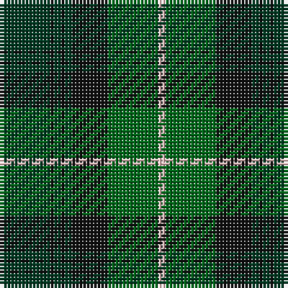

In pattern [GKGKGKGW](/patterns/gkgkgkgw/).

This was sourced from tartans-authority.  It is a [8 stripes tartan](/stripes/stripes8/).

Original link http://www.tartansauthority.com/tartan-ferret/display/8075/

## Thread count
DG/14 K1 DG2 K1 DG2 K10 G14 LR/2

## Palette
Each colour and its ΔE from the base-6 reference it is a variant of.

| Colour | Shade | Base | ΔE (OKLab) |
|---|---|---|---|
| DG | <code style="background-color:#003820;">#003820</code> `#003820` | G <code style="background-color:#006400;">#006400</code> | 0.16 |
| G | <code style="background-color:#006818;">#006818</code> `#006818` | G <code style="background-color:#006400;">#006400</code> | 0.02 |
| K | <code style="background-color:#101010;">#101010</code> `#101010` | K <code style="background-color:#000000;">#000000</code> | 0.17 |
| LR | <code style="background-color:#F4C4C4;">#F4C4C4</code> `#F4C4C4` | W <code style="background-color:#F4F4F0;">#F4F4F0</code> | 0.12 |

# Sample pattern

## Nearest tartans

The nearest existing variants by ΔTartan distance.

1. [Maine Acadia (Fashion)](/setts/s9/g10k2y4k2g38k30y4b40g6-b003c64-g006038-k101010-ye8c000/) — ΔT 1.02
1. [Aitchison (Personal)](/setts/s9/b4g50k22ba4k22ba36k4ba6k4-b780078-ba003c64-g288028-k101010/) — ΔT 1.13
1. [Valley of the Green (The ) Canadian Tartan Tartan Number: 148. Earliest known date: 1968 Specimen from Miss K Sinclair 1968 See products available Copyright © Blair Urquhart, Comrie, 2015](/setts/s7/b8g52ga16b16ga16gb6b4-b5c8ca8-g003820-ga006818-gb289c18/) — ΔT 1.15
1. [Pride of Ireland Fashion Tartan Tartan Number: 5157. Earliest known date: 2008 ONLY FOR DISPLAY PURPOSES. Count and sample from Lochcarron Feb. 2008. See products available Copyright © Blair Urquhart, Comrie, 2015](/setts/s10/g18k4g4ga26k4ga4y2g26k52y4-g003820-ga006818-k101010-ye8c000/) — ΔT 1.19
1. [MacSween Hunting (Lochs, Isle of Lew](/setts/s7/g3r3g31ga18g4k22y3-g006818-ga003820-k101010-rc80000-ye8c000/) — ΔT 1.26
1. [Hope-Vere (Lochcarron)](/setts/s10/g64k4b8k4g12k20ba48k4y4k12-b5c8ca8-ba385c70-g006818-k101010-ye8c000/) — ΔT 1.27
1. [Valley, of the Green. (The )](/setts/s7/b8g52ga16b16ga16gb6b4-b5480b0-g003000-ga008000-gb30a010/) — ΔT 1.30
1. [Cathcart](/setts/s8/g16y8b42g12r14g2r2g16-b003c64-g006818-ra00000-yb8b8b8/) — ΔT 1.33
1. [Symonds (2016)](/setts/s6/g72y4b20y4ga72r4-b780078-g006818-ga003820-rc80000-ye8c000/) — ΔT 1.34
1. [Sardar Chadha (Personal)](/setts/s10/y6g34b4g4k32g4b34g4b2g5-b202060-g006818-k101010-yfcb464/) — ΔT 1.34

## Neighbour map

Every grey dot is one of 15726 variants placed by the first two principal components of the ΔTartan feature space (44% of its variance). Red is this tartan; blue dots are its nearest — click one to open its page.

<svg viewBox="0 0 640 380" role="img" style="max-width:100%;height:auto;border:1px solid #e0e0e0;border-radius:4px;display:block" xmlns="http://www.w3.org/2000/svg"><image href="/nn/cloud.v1.png" width="640" height="380"/><a href="/setts/s9/g10k2y4k2g38k30y4b40g6-b003c64-g006038-k101010-ye8c000/"><circle cx="257.7" cy="176.1" r="4" fill="#3465a4"><title>Maine Acadia (Fashion)</title></circle></a><a href="/setts/s9/b4g50k22ba4k22ba36k4ba6k4-b780078-ba003c64-g288028-k101010/"><circle cx="216.5" cy="193.8" r="4" fill="#3465a4"><title>Aitchison (Personal)</title></circle></a><a href="/setts/s7/b8g52ga16b16ga16gb6b4-b5c8ca8-g003820-ga006818-gb289c18/"><circle cx="274.6" cy="217.3" r="4" fill="#3465a4"><title>Valley of the Green (The ) Canadian Tartan Tartan Number: 148. Earliest known date: 1968 Specimen from Miss K Sinclair 1968 See products available Copyright © Blair Urquhart, Comrie, 2015</title></circle></a><a href="/setts/s10/g18k4g4ga26k4ga4y2g26k52y4-g003820-ga006818-k101010-ye8c000/"><circle cx="296.1" cy="165.3" r="4" fill="#3465a4"><title>Pride of Ireland Fashion Tartan Tartan Number: 5157. Earliest known date: 2008 ONLY FOR DISPLAY PURPOSES. Count and sample from Lochcarron Feb. 2008. See products available Copyright © Blair Urquhart, Comrie, 2015</title></circle></a><a href="/setts/s7/g3r3g31ga18g4k22y3-g006818-ga003820-k101010-rc80000-ye8c000/"><circle cx="236.1" cy="202.7" r="4" fill="#3465a4"><title>MacSween Hunting (Lochs, Isle of Lew</title></circle></a><a href="/setts/s10/g64k4b8k4g12k20ba48k4y4k12-b5c8ca8-ba385c70-g006818-k101010-ye8c000/"><circle cx="247.9" cy="157.3" r="4" fill="#3465a4"><title>Hope-Vere (Lochcarron)</title></circle></a><a href="/setts/s7/b8g52ga16b16ga16gb6b4-b5480b0-g003000-ga008000-gb30a010/"><circle cx="248.8" cy="205.9" r="4" fill="#3465a4"><title>Valley, of the Green. (The )</title></circle></a><a href="/setts/s8/g16y8b42g12r14g2r2g16-b003c64-g006818-ra00000-yb8b8b8/"><circle cx="267.1" cy="187.5" r="4" fill="#3465a4"><title>Cathcart</title></circle></a><a href="/setts/s6/g72y4b20y4ga72r4-b780078-g006818-ga003820-rc80000-ye8c000/"><circle cx="274.6" cy="180.3" r="4" fill="#3465a4"><title>Symonds (2016)</title></circle></a><a href="/setts/s10/y6g34b4g4k32g4b34g4b2g5-b202060-g006818-k101010-yfcb464/"><circle cx="241.1" cy="167.5" r="4" fill="#3465a4"><title>Sardar Chadha (Personal)</title></circle></a><circle cx="252.9" cy="202.8" r="5" fill="#c00000"/></svg>

ID: /setts/s8/g14k1g2k1g2k10ga14w2-g003820-ga006818-k101010-wf4c4c4/
