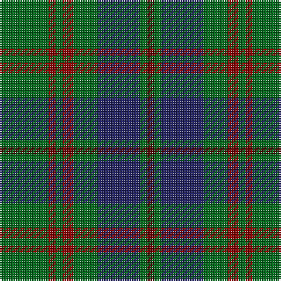

This page is one **sett** — a single exact thread-count. It belongs to the [tartan](/tartans/g14dr2g2dr3g7db12g2dra2/)
(the same proportion at any scale), whose colour order is pattern [BGBGRGRG](/stripes/bgbgrgrg/).

Sourced from register-of-tartans.  It is a [8 stripe tartan](/stripes/stripes8/).

Original link https://www.tartanregister.gov.uk/tartanDetails.aspx?ref=1391

2 attestations — the source records this cloth was collapsed from (oldest owns this page)

<ul>
<li>01/01/1994 — Glen Nevis #3 (register-of-tartans, <a href="https://www.tartanregister.gov.uk/tartanDetails.aspx?ref=1391">record</a>)</li>
<li>1994 — Glen Nevis #3 (Corporate) (tartans-authority, <a href="http://www.tartansauthority.com/tartan-ferret/display/5018/">record</a>)</li>
</ul>

## Register references

External register numbers recorded for this tartan.

- Scottish Register of Tartans: [1391](https://www.tartanregister.gov.uk/tartanDetails.aspx?ref=1391)
- Scottish Tartans Authority (ITI): 5018

## Thread count
G/28 DR4 G4 DR6 G14 DB24 G4 DRa/4

## Palette
Each colour and the base-6 reference it is a variant of.

| Colour | Shade | Base |
|---|---|---|
| DB | <code style="background-color:#202060;">#202060</code> `oklch(28.9% 0.111 276.9)` <small>#202060</small> | B <code style="background-color:#2A418A;">#2A418A</code> |
| DR | <code style="background-color:#880000;">#880000</code> `oklch(39.4% 0.162 29.2)` <small>#880000</small> | R <code style="background-color:#CC0000;">#CC0000</code> |
| DRa | <code style="background-color:#4C0000;">#4C0000</code> `oklch(26.2% 0.107 29.2)` <small>#4C0000</small> | B <code style="background-color:#2A418A;">#2A418A</code> |
| G | <code style="background-color:#006818;">#006818</code> `oklch(45.0% 0.142 145.0)` <small>#006818</small> | G <code style="background-color:#006100;">#006100</code> |

# Sample pattern

## Nearest tartans

The nearest existing variants by ΔTartan distance, with this tartan at the top so the swatches line up against it.

ΔTartan

Tartan

Sett

—

<a href="/ttd/edit/#slug=g14r2g2r3g7db12g2dr2~x2">Glen Nevis #3</a> <a class="nn-out" href="/setts/s8/g14r2g2r3g7db12g2dr2~x2/" title="open its dictionary page">↗</a>

0.86

<a href="/ttd/edit/#slug=g3db8g3k4g15r2~x2">Lauder (Family)</a> <a class="nn-out" href="/setts/s6/g3db8g3k4g15r2~x2/" title="open its dictionary page">↗</a>

0.88

<a href="/ttd/edit/#slug=dg2n8dg2k3dg12r2~x2">Wcwm 1045</a> <a class="nn-out" href="/setts/s6/dg2n8dg2k3dg12r2~x2/" title="open its dictionary page">↗</a>

0.89

<a href="/ttd/edit/#slug=db5dg8k1ly2k1dg8db4~x4">Salvation Army Htg (Corporate)</a> <a class="nn-out" href="/setts/s7/db5dg8k1ly2k1dg8db4~x4/" title="open its dictionary page">↗</a>

0.94

<a href="/ttd/edit/#slug=dt6r15g41r15dt20g41db6">Bean of Freeport Htg (Corporate)</a> <a class="nn-out" href="/setts/s7/dt6r15g41r15dt20g41db6/" title="open its dictionary page">↗</a>

1.00

<a href="/ttd/edit/#slug=dy3g6dg2r2dg14g2dg2dy3~x2">Daks (Muted Loden)</a> <a class="nn-out" href="/setts/s8/dy3g6dg2r2dg14g2dg2dy3~x2/" title="open its dictionary page">↗</a>

1.18

<a href="/ttd/edit/#slug=r1k6g1k1g8k1g8db1g1db6r1~x2">Davidson</a> <a class="nn-out" href="/setts/s11/r1k6g1k1g8k1g8db1g1db6r1~x2/" title="open its dictionary page">↗</a>

1.18

<a href="/ttd/edit/#slug=r1k6g1k1g8k1g8db1g1db6r1~x4">Davidson - 1842 (Clan)</a> <a class="nn-out" href="/setts/s11/r1k6g1k1g8k1g8db1g1db6r1~x4/" title="open its dictionary page">↗</a>

1.21

<a href="/ttd/edit/#slug=r3dg10r3dg14db16dg3ly2~x2">Cameron Hunting</a> <a class="nn-out" href="/setts/s7/r3dg10r3dg14db16dg3ly2~x2/" title="open its dictionary page">↗</a>

1.22

<a href="/ttd/edit/#slug=r5dt12g3db4g20dt3g3r5~x4">Daks (0600150)</a> <a class="nn-out" href="/setts/s8/r5dt12g3db4g20dt3g3r5~x4/" title="open its dictionary page">↗</a>

1.26

<a href="/ttd/edit/#slug=dt6r15dg41r15dt20dg41db6">Bean of Freeport (Personal)</a> <a class="nn-out" href="/setts/s7/dt6r15dg41r15dt20dg41db6/" title="open its dictionary page">↗</a>

## Neighbour map

Every grey dot is one of 14299 variants placed by the first two principal components of the ΔTartan feature space (44% of its variance). Red is this tartan; blue dots are its nearest — click one to open its page.

<svg viewBox="0 0 640 380" role="img" style="max-width:100%;height:auto;border:1px solid #e0e0e0;border-radius:4px;display:block" xmlns="http://www.w3.org/2000/svg"><image href="/nn/cloud.v1.png" width="640" height="380"/><a href="/setts/s6/g3db8g3k4g15r2~x2/"><circle cx="329.0" cy="253.4" r="4" fill="#3465a4"><title>Lauder (Family)</title></circle></a><a href="/setts/s6/dg2n8dg2k3dg12r2~x2/"><circle cx="294.4" cy="259.4" r="4" fill="#3465a4"><title>Wcwm 1045</title></circle></a><a href="/setts/s7/db5dg8k1ly2k1dg8db4~x4/"><circle cx="295.5" cy="252.0" r="4" fill="#3465a4"><title>Salvation Army Htg (Corporate)</title></circle></a><a href="/setts/s7/dt6r15g41r15dt20g41db6/"><circle cx="305.0" cy="258.2" r="4" fill="#3465a4"><title>Bean of Freeport Htg (Corporate)</title></circle></a><a href="/setts/s8/dy3g6dg2r2dg14g2dg2dy3~x2/"><circle cx="296.9" cy="234.1" r="4" fill="#3465a4"><title>Daks (Muted Loden)</title></circle></a><a href="/setts/s11/r1k6g1k1g8k1g8db1g1db6r1~x2/"><circle cx="272.1" cy="207.4" r="4" fill="#3465a4"><title>Davidson</title></circle></a><a href="/setts/s11/r1k6g1k1g8k1g8db1g1db6r1~x4/"><circle cx="272.1" cy="207.4" r="4" fill="#3465a4"><title>Davidson - 1842 (Clan)</title></circle></a><a href="/setts/s7/r3dg10r3dg14db16dg3ly2~x2/"><circle cx="285.4" cy="241.4" r="4" fill="#3465a4"><title>Cameron Hunting</title></circle></a><a href="/setts/s8/r5dt12g3db4g20dt3g3r5~x4/"><circle cx="248.5" cy="231.4" r="4" fill="#3465a4"><title>Daks (0600150)</title></circle></a><a href="/setts/s7/dt6r15dg41r15dt20dg41db6/"><circle cx="311.2" cy="262.4" r="4" fill="#3465a4"><title>Bean of Freeport (Personal)</title></circle></a><circle cx="322.5" cy="241.3" r="5" fill="#c00000"/></svg>

ID: /setts/s8/g14r2g2r3g7db12g2dr2~x2/
