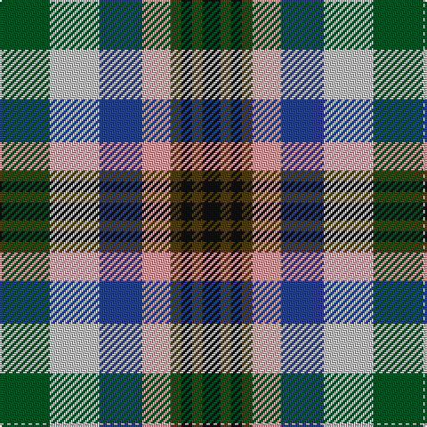

In pattern [GWBYGKGK](/patterns/gwbygkgk/).

This was sourced from register-of-tartans.  It is a [8 stripes tartan](/stripes/stripes8/).

Original link https://www.tartanregister.gov.uk/tartanDetails.aspx?ref=3834

## Thread count
G/28 N28 B24 LR16 T6 K6 T6 K/10

## Palette
Each colour and its ΔE from the base-6 reference it is a variant of.

| Colour | Shade | Base | ΔE (OKLab) |
|---|---|---|---|
| B | <code style="background-color:#2C4084;">#2C4084</code> `#2C4084` | B <code style="background-color:#2A418A;">#2A418A</code> | 0.01 |
| G | <code style="background-color:#005020;">#005020</code> `#005020` | G <code style="background-color:#006100;">#006100</code> | 0.07 |
| K | <code style="background-color:#101010;">#101010</code> `#101010` | K <code style="background-color:#000000;">#000000</code> | 0.17 |
| LR | <code style="background-color:#EC9D9D;">#EC9D9D</code> `#EC9D9D` | Y <code style="background-color:#F2BF00;">#F2BF00</code> | 0.17 |
| N | <code style="background-color:#C0C0C0;">#C0C0C0</code> `#C0C0C0` | W <code style="background-color:#F7F7F7;">#F7F7F7</code> | 0.17 |
| T | <code style="background-color:#503C14;">#503C14</code> `#503C14` | G <code style="background-color:#006100;">#006100</code> | 0.14 |

# Sample pattern

## Nearest tartans

The nearest existing variants by ΔTartan distance.

1. [Belwade](/setts/s11/b4g4b4w1ba1w1r4y4w1g4r4x4~b2c4084-ba141e46-g007800-r781c38-wffffff-ydc943c/) — ΔT 1.00
1. [Kilkenny County Crest (Fashion)](/setts/s8/y6r8k4w6g16k13ya19k5x2~g5c6428-k101010-r880000-we0e0e0-ybc8c00-yaa0a0a0/) — ΔT 1.01
1. [Caledonian Labrador Retrievers](/setts/s8/r21y4b5y4r5k21g21ya5x2~b441800-g00643c-k101010-r9c68a4-y86c67c-yae0a126/) — ΔT 1.06
1. [Somerset](/setts/s9/g8ga8b7r5ra2k2ra2k2ra2x2~b5480b0-g008000-ga808080-k000000-rd03030-ra806050/) — ΔT 1.07
1. [Bhutan](/setts/s9/r3w2b6w2ba8y2g6y2r2x2~b1c0070-ba4c0000-g006818-r981c70-wc0c0c0-yd09800/) — ΔT 1.10
1. [Caledonian Labrador Retrievers](/setts/s8/r21b4ba5b4r5k21g21y5x2~b000048-ba501400-g006818-k101010-r9c68a4-yfccc00/) — ΔT 1.22
1. [Labrador Club of Scotland (Corporate](/setts/s8/r21y4g5y4r5k21ga21ya5x2~g604000-ga006818-k101010-ra478a0-y98a46c-yabc8c00/) — ΔT 1.22
1. [Tipperary County Crest (Fashion)](/setts/s9/r10y36k24r30ya8k16w18b16ya9~b2c2c80-k101010-r880000-we0e0e0-ya0a0a0-yabc8c00/) — ΔT 1.25
1. [Manderson (Personal)](/setts/s11/k8b22b8g16k24ba8g32w32ba7w12wa4~b5c5c5c-ba4c0000-g005448-k101010-wa8ace8-wac0c0c0/) — ΔT 1.28
1. [Somerset (District)](/setts/s9/g8r8y7ya5w2k2w2k2w2x4~g5c6428-k101010-r888888-we8ccb8-y48a4c0-yae08070/) — ΔT 1.34

## Neighbour map

Every grey dot is one of 15726 variants placed by the first two principal components of the ΔTartan feature space (44% of its variance). Red is this tartan; blue dots are its nearest — click one to open its page.

<svg viewBox="0 0 640 380" role="img" style="max-width:100%;height:auto;border:1px solid #e0e0e0;border-radius:4px;display:block" xmlns="http://www.w3.org/2000/svg"><image href="/nn/cloud.v1.png" width="640" height="380"/><a href="/setts/s11/b4g4b4w1ba1w1r4y4w1g4r4x4~b2c4084-ba141e46-g007800-r781c38-wffffff-ydc943c/"><circle cx="14.0" cy="202.6" r="4" fill="#3465a4"><title>Belwade</title></circle></a><a href="/setts/s8/y6r8k4w6g16k13ya19k5x2~g5c6428-k101010-r880000-we0e0e0-ybc8c00-yaa0a0a0/"><circle cx="18.2" cy="201.9" r="4" fill="#3465a4"><title>Kilkenny County Crest (Fashion)</title></circle></a><a href="/setts/s8/r21y4b5y4r5k21g21ya5x2~b441800-g00643c-k101010-r9c68a4-y86c67c-yae0a126/"><circle cx="61.5" cy="186.1" r="4" fill="#3465a4"><title>Caledonian Labrador Retrievers</title></circle></a><a href="/setts/s9/g8ga8b7r5ra2k2ra2k2ra2x2~b5480b0-g008000-ga808080-k000000-rd03030-ra806050/"><circle cx="14.0" cy="204.7" r="4" fill="#3465a4"><title>Somerset</title></circle></a><a href="/setts/s9/r3w2b6w2ba8y2g6y2r2x2~b1c0070-ba4c0000-g006818-r981c70-wc0c0c0-yd09800/"><circle cx="14.0" cy="196.7" r="4" fill="#3465a4"><title>Bhutan</title></circle></a><a href="/setts/s8/r21b4ba5b4r5k21g21y5x2~b000048-ba501400-g006818-k101010-r9c68a4-yfccc00/"><circle cx="59.5" cy="187.2" r="4" fill="#3465a4"><title>Caledonian Labrador Retrievers</title></circle></a><a href="/setts/s8/r21y4g5y4r5k21ga21ya5x2~g604000-ga006818-k101010-ra478a0-y98a46c-yabc8c00/"><circle cx="67.7" cy="188.8" r="4" fill="#3465a4"><title>Labrador Club of Scotland (Corporate</title></circle></a><a href="/setts/s9/r10y36k24r30ya8k16w18b16ya9~b2c2c80-k101010-r880000-we0e0e0-ya0a0a0-yabc8c00/"><circle cx="14.0" cy="199.9" r="4" fill="#3465a4"><title>Tipperary County Crest (Fashion)</title></circle></a><a href="/setts/s11/k8b22b8g16k24ba8g32w32ba7w12wa4~b5c5c5c-ba4c0000-g005448-k101010-wa8ace8-wac0c0c0/"><circle cx="46.8" cy="171.5" r="4" fill="#3465a4"><title>Manderson (Personal)</title></circle></a><a href="/setts/s9/g8r8y7ya5w2k2w2k2w2x4~g5c6428-k101010-r888888-we8ccb8-y48a4c0-yae08070/"><circle cx="14.0" cy="198.8" r="4" fill="#3465a4"><title>Somerset (District)</title></circle></a><circle cx="14.0" cy="198.5" r="5" fill="#c00000"/></svg>

ID: /setts/s8/g14w14b12y8ga3k3ga3k5x2~b2c4084-g005020-ga503c14-k101010-wc0c0c0-yec9d9d/
