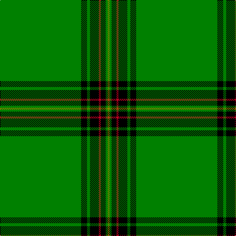

In pattern [GGKRKGKG](/patterns/ggkrkgkg/).

This was sourced from weddslist.  It is a [8 stripes tartan](/stripes/stripes8/).

Original link http://www.weddslist.com/cgi-bin/tartans/pg.pl?source=sts

## Thread count
G/165 K12 G6 K18 R4 K10 G4 LG/4

## Palette
Each colour and its ΔE from the base-6 reference it is a variant of.

| Colour | Shade | Base | ΔE (OKLab) |
|---|---|---|---|
| G | <code style="background-color:#008000;">#008000</code> `#008000` | G <code style="background-color:#006100;">#006100</code> | 0.10 |
| K | <code style="background-color:#000000;">#000000</code> `#000000` | K <code style="background-color:#000000;">#000000</code> | 0.00 |
| LG | <code style="background-color:#908000;">#908000</code> `#908000` | G <code style="background-color:#006100;">#006100</code> | 0.20 |
| R | <code style="background-color:#C00020;">#C00020</code> `#C00020` | R <code style="background-color:#CC0000;">#CC0000</code> | 0.03 |

# Sample pattern

## Nearest tartans

The nearest existing variants by ΔTartan distance.

1. [Mar, (Tribe of..)](/setts/s5/r2k4g45k3y2~g008000-k000000-rc00000-yf0c000/) — ΔT 1.51
1. [Marshall University](/setts/s8/g25w1ga2w1g6k2w2ga3~g146400-ga003c14-k101010-wffffff~x2/) — ΔT 1.55
1. [Delta Lambda Phi](/setts/s12/y5k1y6g20w1g3w1g3w1g30k1y2~g006400-k101010-wffffff-yffcc33~x2/) — ΔT 1.60
1. [Suffolk County Police](/setts/s11/g74g6k12y3k3w3g16g8k3g4w3~g30a010-k000000-we0e0e0-yffe000~x2/) — ΔT 1.62
1. [Braemar Royal Highland Gathering](/setts/s6/r3k4w2g64k6y3~g006818-k101010-rc80000-wc0c0c0-ye8c000~x2/) — ΔT 1.88
1. [Unidentified 23](/setts/s11/b2k1g36k1r2k1r2k1g36k1y2~b5480b0-g008000-k000000-rc00000-yf0c000~x2/) — ΔT 1.89
1. [Crane of Cluny (Personal)](/setts/s8/g82k6g3k9r2k5g2y2~g006818-k101010-rc8002c-ye8c000~x2/) — ΔT 1.90
1. [Marshall University](/setts/s8/g25w1ga2w1g6k2w2ga3~g289c18-ga003820-k101010-wfcfcfc~x2/) — ΔT 1.91
1. [Delta Lambda Phi (Corporate)](/setts/s12/y5k1y6g20w1g3w1g3w1g30k1y2~g006818-k101010-wfcfcfc-ybc8c00~x2/) — ΔT 2.08
1. [MacBeorn](/setts/s7/g55ga6g7ga17y1ga2y2~g007800-ga002814-yffff00~x2/) — ΔT 2.17

## Neighbour map

Every grey dot is one of 15726 variants placed by the first two principal components of the ΔTartan feature space (44% of its variance). Red is this tartan; blue dots are its nearest — click one to open its page.

<svg viewBox="0 0 640 380" role="img" style="max-width:100%;height:auto;border:1px solid #e0e0e0;border-radius:4px;display:block" xmlns="http://www.w3.org/2000/svg"><image href="/nn/cloud.v1.png" width="640" height="380"/><a href="/setts/s5/r2k4g45k3y2~g008000-k000000-rc00000-yf0c000/"><circle cx="523.1" cy="167.8" r="4" fill="#3465a4"><title>Mar, (Tribe of..)</title></circle></a><a href="/setts/s8/g25w1ga2w1g6k2w2ga3~g146400-ga003c14-k101010-wffffff~x2/"><circle cx="470.0" cy="146.0" r="4" fill="#3465a4"><title>Marshall University</title></circle></a><a href="/setts/s12/y5k1y6g20w1g3w1g3w1g30k1y2~g006400-k101010-wffffff-yffcc33~x2/"><circle cx="474.0" cy="115.0" r="4" fill="#3465a4"><title>Delta Lambda Phi</title></circle></a><a href="/setts/s11/g74g6k12y3k3w3g16g8k3g4w3~g30a010-k000000-we0e0e0-yffe000~x2/"><circle cx="492.2" cy="116.3" r="4" fill="#3465a4"><title>Suffolk County Police</title></circle></a><a href="/setts/s6/r3k4w2g64k6y3~g006818-k101010-rc80000-wc0c0c0-ye8c000~x2/"><circle cx="537.7" cy="137.0" r="4" fill="#3465a4"><title>Braemar Royal Highland Gathering</title></circle></a><a href="/setts/s11/b2k1g36k1r2k1r2k1g36k1y2~b5480b0-g008000-k000000-rc00000-yf0c000~x2/"><circle cx="577.8" cy="104.1" r="4" fill="#3465a4"><title>Unidentified 23</title></circle></a><a href="/setts/s8/g82k6g3k9r2k5g2y2~g006818-k101010-rc8002c-ye8c000~x2/"><circle cx="587.9" cy="132.1" r="4" fill="#3465a4"><title>Crane of Cluny (Personal)</title></circle></a><a href="/setts/s8/g25w1ga2w1g6k2w2ga3~g289c18-ga003820-k101010-wfcfcfc~x2/"><circle cx="455.8" cy="138.1" r="4" fill="#3465a4"><title>Marshall University</title></circle></a><a href="/setts/s12/y5k1y6g20w1g3w1g3w1g30k1y2~g006818-k101010-wfcfcfc-ybc8c00~x2/"><circle cx="513.1" cy="131.3" r="4" fill="#3465a4"><title>Delta Lambda Phi (Corporate)</title></circle></a><a href="/setts/s7/g55ga6g7ga17y1ga2y2~g007800-ga002814-yffff00~x2/"><circle cx="511.9" cy="156.4" r="4" fill="#3465a4"><title>MacBeorn</title></circle></a><circle cx="533.5" cy="112.3" r="5" fill="#c00000"/></svg>

ID: /setts/s8/g165k12g6k18r4k10g4ga4~g008000-ga908000-k000000-rc00020/
