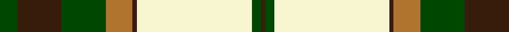

In pattern [BGWBRGBG](/patterns/bgwbrgbg/).

This was sourced from register-of-tartans.  It is a [8 stripes tartan](/stripes/stripes8/).

Original link https://www.tartanregister.gov.uk/tartanDetails.aspx?ref=943

## Attestations

This cloth appears in 2 source records; the oldest owns this page.

- 01/01/1968 — Dogwood (register-of-tartans, [record](https://www.tartanregister.gov.uk/tartanDetails.aspx?ref=943))
- 1968 — Dogwood (Fashion) (tartans-authority, [record](http://www.tartansauthority.com/tartan-ferret/display/913/))

## Thread count
G/16 K40 G40 LT24 K4 LY104 G8 K/4

## Palette
Each colour and its ΔE from the base-6 reference it is a variant of.

| Colour | Shade | Base | ΔE (OKLab) |
|---|---|---|---|
| G | <code style="background-color:#004800;">#004800</code> `#004800` | G <code style="background-color:#006400;">#006400</code> | 0.09 |
| K | <code style="background-color:#381C0C;">#381C0C</code> `#381C0C` | B <code style="background-color:#2C4084;">#2C4084</code> | 0.21 |
| LT | <code style="background-color:#B07430;">#B07430</code> `#B07430` | R <code style="background-color:#C80000;">#C80000</code> | 0.17 |
| LY | <code style="background-color:#F8F4D0;">#F8F4D0</code> `#F8F4D0` | W <code style="background-color:#F4F4F0;">#F4F4F0</code> | 0.04 |

# Sample pattern

ID: /setts/s8/g16b40g40r24b4w104g8b4-b381c0c-g004800-rb07430-wf8f4d0/
