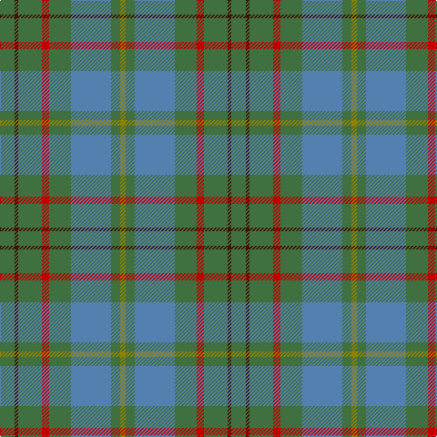

In pattern [GBGRGBGG](/patterns/gbgrgbgg/).

This was sourced from weddslist.  It is a [8 stripes tartan](/stripes/stripes8/).

Original link http://www.weddslist.com/cgi-bin/tartans/pg.pl?source=sts

## Thread count
G/16 DR4 G26 R8 G24 B44 G10 LG/6

## Palette
Each colour and its ΔE from the base-6 reference it is a variant of.

| Colour | Shade | Base | ΔE (OKLab) |
|---|---|---|---|
| B | <code style="background-color:#5480B0;">#5480B0</code> `#5480B0` | B <code style="background-color:#2C4084;">#2C4084</code> | 0.20 |
| DR | <code style="background-color:#401000;">#401000</code> `#401000` | B <code style="background-color:#2C4084;">#2C4084</code> | 0.23 |
| G | <code style="background-color:#407040;">#407040</code> `#407040` | G <code style="background-color:#006400;">#006400</code> | 0.08 |
| LG | <code style="background-color:#908000;">#908000</code> `#908000` | G <code style="background-color:#006400;">#006400</code> | 0.19 |
| R | <code style="background-color:#C00000;">#C00000</code> `#C00000` | R <code style="background-color:#C80000;">#C80000</code> | 0.02 |

# Sample pattern

## Nearest tartans

The nearest existing variants by ΔTartan distance.

1. [Taylor](/setts/s8/g16k4g26y8g24b44g10ya6-b506878-g006818-k101010-yd0908c-yabc8c00/) — ΔT 0.97
1. [Scottish Pup](/setts/s8/g16b4g26ba8g24bb44g10y6-b412719-ba373875-bb486373-g1e492b-yd9c341/) — ΔT 1.01
1. [Hesco](/setts/s7/b6ba48bb20ba4g22ba16w6-b5a008c-ba5c5c5c-bb505050-g289c18-we0e0e0/) — ΔT 1.21
1. [Bagpipe Shop, The (Corporate)](/setts/s5/b100y30r30ra10g10-b5c5c5c-g289c18-r888888-rac80000-ya0a0a0/) — ΔT 1.53
1. [Harkness Htg (Name)](/setts/s10/g40b8w8b64g24y8g16r8g12b24-b0c585c-g006818-rc80000-we0e0e0-ya8a834/) — ΔT 1.60
1. [Burt #1 (Name)](/setts/s9/r4y26b16y6b66ya6b16ya26ra4-b5c649c-rb468ac-rac80000-y44ac64-yaa49058/) — ΔT 1.65
1. [Exabyte](/setts/s5/r6b68ba8g94w6-b5c5c5c-ba1c0070-g006818-r880000-wc0c0c0/) — ΔT 1.68
1. [Daks (Loden)](/setts/s8/b6g14ga4gb4ga28g4ga4b6-b2c2c80-g604000-ga006818-gb808080/) — ΔT 1.69
1. [Lawrence of Broughty Ferry](/setts/s6/g40k4g40b50w4ba6-b3d2e60-ba3e647a-g124b24-k120a01-wf7f1e8/) — ΔT 1.72
1. [Willsher Wedding (Personal)](/setts/s9/b16r8w4r8b2r24g18b48ra8-b5c5c5c-g006818-r888888-ra880000-we8ccb8/) — ΔT 1.73

## Neighbour map

Every grey dot is one of 15726 variants placed by the first two principal components of the ΔTartan feature space (44% of its variance). Red is this tartan; blue dots are its nearest — click one to open its page.

<svg viewBox="0 0 640 380" role="img" style="max-width:100%;height:auto;border:1px solid #e0e0e0;border-radius:4px;display:block" xmlns="http://www.w3.org/2000/svg"><image href="/nn/cloud.v1.png" width="640" height="380"/><a href="/setts/s8/g16k4g26y8g24b44g10ya6-b506878-g006818-k101010-yd0908c-yabc8c00/"><circle cx="333.2" cy="228.9" r="4" fill="#3465a4"><title>Taylor</title></circle></a><a href="/setts/s8/g16b4g26ba8g24bb44g10y6-b412719-ba373875-bb486373-g1e492b-yd9c341/"><circle cx="354.8" cy="240.0" r="4" fill="#3465a4"><title>Scottish Pup</title></circle></a><a href="/setts/s7/b6ba48bb20ba4g22ba16w6-b5a008c-ba5c5c5c-bb505050-g289c18-we0e0e0/"><circle cx="321.5" cy="210.9" r="4" fill="#3465a4"><title>Hesco</title></circle></a><a href="/setts/s5/b100y30r30ra10g10-b5c5c5c-g289c18-r888888-rac80000-ya0a0a0/"><circle cx="362.0" cy="231.2" r="4" fill="#3465a4"><title>Bagpipe Shop, The (Corporate)</title></circle></a><a href="/setts/s10/g40b8w8b64g24y8g16r8g12b24-b0c585c-g006818-rc80000-we0e0e0-ya8a834/"><circle cx="279.6" cy="222.8" r="4" fill="#3465a4"><title>Harkness Htg (Name)</title></circle></a><a href="/setts/s9/r4y26b16y6b66ya6b16ya26ra4-b5c649c-rb468ac-rac80000-y44ac64-yaa49058/"><circle cx="368.1" cy="176.5" r="4" fill="#3465a4"><title>Burt #1 (Name)</title></circle></a><a href="/setts/s5/r6b68ba8g94w6-b5c5c5c-ba1c0070-g006818-r880000-wc0c0c0/"><circle cx="377.2" cy="216.9" r="4" fill="#3465a4"><title>Exabyte</title></circle></a><a href="/setts/s8/b6g14ga4gb4ga28g4ga4b6-b2c2c80-g604000-ga006818-gb808080/"><circle cx="326.4" cy="247.3" r="4" fill="#3465a4"><title>Daks (Loden)</title></circle></a><a href="/setts/s6/g40k4g40b50w4ba6-b3d2e60-ba3e647a-g124b24-k120a01-wf7f1e8/"><circle cx="357.4" cy="229.3" r="4" fill="#3465a4"><title>Lawrence of Broughty Ferry</title></circle></a><a href="/setts/s9/b16r8w4r8b2r24g18b48ra8-b5c5c5c-g006818-r888888-ra880000-we8ccb8/"><circle cx="345.6" cy="180.3" r="4" fill="#3465a4"><title>Willsher Wedding (Personal)</title></circle></a><circle cx="346.9" cy="230.0" r="5" fill="#c00000"/></svg>

ID: /setts/s8/g16b4g26r8g24ba44g10ga6-b401000-ba5480b0-g407040-ga908000-rc00000/
