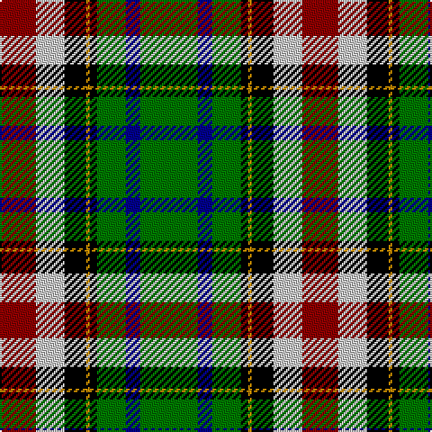

This page is one **sett** — a single exact thread-count. It belongs to the [tartan](/tartans/g16db4g8k2lo1k6lb8r10/)
(the same proportion at any scale), whose colour order is pattern [GBGKYKWR](/stripes/gbgkykwr/).

Sourced from register-of-tartans.  It is a [8 stripe tartan](/stripes/stripes8/).

Original link https://www.tartanregister.gov.uk/tartanDetails.aspx?ref=3477

2 attestations — the source records this cloth was collapsed from (oldest owns this page)

<ul>
<li>01/01/1996 — Red Deer, City of (register-of-tartans, <a href="https://www.tartanregister.gov.uk/tartanDetails.aspx?ref=3477">record</a>)</li>
<li>1996 — Red Deer, City of (District) (tartans-authority, <a href="http://www.tartansauthority.com/tartan-ferret/display/5430/">record</a>)</li>
</ul>

## Register references

External register numbers recorded for this tartan.

- Scottish Register of Tartans: [3477](https://www.tartanregister.gov.uk/tartanDetails.aspx?ref=3477)
- Scottish Tartans Authority (ITI): 5430

## Thread count
G/32 DB8 G16 K4 DY2 K12 N16 DR/20

## Palette

Palette: <strong>Tartan Register</strong> <small style="color:#888">(5 of 6 colours)</small>
<table><thead><tr><th>Colour</th><th>Threads</th><th>Shade</th><th>Base</th><th>OKLCh</th></tr></thead><tbody><tr><td>G/</td><td style="text-align:right;font-variant-numeric:tabular-nums">32</td><td><code style="background-color:#007800;">#007800</code> <small style="color:#888">#007800</small></td><td>G <code style="background-color:#006100;">#006100</code></td><td><small style="color:#888">oklch(49.6% 0.169 142.5)</small></td></tr><tr><td>DB</td><td style="text-align:right;font-variant-numeric:tabular-nums">8</td><td><code style="background-color:#00008C;">#00008C</code> <small style="color:#888">#00008C</small></td><td>B <code style="background-color:#2A418A;">#2A418A</code></td><td><small style="color:#888">oklch(28.9% 0.200 264.1)</small></td></tr><tr><td>G</td><td style="text-align:right;font-variant-numeric:tabular-nums">16</td><td><code style="background-color:#007800;">#007800</code> <small style="color:#888">#007800</small></td><td>G <code style="background-color:#006100;">#006100</code></td><td><small style="color:#888">oklch(49.6% 0.169 142.5)</small></td></tr><tr><td>K</td><td style="text-align:right;font-variant-numeric:tabular-nums">4</td><td><code style="background-color:#000000;">#000000</code> <small style="color:#888">#000000</small></td><td>K <code style="background-color:#000000;">#000000</code></td><td><small style="color:#888">oklch(0.0% 0.000 0.0)</small></td></tr><tr><td>DY</td><td style="text-align:right;font-variant-numeric:tabular-nums">2</td><td><code style="background-color:#C88C00;">#C88C00</code> <small style="color:#888">#C88C00</small></td><td>Y <code style="background-color:#F2BF00;">#F2BF00</code></td><td><small style="color:#888">oklch(68.2% 0.142 78.2)</small></td></tr><tr><td>K</td><td style="text-align:right;font-variant-numeric:tabular-nums">12</td><td><code style="background-color:#000000;">#000000</code> <small style="color:#888">#000000</small></td><td>K <code style="background-color:#000000;">#000000</code></td><td><small style="color:#888">oklch(0.0% 0.000 0.0)</small></td></tr><tr><td>N</td><td style="text-align:right;font-variant-numeric:tabular-nums">16</td><td><code style="background-color:#C8C8C8;">#C8C8C8</code> <small style="color:#888">#C8C8C8</small></td><td>W <code style="background-color:#F7F7F7;">#F7F7F7</code></td><td><small style="color:#888">oklch(83.3% 0.000 89.9)</small></td></tr><tr><td>DR/</td><td style="text-align:right;font-variant-numeric:tabular-nums">20</td><td><code style="background-color:#8C0000;">#8C0000</code> <small style="color:#888">#8C0000</small></td><td>R <code style="background-color:#CC0000;">#CC0000</code></td><td><small style="color:#888">oklch(40.2% 0.165 29.2)</small></td></tr></tbody></table>

# Sample pattern

## Nearest tartans

The nearest existing variants by ΔTartan distance, with this tartan at the top so the swatches line up against it.

ΔTartan

Tartan

Sett

—

<a href="/ttd/edit/#slug=g16db4g8k2lo1k6lb8r10~x2">Red Deer, City of</a> <a class="nn-out" href="/setts/s8/g16db4g8k2lo1k6lb8r10~x2/" title="open its dictionary page">↗</a>

1.17

<a href="/ttd/edit/#slug=ly4ly3dg2k6g4w1dg12k10g2dg3~x2">Noble (South Africa) (Personal)</a> <a class="nn-out" href="/setts/s10/ly4ly3dg2k6g4w1dg12k10g2dg3~x2/" title="open its dictionary page">↗</a>

1.21

<a href="/ttd/edit/#slug=k6g20t2r6t2k20ly3db20g26r3db6~x2">Stevenson</a> <a class="nn-out" href="/setts/s11/k6g20t2r6t2k20ly3db20g26r3db6~x2/" title="open its dictionary page">↗</a>

1.22

<a href="/ttd/edit/#slug=ly4ly3dg2k6dg4w1dg12k10dg2dg3~x2">Noble (South Africa) (Personal)</a> <a class="nn-out" href="/setts/s10/ly4ly3dg2k6dg4w1dg12k10dg2dg3~x2/" title="open its dictionary page">↗</a>

1.28

<a href="/ttd/edit/#slug=w4k2t18g18k18w3k18r3~x2">Hislop (Name)</a> <a class="nn-out" href="/setts/s8/w4k2t18g18k18w3k18r3~x2/" title="open its dictionary page">↗</a>

1.29

<a href="/ttd/edit/#slug=k6g20t2r5t2k20ly3db20g26r3db5~x2">Stephenson</a> <a class="nn-out" href="/setts/s11/k6g20t2r5t2k20ly3db20g26r3db5~x2/" title="open its dictionary page">↗</a>

1.32

<a href="/ttd/edit/#slug=lr3k15y10o10k1g5k1lo10k10g8k1y2~x2">Castlefield (Personal)</a> <a class="nn-out" href="/setts/s12/lr3k15y10o10k1g5k1lo10k10g8k1y2~x2/" title="open its dictionary page">↗</a>

1.32

<a href="/ttd/edit/#slug=g16g2p13t2k6ly2g16t2k12~x2">Wilson's, No 225</a> <a class="nn-out" href="/setts/s9/g16g2p13t2k6ly2g16t2k12~x2/" title="open its dictionary page">↗</a>

1.33

<a href="/ttd/edit/#slug=t6db17p4db2k11g33ly4~x2">East Lothian</a> <a class="nn-out" href="/setts/s7/t6db17p4db2k11g33ly4~x2/" title="open its dictionary page">↗</a>

1.33

<a href="/ttd/edit/#slug=r10k18t10db18g40ly5">Gallowater</a> <a class="nn-out" href="/setts/s6/r10k18t10db18g40ly5/" title="open its dictionary page">↗</a>

1.35

<a href="/ttd/edit/#slug=db4g17t3r3t3k19w2g17r4~x2">Wilson's, No 2/33</a> <a class="nn-out" href="/setts/s9/db4g17t3r3t3k19w2g17r4~x2/" title="open its dictionary page">↗</a>

## Neighbour map

Every grey dot is one of 14299 variants placed by the first two principal components of the ΔTartan feature space (44% of its variance). Red is this tartan; blue dots are its nearest — click one to open its page.

<svg viewBox="0 0 640 380" role="img" style="max-width:100%;height:auto;border:1px solid #e0e0e0;border-radius:4px;display:block" xmlns="http://www.w3.org/2000/svg"><image href="/nn/cloud.v1.png" width="640" height="380"/><a href="/setts/s10/ly4ly3dg2k6g4w1dg12k10g2dg3~x2/"><circle cx="118.4" cy="158.6" r="4" fill="#3465a4"><title>Noble (South Africa) (Personal)</title></circle></a><a href="/setts/s11/k6g20t2r6t2k20ly3db20g26r3db6~x2/"><circle cx="140.9" cy="138.9" r="4" fill="#3465a4"><title>Stevenson</title></circle></a><a href="/setts/s10/ly4ly3dg2k6dg4w1dg12k10dg2dg3~x2/"><circle cx="117.3" cy="158.7" r="4" fill="#3465a4"><title>Noble (South Africa) (Personal)</title></circle></a><a href="/setts/s8/w4k2t18g18k18w3k18r3~x2/"><circle cx="145.8" cy="175.4" r="4" fill="#3465a4"><title>Hislop (Name)</title></circle></a><a href="/setts/s11/k6g20t2r5t2k20ly3db20g26r3db5~x2/"><circle cx="140.2" cy="137.3" r="4" fill="#3465a4"><title>Stephenson</title></circle></a><a href="/setts/s12/lr3k15y10o10k1g5k1lo10k10g8k1y2~x2/"><circle cx="110.6" cy="135.6" r="4" fill="#3465a4"><title>Castlefield (Personal)</title></circle></a><a href="/setts/s9/g16g2p13t2k6ly2g16t2k12~x2/"><circle cx="135.0" cy="168.8" r="4" fill="#3465a4"><title>Wilson's, No 225</title></circle></a><a href="/setts/s7/t6db17p4db2k11g33ly4~x2/"><circle cx="170.7" cy="144.5" r="4" fill="#3465a4"><title>East Lothian</title></circle></a><a href="/setts/s6/r10k18t10db18g40ly5/"><circle cx="99.4" cy="192.1" r="4" fill="#3465a4"><title>Gallowater</title></circle></a><a href="/setts/s9/db4g17t3r3t3k19w2g17r4~x2/"><circle cx="158.8" cy="154.5" r="4" fill="#3465a4"><title>Wilson's, No 2/33</title></circle></a><circle cx="137.0" cy="153.7" r="5" fill="#c00000"/></svg>

ID: /setts/s8/g16db4g8k2lo1k6lb8r10~x2/
