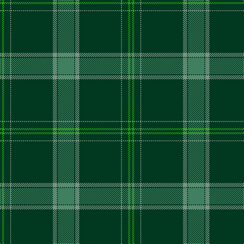

**Bands:** [GGGGGGGG](/stripes/gggggggg/) · **Stripes:** [DG G DG Y DG Y DG G](/stripes/stripes8/) DG G DG Y DG Y DG G

This was sourced from tartans-authority.  It is a [8 band tartan](/bands/bands8/).

Original link http://www.tartansauthority.com/tartan-ferret/display/11007/

## Thread count
G/32 DG2 LG8 DG82 LG2 DG12 Ga4 DG/4

## Palette
Each colour and its ΔE from the base-6 reference it is a variant of.

| Colour | Shade | Base | ΔE (OKLab) |
|---|---|---|---|
| DG | <code style="background-color:#003820;">#003820</code> `#003820` | G <code style="background-color:#006100;">#006100</code> | 0.15 |
| G | <code style="background-color:#408060;">#408060</code> `#408060` | G <code style="background-color:#006100;">#006100</code> | 0.14 |
| Ga | <code style="background-color:#289C18;">#289C18</code> `#289C18` | G <code style="background-color:#006100;">#006100</code> | 0.19 |
| LG | <code style="background-color:#789484;">#789484</code> `#789484` | G <code style="background-color:#006100;">#006100</code> | 0.24 |

# Sample pattern

## Nearest tartans

The nearest existing variants by ΔTartan distance.

1. [Semper](/setts/s8/g16dg1lg4dg41lg1dg6g2dg2~x2/) — ΔT 0.37
1. [St Andrews Old Course Hotel Corporate Tartan Tartan Number: 2332. Earliest known date: 1994 St Andrews Old Course Hotel, Golf Resort, and SPA See products available Copyright © Blair Urquhart, Comrie, 2015](/setts/s6/g50db20k3db2dy2db5~x2/) — ΔT 1.32
1. [Fife, Duke Of](/setts/s6/dg32k6dg4k8r1k2~x4/) — ΔT 1.39
1. [Orvis Sports Company (Corporate)](/setts/s10/y36dg4k1y2k1dg4k4dg60r4dg4~x2/) — ΔT 1.40
1. [Hastings-Stephenson (Personal)](/setts/s8/g44db11g5t3g4db8g4w1~x2/) — ΔT 1.44
1. [Royal and Ancient, The](/setts/s6/g49db16dy3db2dy2db6~x2/) — ΔT 1.48
1. [Celtic (New) Corporate Sport Tartan Tartan Number: 2232. Earliest known date: 1842 Should have a white line (?). See products available Copyright © Blair Urquhart, Comrie, 2015](/setts/s8/g44k2g2k2g3k12db10r3~x2/) — ΔT 1.52
1. [Wexford Irish County Tartan Tartan Number: 2251. Earliest known date: 1995 One of a series of Irish District tartans designed by Polly Wittering of the House of Edgar, with colours reminiscent of the Country with soft warm colours dominating. See products available Copyright © Blair Urquhart, Comrie, 2015](/setts/s14/g11dg6g6w1dg2w1g6dg6g36k1lo3k1g5dg5~x2/) — ΔT 1.62
1. [Kinfauns Castle (Corporate)](/setts/s6/r4dp12g2dp2g46w1~x2/) — ΔT 1.65
1. [Royal and Ancient, The](/setts/s6/g49db16o3db2o2db6~x2/) — ΔT 1.68

## Neighbour map

Every grey dot is one of 14299 variants placed by the first two principal components of the ΔTartan feature space (44% of its variance). Red is this tartan; blue dots are its nearest — click one to open its page.

<svg viewBox="0 0 640 380" role="img" style="max-width:100%;height:auto;border:1px solid #e0e0e0;border-radius:4px;display:block" xmlns="http://www.w3.org/2000/svg"><image href="/nn/cloud.v1.png" width="640" height="380"/><a href="/setts/s8/g16dg1lg4dg41lg1dg6g2dg2~x2/"><circle cx="503.7" cy="153.1" r="4" fill="#3465a4"><title>Semper</title></circle></a><a href="/setts/s6/g50db20k3db2dy2db5~x2/"><circle cx="447.4" cy="189.0" r="4" fill="#3465a4"><title>St Andrews Old Course Hotel Corporate Tartan Tartan Number: 2332. Earliest known date: 1994 St Andrews Old Course Hotel, Golf Resort, and SPA See products available Copyright © Blair Urquhart, Comrie, 2015</title></circle></a><a href="/setts/s6/dg32k6dg4k8r1k2~x4/"><circle cx="530.4" cy="208.9" r="4" fill="#3465a4"><title>Fife, Duke Of</title></circle></a><a href="/setts/s10/y36dg4k1y2k1dg4k4dg60r4dg4~x2/"><circle cx="471.2" cy="124.3" r="4" fill="#3465a4"><title>Orvis Sports Company (Corporate)</title></circle></a><a href="/setts/s8/g44db11g5t3g4db8g4w1~x2/"><circle cx="502.3" cy="146.5" r="4" fill="#3465a4"><title>Hastings-Stephenson (Personal)</title></circle></a><a href="/setts/s6/g49db16dy3db2dy2db6~x2/"><circle cx="485.2" cy="209.5" r="4" fill="#3465a4"><title>Royal and Ancient, The</title></circle></a><a href="/setts/s8/g44k2g2k2g3k12db10r3~x2/"><circle cx="419.8" cy="164.8" r="4" fill="#3465a4"><title>Celtic (New) Corporate Sport Tartan Tartan Number: 2232. Earliest known date: 1842 Should have a white line (?). See products available Copyright © Blair Urquhart, Comrie, 2015</title></circle></a><a href="/setts/s14/g11dg6g6w1dg2w1g6dg6g36k1lo3k1g5dg5~x2/"><circle cx="495.3" cy="124.2" r="4" fill="#3465a4"><title>Wexford Irish County Tartan Tartan Number: 2251. Earliest known date: 1995 One of a series of Irish District tartans designed by Polly Wittering of the House of Edgar, with colours reminiscent of the Country with soft warm colours dominating. See products available Copyright © Blair Urquhart, Comrie, 2015</title></circle></a><a href="/setts/s6/r4dp12g2dp2g46w1~x2/"><circle cx="518.5" cy="140.9" r="4" fill="#3465a4"><title>Kinfauns Castle (Corporate)</title></circle></a><a href="/setts/s6/g49db16o3db2o2db6~x2/"><circle cx="470.7" cy="201.6" r="4" fill="#3465a4"><title>Royal and Ancient, The</title></circle></a><circle cx="512.8" cy="157.9" r="5" fill="#c00000"/></svg>

ID: /setts/s8/g16dg1y4dg41y1dg6g2dg2~x2/
