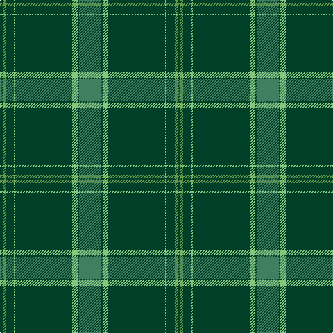

In pattern [GGGYGYGG](/patterns/gggygygg/).

This was sourced from register-of-tartans.  It is a [8 stripes tartan](/stripes/stripes8/).

Original link https://www.tartanregister.gov.uk/tartanDetails.aspx?ref=11007

## Thread count
DG/4 LG4 DG12 LGa2 DG82 LGa8 DG2 G/32

## Palette
Each colour and its ΔE from the base-6 reference it is a variant of.

| Colour | Shade | Base | ΔE (OKLab) |
|---|---|---|---|
| DG | <code style="background-color:#004028;">#004028</code> `#004028` | G <code style="background-color:#006100;">#006100</code> | 0.13 |
| G | <code style="background-color:#408060;">#408060</code> `#408060` | G <code style="background-color:#006100;">#006100</code> | 0.14 |
| LG | <code style="background-color:#649848;">#649848</code> `#649848` | G <code style="background-color:#006100;">#006100</code> | 0.20 |
| LGa | <code style="background-color:#86C67C;">#86C67C</code> `#86C67C` | Y <code style="background-color:#F2BF00;">#F2BF00</code> | 0.15 |

# Sample pattern

## Nearest tartans

The nearest existing variants by ΔTartan distance.

1. [Semper](/setts/s8/g16ga1gb4ga41gb1ga6gc2ga2x2~g408060-ga003820-gb789484-gc289c18/) — ΔT 0.37
1. [Hastings-Stephenson (Personal)](/setts/s8/g44b11g5ba3g4b8g4w1x2~b000048-ba2888c4-g00643c-wf8f8f8/) — ΔT 1.31
1. [St Andrews Old Course Hotel Corporate Tartan Tartan Number: 2332. Earliest known date: 1994 St Andrews Old Course Hotel, Golf Resort, and SPA See products available Copyright © Blair Urquhart, Comrie, 2015](/setts/s6/g50b20k3b2ga2b5x2~b2c2c80-g006818-ga604000-k101010/) — ΔT 1.32
1. [Celtic (New) Corporate Sport Tartan Tartan Number: 2232. Earliest known date: 1842 Should have a white line (?). See products available Copyright © Blair Urquhart, Comrie, 2015](/setts/s8/g44k2g2k2g3k12b10r3x2~b2c2c80-g006818-k101010-rc80000/) — ΔT 1.42
1. [Orvis Sports Company (Corporate)](/setts/s10/g36ga4k1g2k1ga4k4ga60r4ga4~g8c7038-ga003820-k101010-r880000/) — ΔT 1.46
1. [Kinfauns Castle (Corporate)](/setts/s6/r4b12g2b2g46w1x2~b780078-g006818-rc80000-we0e0e0/) — ΔT 1.47
1. [Fife, Duke Of](/setts/s6/g32k6g4k8r1k2x4~g005814-k101010-rc80000/) — ΔT 1.50
1. [Royal and Ancient, The](/setts/s6/g49b16ga3b2ga2b6x2~b2c2c80-g006818-ga604000/) — ΔT 1.52
1. [Royal and Ancient, The](/setts/s6/g49b16r3b2r2b6x2~b304080-g008000-r806050/) — ΔT 1.55
1. [Fife Duke of.. District Tartan Tartan Number: 790. Earliest known date: 1889 Designed for the celebration of the wedding of Louise, the Princess Royal, daughter of Edward VII, and grand daughter of Queen Victoria, to Alexander Duff, the first Duke of Fife. The sett differs slightly from the modern district tartan. See products available Copyright © Blair Urquhart, Comrie, 2015](/setts/s6/g32k6g4k8r1k2x2~g006818-k101010-rc80000/) — ΔT 1.55

## Neighbour map

Every grey dot is one of 15726 variants placed by the first two principal components of the ΔTartan feature space (44% of its variance). Red is this tartan; blue dots are its nearest — click one to open its page.

<svg viewBox="0 0 640 380" role="img" style="max-width:100%;height:auto;border:1px solid #e0e0e0;border-radius:4px;display:block" xmlns="http://www.w3.org/2000/svg"><image href="/nn/cloud.v1.png" width="640" height="380"/><a href="/setts/s8/g16ga1gb4ga41gb1ga6gc2ga2x2~g408060-ga003820-gb789484-gc289c18/"><circle cx="510.8" cy="152.7" r="4" fill="#3465a4"><title>Semper</title></circle></a><a href="/setts/s8/g44b11g5ba3g4b8g4w1x2~b000048-ba2888c4-g00643c-wf8f8f8/"><circle cx="499.7" cy="145.2" r="4" fill="#3465a4"><title>Hastings-Stephenson (Personal)</title></circle></a><a href="/setts/s6/g50b20k3b2ga2b5x2~b2c2c80-g006818-ga604000-k101010/"><circle cx="444.9" cy="184.0" r="4" fill="#3465a4"><title>St Andrews Old Course Hotel Corporate Tartan Tartan Number: 2332. Earliest known date: 1994 St Andrews Old Course Hotel, Golf Resort, and SPA See products available Copyright © Blair Urquhart, Comrie, 2015</title></circle></a><a href="/setts/s8/g44k2g2k2g3k12b10r3x2~b2c2c80-g006818-k101010-rc80000/"><circle cx="417.4" cy="161.7" r="4" fill="#3465a4"><title>Celtic (New) Corporate Sport Tartan Tartan Number: 2232. Earliest known date: 1842 Should have a white line (?). See products available Copyright © Blair Urquhart, Comrie, 2015</title></circle></a><a href="/setts/s10/g36ga4k1g2k1ga4k4ga60r4ga4~g8c7038-ga003820-k101010-r880000/"><circle cx="469.5" cy="119.4" r="4" fill="#3465a4"><title>Orvis Sports Company (Corporate)</title></circle></a><a href="/setts/s6/r4b12g2b2g46w1x2~b780078-g006818-rc80000-we0e0e0/"><circle cx="517.0" cy="141.6" r="4" fill="#3465a4"><title>Kinfauns Castle (Corporate)</title></circle></a><a href="/setts/s6/g32k6g4k8r1k2x4~g005814-k101010-rc80000/"><circle cx="528.6" cy="205.0" r="4" fill="#3465a4"><title>Fife, Duke Of</title></circle></a><a href="/setts/s6/g49b16ga3b2ga2b6x2~b2c2c80-g006818-ga604000/"><circle cx="483.1" cy="204.2" r="4" fill="#3465a4"><title>Royal and Ancient, The</title></circle></a><a href="/setts/s6/g49b16r3b2r2b6x2~b304080-g008000-r806050/"><circle cx="468.6" cy="197.5" r="4" fill="#3465a4"><title>Royal and Ancient, The</title></circle></a><a href="/setts/s6/g32k6g4k8r1k2x2~g006818-k101010-rc80000/"><circle cx="500.5" cy="193.3" r="4" fill="#3465a4"><title>Fife Duke of.. District Tartan Tartan Number: 790. Earliest known date: 1889 Designed for the celebration of the wedding of Louise, the Princess Royal, daughter of Edward VII, and grand daughter of Queen Victoria, to Alexander Duff, the first Duke of Fife. The sett differs slightly from the modern district tartan. See products available Copyright © Blair Urquhart, Comrie, 2015</title></circle></a><circle cx="501.6" cy="148.7" r="5" fill="#c00000"/></svg>

ID: /setts/s8/g16ga1y4ga41y1ga6gb2ga2x2~g408060-ga004028-gb649848-y86c67c/
