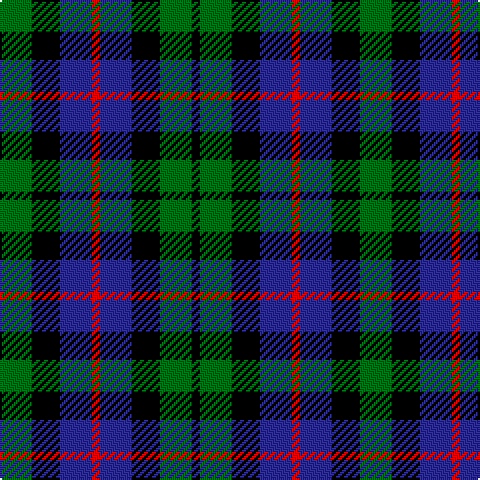

In pattern [GKBRBKGK](/patterns/gkbrbkgk/).

This was sourced from register-of-tartans.  It is a [8 stripes tartan](/stripes/stripes8/).

Original link https://www.tartanregister.gov.uk/tartanDetails.aspx?ref=914

## Thread count
G/16 K14 DB16 R4 DB16 K14 G16 K/4

## Palette
Each colour and its ΔE from the base-6 reference it is a variant of.

| Colour | Shade | Base | ΔE (OKLab) |
|---|---|---|---|
| DB | <code style="background-color:#2C2C80;">#2C2C80</code> `#2C2C80` | B <code style="background-color:#2C4084;">#2C4084</code> | 0.05 |
| G | <code style="background-color:#006818;">#006818</code> `#006818` | G <code style="background-color:#006400;">#006400</code> | 0.02 |
| K | <code style="background-color:#000000;">#000000</code> `#000000` | K <code style="background-color:#000000;">#000000</code> | 0.00 |
| R | <code style="background-color:#C80000;">#C80000</code> `#C80000` | R <code style="background-color:#C80000;">#C80000</code> | 0.00 |

# Sample pattern

## Nearest tartans

The nearest existing variants by ΔTartan distance.

1. [MacNeil of Colonsay](/setts/s7/b8g12w2g12k12b12k4-b000064-g004c00-k000000-wd0d0d0/) — ΔT 1.09
1. [Graham of Montrose](/setts/s7/k4g4w1g4k4b4k1-b00004c-g004c00-k000000-wd0d0d0/) — ΔT 1.11
1. [Campbell of Breadalbane (Clan)](/setts/s7/k18g18y4g18k18b18k6-b2c2c80-g006818-k000000-ydcbc00/) — ΔT 1.15
1. [Graham of Montrose](/setts/s7/k8g8y2g8k8b8k2-b000052-g11450d-k000000-yaaaaaa/) — ΔT 1.16
1. [Graham of Montrose](/setts/s7/k4g4y1g4k4b4k1-b000052-g11450d-k000000-yaaaaaa/) — ΔT 1.16
1. [Norwich No.064](/setts/s8/b24k32g28k10g28k32b24g8-b2c2c80-g006818-k000000/) — ΔT 1.16
1. [Denholm (Fashion)](/setts/s5/k10g40k36b40r10-b2c2c80-g006818-k000000-rc80000/) — ΔT 1.20
1. [Graham of Montrose Clan Tartan Tartan Number: 1044. Earliest known date: 1810-15 This sett was woven by Wilson's of Bannockburn around 1819. Wilson called it the No. 64 or 'Abercrombie' pattern, and produced it in various colours. In yellow it becomes the Breadalbane and in red, the MacCallum. The white striped Graham tartan is also known as MacLaggan. It is worn unofficially by 205 (sc) General Hospital RAMCV. There is a sample dating from 1815, labelled 'Graham', in the Cockburn Collection. It was first published in the Smith's book of 1850. See also Montrose, Menteith. See products available Copyright © Blair Urquhart, Comrie, 2015](/setts/s7/k16g16w4g16k16b16k4-b2c2c80-g006818-k101010-we0e0e0/) — ΔT 1.22
1. [Graham of Montrose - 1850 (Clan)](/setts/s7/k18g18w4g18k18b18k6-b2c2c80-g006818-k101010-wfcfcfc/) — ΔT 1.23
1. [Melrose of Alabama](/setts/s7/k24b24r8b24k24g24y8-b00008c-g007800-k000000-r8c0000-yc88c00/) — ΔT 1.24

## Neighbour map

Every grey dot is one of 15726 variants placed by the first two principal components of the ΔTartan feature space (44% of its variance). Red is this tartan; blue dots are its nearest — click one to open its page.

<svg viewBox="0 0 640 380" role="img" style="max-width:100%;height:auto;border:1px solid #e0e0e0;border-radius:4px;display:block" xmlns="http://www.w3.org/2000/svg"><image href="/nn/cloud.v1.png" width="640" height="380"/><a href="/setts/s7/b8g12w2g12k12b12k4-b000064-g004c00-k000000-wd0d0d0/"><circle cx="142.3" cy="275.5" r="4" fill="#3465a4"><title>MacNeil of Colonsay</title></circle></a><a href="/setts/s7/k4g4w1g4k4b4k1-b00004c-g004c00-k000000-wd0d0d0/"><circle cx="132.0" cy="290.0" r="4" fill="#3465a4"><title>Graham of Montrose</title></circle></a><a href="/setts/s7/k18g18y4g18k18b18k6-b2c2c80-g006818-k000000-ydcbc00/"><circle cx="127.0" cy="280.9" r="4" fill="#3465a4"><title>Campbell of Breadalbane (Clan)</title></circle></a><a href="/setts/s7/k8g8y2g8k8b8k2-b000052-g11450d-k000000-yaaaaaa/"><circle cx="143.3" cy="294.4" r="4" fill="#3465a4"><title>Graham of Montrose</title></circle></a><a href="/setts/s7/k4g4y1g4k4b4k1-b000052-g11450d-k000000-yaaaaaa/"><circle cx="143.3" cy="294.4" r="4" fill="#3465a4"><title>Graham of Montrose</title></circle></a><a href="/setts/s8/b24k32g28k10g28k32b24g8-b2c2c80-g006818-k000000/"><circle cx="136.1" cy="305.2" r="4" fill="#3465a4"><title>Norwich No.064</title></circle></a><a href="/setts/s5/k10g40k36b40r10-b2c2c80-g006818-k000000-rc80000/"><circle cx="108.1" cy="283.4" r="4" fill="#3465a4"><title>Denholm (Fashion)</title></circle></a><a href="/setts/s7/k16g16w4g16k16b16k4-b2c2c80-g006818-k101010-we0e0e0/"><circle cx="142.2" cy="289.2" r="4" fill="#3465a4"><title>Graham of Montrose Clan Tartan Tartan Number: 1044. Earliest known date: 1810-15 This sett was woven by Wilson's of Bannockburn around 1819. Wilson called it the No. 64 or 'Abercrombie' pattern, and produced it in various colours. In yellow it becomes the Breadalbane and in red, the MacCallum. The white striped Graham tartan is also known as MacLaggan. It is worn unofficially by 205 (sc) General Hospital RAMCV. There is a sample dating from 1815, labelled 'Graham', in the Cockburn Collection. It was first published in the Smith's book of 1850. See also Montrose, Menteith. See products available Copyright © Blair Urquhart, Comrie, 2015</title></circle></a><a href="/setts/s7/k18g18w4g18k18b18k6-b2c2c80-g006818-k101010-wfcfcfc/"><circle cx="146.5" cy="286.6" r="4" fill="#3465a4"><title>Graham of Montrose - 1850 (Clan)</title></circle></a><a href="/setts/s7/k24b24r8b24k24g24y8-b00008c-g007800-k000000-r8c0000-yc88c00/"><circle cx="48.2" cy="283.1" r="4" fill="#3465a4"><title>Melrose of Alabama</title></circle></a><circle cx="84.5" cy="282.6" r="5" fill="#c00000"/></svg>

ID: /setts/s8/g16k14b16r4b16k14g16k4-b2c2c80-g006818-k000000-rc80000/
