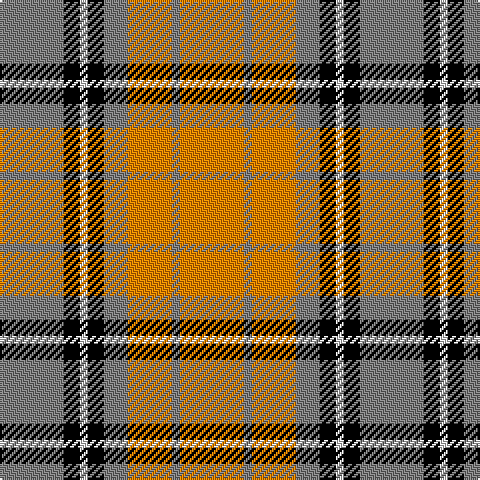

In pattern [GKWKGYGY](/patterns/gkwkgygy/).

This was sourced from weddslist.  It is a [8 stripes tartan](/stripes/stripes8/).

Original link http://www.weddslist.com/cgi-bin/tartans/pg.pl?source=sts

## Thread count
N/32 K8 LN4 K8 N12 O22 N4 O/32

## Palette
Each colour and its ΔE from the base-6 reference it is a variant of.

| Colour | Shade | Base | ΔE (OKLab) |
|---|---|---|---|
| K | <code style="background-color:#000000;">#000000</code> `#000000` | K <code style="background-color:#000000;">#000000</code> | 0.00 |
| LN | <code style="background-color:#E0E0E0;">#E0E0E0</code> `#E0E0E0` | W <code style="background-color:#F7F7F7;">#F7F7F7</code> | 0.07 |
| N | <code style="background-color:#808080;">#808080</code> `#808080` | G <code style="background-color:#006100;">#006100</code> | 0.23 |
| O | <code style="background-color:#FF8500;">#FF8500</code> `#FF8500` | Y <code style="background-color:#F2BF00;">#F2BF00</code> | 0.14 |

# Sample pattern

## Nearest tartans

The nearest existing variants by ΔTartan distance.

1. [Orange Fanaticos (Corporate)](/setts/s7/b12y75k22w12k22w16b8~b5c788c-k101010-we0e0e0-yd87c00/) — ΔT 1.00
1. [Orange Fanaticos](/setts/s7/w12y75k22wa12k22wa16w8~k101010-wadbee9-waffffff-yfc8100/) — ΔT 1.06
1. [Redwood Dress](/setts/s9/g3r1w5r1g2r1g1r9b2~b4c3428-g285800-r880000-wece8cc~x4/) — ΔT 1.18
1. [Starr (1978) (Name)](/setts/s7/k2r4w1r10g12r2w2~g00881c-k101010-rc80000-we0e0e0~x4/) — ΔT 1.25
1. [Carolyn, Melieres](/setts/s10/y4w2y2w8r16g3r3g8r6k2~g008000-k000000-rc00000-we0e0e0-yf0c000~x2/) — ΔT 1.26
1. [Unidentified 34](/setts/s9/w6r1ra4w1b4r1ra8w1ra2~b000050-r906030-rac00000-we0e0e0~x2/) — ΔT 1.29
1. [Thomson Camel](/setts/s6/r4y30k6w13k13w3~k101010-rc80000-we0e0e0-ya08858~x2/) — ΔT 1.29
1. [Melieres, Carolyn (Personal)](/setts/s10/y4w2y2w8r16g3r3g8r6k2~g006818-k101010-rc80000-we0e0e0-ye8c000~x2/) — ΔT 1.29
1. [Kinloch Anderson Check (Fashion)](/setts/s7/k3y18k12y18k2y2k3~k101010-ydc943c~x2/) — ΔT 1.30
1. [Graham Red](/setts/s9/y1k1r10g10k5y5r10k1y1~g388458-k000000-rc80000-y94a4b8~x4/) — ΔT 1.32

## Neighbour map

Every grey dot is one of 15726 variants placed by the first two principal components of the ΔTartan feature space (44% of its variance). Red is this tartan; blue dots are its nearest — click one to open its page.

<svg viewBox="0 0 640 380" role="img" style="max-width:100%;height:auto;border:1px solid #e0e0e0;border-radius:4px;display:block" xmlns="http://www.w3.org/2000/svg"><image href="/nn/cloud.v1.png" width="640" height="380"/><a href="/setts/s7/b12y75k22w12k22w16b8~b5c788c-k101010-we0e0e0-yd87c00/"><circle cx="197.1" cy="176.4" r="4" fill="#3465a4"><title>Orange Fanaticos (Corporate)</title></circle></a><a href="/setts/s7/w12y75k22wa12k22wa16w8~k101010-wadbee9-waffffff-yfc8100/"><circle cx="187.7" cy="166.8" r="4" fill="#3465a4"><title>Orange Fanaticos</title></circle></a><a href="/setts/s9/g3r1w5r1g2r1g1r9b2~b4c3428-g285800-r880000-wece8cc~x4/"><circle cx="227.4" cy="174.2" r="4" fill="#3465a4"><title>Redwood Dress</title></circle></a><a href="/setts/s7/k2r4w1r10g12r2w2~g00881c-k101010-rc80000-we0e0e0~x4/"><circle cx="264.1" cy="180.6" r="4" fill="#3465a4"><title>Starr (1978) (Name)</title></circle></a><a href="/setts/s10/y4w2y2w8r16g3r3g8r6k2~g008000-k000000-rc00000-we0e0e0-yf0c000~x2/"><circle cx="168.0" cy="158.1" r="4" fill="#3465a4"><title>Carolyn, Melieres</title></circle></a><a href="/setts/s9/w6r1ra4w1b4r1ra8w1ra2~b000050-r906030-rac00000-we0e0e0~x2/"><circle cx="218.1" cy="177.2" r="4" fill="#3465a4"><title>Unidentified 34</title></circle></a><a href="/setts/s6/r4y30k6w13k13w3~k101010-rc80000-we0e0e0-ya08858~x2/"><circle cx="188.6" cy="191.0" r="4" fill="#3465a4"><title>Thomson Camel</title></circle></a><a href="/setts/s10/y4w2y2w8r16g3r3g8r6k2~g006818-k101010-rc80000-we0e0e0-ye8c000~x2/"><circle cx="173.6" cy="159.4" r="4" fill="#3465a4"><title>Melieres, Carolyn (Personal)</title></circle></a><a href="/setts/s7/k3y18k12y18k2y2k3~k101010-ydc943c~x2/"><circle cx="160.0" cy="184.8" r="4" fill="#3465a4"><title>Kinloch Anderson Check (Fashion)</title></circle></a><a href="/setts/s9/y1k1r10g10k5y5r10k1y1~g388458-k000000-rc80000-y94a4b8~x4/"><circle cx="200.0" cy="175.1" r="4" fill="#3465a4"><title>Graham Red</title></circle></a><circle cx="198.5" cy="192.0" r="5" fill="#c00000"/></svg>

ID: /setts/s8/g16k4w2k4g6y11g2y16~g808080-k000000-we0e0e0-yff8500~x2/
