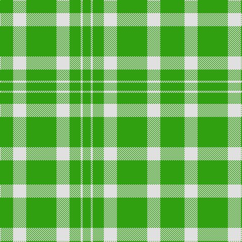

In pattern [GGWGWGWG](/patterns/ggwgwgwg/).

This was sourced from weddslist.  It is a [8 stripes tartan](/stripes/stripes8/).

Original link http://www.weddslist.com/cgi-bin/tartans/pg.pl?source=sts

## Thread count
G/4 G22 LN26 G60 LN26 G22 LN4 G/16

## Palette
Each colour and its ΔE from the base-6 reference it is a variant of.

| Colour | Shade | Base | ΔE (OKLab) |
|---|---|---|---|
| G | <code style="background-color:#30A010;">#30A010</code> `#30A010` | G <code style="background-color:#006100;">#006100</code> | 0.20 |
| LN | <code style="background-color:#E0E0E0;">#E0E0E0</code> `#E0E0E0` | W <code style="background-color:#F7F7F7;">#F7F7F7</code> | 0.07 |

# Sample pattern

## Nearest tartans

The nearest existing variants by ΔTartan distance.

1. [Heritage (Commemorative)](/setts/s7/g40w4g18w4y10w14g20-g006818-we0e0e0-ye8c000/) — ΔT 1.93
1. [Logan](/setts/s7/g40r16g4r16g60ra16g4-g008000-rd03030-rac00000/) — ΔT 2.37
1. [Erskine, Green](/setts/s6/g12w4g58w58g4w12-g008000-we0e0e0/) — ΔT 2.38
1. [O'Neill Irish Family Tartan Tartan Number: 2464. Earliest known date: 1985 O'Neill is an Irish family tartan. The dark yellow stripe is mustard or dark saffron. See products available Copyright © Blair Urquhart, Comrie, 2015](/setts/s4/g18y40g80w10-g006818-we0e0e0-ye8c000/) — ΔT 2.45
1. [O'Neill](/setts/s4/g18y40g80w10-g008000-we0e0e0-yd08010/) — ΔT 2.46
1. [Logan #4](/setts/s7/g36r16g4r16g60ra16g4-g006818-re87878-rac80000/) — ΔT 2.52
1. [Welsh Assembly](/setts/s8/g10ga18g8w10g60r4g8r4-g008000-ga808080-rc00000-we0e0e0/) — ΔT 2.58
1. [Heritage #2](/setts/s7/g40w4g18w4y10w14g20-g005020-we0e0e0-ye8c000/) — ΔT 2.59
1. [Deer Park (Loton) (Personal)](/setts/s7/y120r14w20g32y30w6y30-g003820-rc03824-wf8f8f8-y8ca064/) — ΔT 2.61
1. [Welsh, National](/setts/s5/r16g8r8g88w8-g008000-rc00000-we0e0e0/) — ΔT 2.61

## Neighbour map

Every grey dot is one of 15726 variants placed by the first two principal components of the ΔTartan feature space (44% of its variance). Red is this tartan; blue dots are its nearest — click one to open its page.

<svg viewBox="0 0 640 380" role="img" style="max-width:100%;height:auto;border:1px solid #e0e0e0;border-radius:4px;display:block" xmlns="http://www.w3.org/2000/svg"><image href="/nn/cloud.v1.png" width="640" height="380"/><a href="/setts/s7/g40w4g18w4y10w14g20-g006818-we0e0e0-ye8c000/"><circle cx="380.7" cy="230.0" r="4" fill="#3465a4"><title>Heritage (Commemorative)</title></circle></a><a href="/setts/s7/g40r16g4r16g60ra16g4-g008000-rd03030-rac00000/"><circle cx="445.4" cy="220.8" r="4" fill="#3465a4"><title>Logan</title></circle></a><a href="/setts/s6/g12w4g58w58g4w12-g008000-we0e0e0/"><circle cx="340.3" cy="207.6" r="4" fill="#3465a4"><title>Erskine, Green</title></circle></a><a href="/setts/s4/g18y40g80w10-g006818-we0e0e0-ye8c000/"><circle cx="364.0" cy="261.1" r="4" fill="#3465a4"><title>O'Neill Irish Family Tartan Tartan Number: 2464. Earliest known date: 1985 O'Neill is an Irish family tartan. The dark yellow stripe is mustard or dark saffron. See products available Copyright © Blair Urquhart, Comrie, 2015</title></circle></a><a href="/setts/s4/g18y40g80w10-g008000-we0e0e0-yd08010/"><circle cx="406.7" cy="278.8" r="4" fill="#3465a4"><title>O'Neill</title></circle></a><a href="/setts/s7/g36r16g4r16g60ra16g4-g006818-re87878-rac80000/"><circle cx="428.8" cy="215.7" r="4" fill="#3465a4"><title>Logan #4</title></circle></a><a href="/setts/s8/g10ga18g8w10g60r4g8r4-g008000-ga808080-rc00000-we0e0e0/"><circle cx="440.5" cy="183.2" r="4" fill="#3465a4"><title>Welsh Assembly</title></circle></a><a href="/setts/s7/g40w4g18w4y10w14g20-g005020-we0e0e0-ye8c000/"><circle cx="372.9" cy="226.8" r="4" fill="#3465a4"><title>Heritage #2</title></circle></a><a href="/setts/s7/y120r14w20g32y30w6y30-g003820-rc03824-wf8f8f8-y8ca064/"><circle cx="429.4" cy="168.1" r="4" fill="#3465a4"><title>Deer Park (Loton) (Personal)</title></circle></a><a href="/setts/s5/r16g8r8g88w8-g008000-rc00000-we0e0e0/"><circle cx="491.9" cy="218.5" r="4" fill="#3465a4"><title>Welsh, National</title></circle></a><circle cx="432.1" cy="232.4" r="5" fill="#c00000"/></svg>

ID: /setts/s8/g16w4g22w26g60w26g22g4-g30a010-we0e0e0/
