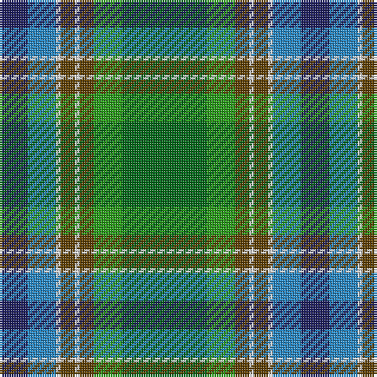

**Bands:** [BBWGWGGG](/stripes/bbwgwggg/) · **Stripes:** [DB T W DY W DY G G](/stripes/stripes8/) DB T W DY W DY G G

This was sourced from tartans-authority.  It is a [8 band tartan](/bands/bands8/).

Original link http://www.tartansauthority.com/tartan-ferret/display/10574/

## Thread count
DB/12 B12 LN2 T6 LN2 T6 G12 Ga/36

## Palette
Each colour and its ΔE from the base-6 reference it is a variant of.

| Colour | Shade | Base | ΔE (OKLab) |
|---|---|---|---|
| B | <code style="background-color:#2888C4;">#2888C4</code> `#2888C4` | B <code style="background-color:#2A418A;">#2A418A</code> | 0.21 |
| DB | <code style="background-color:#202060;">#202060</code> `#202060` | B <code style="background-color:#2A418A;">#2A418A</code> | 0.11 |
| G | <code style="background-color:#289C18;">#289C18</code> `#289C18` | G <code style="background-color:#006100;">#006100</code> | 0.19 |
| Ga | <code style="background-color:#006818;">#006818</code> `#006818` | G <code style="background-color:#006100;">#006100</code> | 0.02 |
| LN | <code style="background-color:#E0E0E0;">#E0E0E0</code> `#E0E0E0` | W <code style="background-color:#F7F7F7;">#F7F7F7</code> | 0.07 |
| T | <code style="background-color:#604000;">#604000</code> `#604000` | G <code style="background-color:#006100;">#006100</code> | 0.14 |

# Sample pattern

## Nearest tartans

The nearest existing variants by ΔTartan distance.

1. [Hughes](/setts/s7/g20dg14db9ly2db9k1w2~x4/) — ΔT 1.19
1. [Jones (Name)](/setts/s7/r4lb1y6g25k8db15lb2~x2/) — ΔT 1.24
1. [Hughes (Inverbervie) (Personal)](/setts/s7/g36dg24b18ly4b18k2w5~x2/) — ΔT 1.25
1. [Mission](/setts/s8/lo2t14k1g11k2w2g2k1~x4/) — ΔT 1.28
1. [Wagland (Name)](/setts/s7/r3db6ly2db15g12dg39w3~x2/) — ΔT 1.32
1. [Wagga Wagga (District)](/setts/s11/g16k6g16g32k2dy7ly2dy7ly2dy7b13/) — ΔT 1.32
1. [Hogg Dress (Name)](/setts/s9/t34r3t8db4t8k24g34k2w6/) — ΔT 1.37
1. [Carter (Savannah) (Personal)](/setts/s10/dy4g26lb1g2lb2dy4lg26dy4g3ly3~x2/) — ΔT 1.37
1. [Stirling, University of Corporate Univ Tartan Tartan Number: 2297. Earliest known date: 1994 This is the accepted University design. See products available Copyright © Blair Urquhart, Comrie, 2015](/setts/s8/g22r3k1g2r3t16k3ly2~x4/) — ΔT 1.37
1. [Stirling University (Corporate)](/setts/s8/g22r3w1g2r3t16k3ly2~x4/) — ΔT 1.39

## Neighbour map

Every grey dot is one of 14313 variants placed by the first two principal components of the ΔTartan feature space (44% of its variance). Red is this tartan; blue dots are its nearest — click one to open its page.

<svg viewBox="0 0 640 380" role="img" style="max-width:100%;height:auto;border:1px solid #e0e0e0;border-radius:4px;display:block" xmlns="http://www.w3.org/2000/svg"><image href="/nn/cloud.v1.png" width="640" height="380"/><a href="/setts/s7/g20dg14db9ly2db9k1w2~x4/"><circle cx="167.0" cy="160.0" r="4" fill="#3465a4"><title>Hughes</title></circle></a><a href="/setts/s7/r4lb1y6g25k8db15lb2~x2/"><circle cx="209.6" cy="147.0" r="4" fill="#3465a4"><title>Jones (Name)</title></circle></a><a href="/setts/s7/g36dg24b18ly4b18k2w5~x2/"><circle cx="153.1" cy="169.5" r="4" fill="#3465a4"><title>Hughes (Inverbervie) (Personal)</title></circle></a><a href="/setts/s8/lo2t14k1g11k2w2g2k1~x4/"><circle cx="181.8" cy="136.7" r="4" fill="#3465a4"><title>Mission</title></circle></a><a href="/setts/s7/r3db6ly2db15g12dg39w3~x2/"><circle cx="271.9" cy="154.1" r="4" fill="#3465a4"><title>Wagland (Name)</title></circle></a><a href="/setts/s11/g16k6g16g32k2dy7ly2dy7ly2dy7b13/"><circle cx="138.0" cy="155.4" r="4" fill="#3465a4"><title>Wagga Wagga (District)</title></circle></a><a href="/setts/s9/t34r3t8db4t8k24g34k2w6/"><circle cx="181.6" cy="141.6" r="4" fill="#3465a4"><title>Hogg Dress (Name)</title></circle></a><a href="/setts/s10/dy4g26lb1g2lb2dy4lg26dy4g3ly3~x2/"><circle cx="228.6" cy="112.7" r="4" fill="#3465a4"><title>Carter (Savannah) (Personal)</title></circle></a><a href="/setts/s8/g22r3k1g2r3t16k3ly2~x4/"><circle cx="250.6" cy="124.7" r="4" fill="#3465a4"><title>Stirling, University of Corporate Univ Tartan Tartan Number: 2297. Earliest known date: 1994 This is the accepted University design. See products available Copyright © Blair Urquhart, Comrie, 2015</title></circle></a><a href="/setts/s8/g22r3w1g2r3t16k3ly2~x4/"><circle cx="250.7" cy="123.9" r="4" fill="#3465a4"><title>Stirling University (Corporate)</title></circle></a><circle cx="189.4" cy="154.3" r="5" fill="#c00000"/></svg>

ID: /setts/s8/g18g6dy3w1dy3w1t6db6~x2/
