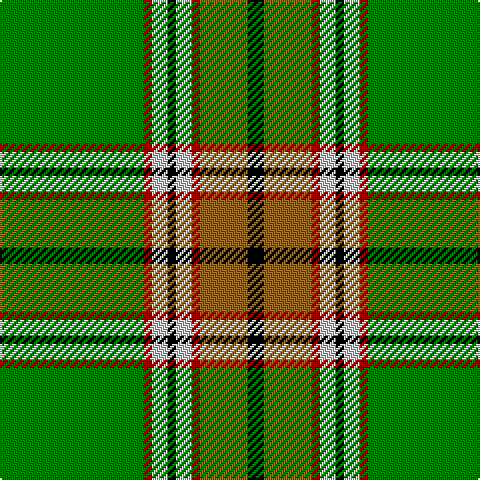

In pattern [GRWKWRRK](/stripes/grwkwrrk/).

This was sourced from tartans-authority.  It is a [8 stripe tartan](/stripes/stripes8/).

Original link http://www.tartansauthority.com/tartan-ferret/display/5225/

## Thread count
G/72 DR4 N8 K4 N8 DR4 LT24 K/8

## Palette
Each colour and the base-6 reference it is a variant of.

| Colour | Shade | Base |
|---|---|---|
| DR | <code style="background-color:#8C0000;">#8C0000</code> `oklch(40.2% 0.165 29.2)` <small>#8C0000</small> | R <code style="background-color:#CC0000;">#CC0000</code> |
| G | <code style="background-color:#007800;">#007800</code> `oklch(49.6% 0.169 142.5)` <small>#007800</small> | G <code style="background-color:#006100;">#006100</code> |
| K | <code style="background-color:#000000;">#000000</code> `oklch(0.0% 0.000 0.0)` <small>#000000</small> | K <code style="background-color:#000000;">#000000</code> |
| LT | <code style="background-color:#8C6428;">#8C6428</code> `oklch(53.3% 0.092 74.3)` <small>#8C6428</small> | R <code style="background-color:#CC0000;">#CC0000</code> |
| N | <code style="background-color:#C8C8C8;">#C8C8C8</code> `oklch(83.3% 0.000 89.9)` <small>#C8C8C8</small> | W <code style="background-color:#F7F7F7;">#F7F7F7</code> |

# Sample pattern

## Nearest tartans

The nearest existing variants by ΔTartan distance, with this tartan at the top so the swatches line up against it.

ΔTartan

Tartan

Sett

—

<a href="/ttd/edit/#slug=g18r1lb2k1lb2r1o6k2~x4">Humphries (Name)</a> <a class="nn-out" href="/setts/s8/g18r1lb2k1lb2r1o6k2~x4/" title="open its dictionary page">↗</a>

0.75

<a href="/ttd/edit/#slug=g12k1r1k1t2k1ly4~x2">Alberta District Tartan Tartan Number: 2055. Earliest known date: 1961 Designed for the Edmonton Rehabilitation Society as a project for handloom weaving by disabled students. The Provincial Legislative of Alberta gave formal approval for the Alberta tartan in 1961. See products available Copyright © Blair Urquhart, Comrie, 2015</a> <a class="nn-out" href="/setts/s7/g12k1r1k1t2k1ly4~x2/" title="open its dictionary page">↗</a>

0.76

<a href="/ttd/edit/#slug=g13k1r1k1b2k1ly4~x8">Alberta (Province)</a> <a class="nn-out" href="/setts/s7/g13k1r1k1b2k1ly4~x8/" title="open its dictionary page">↗</a>

0.84

<a href="/ttd/edit/#slug=g12k1r1k1b2k1ly4~x8">Alberta (District)</a> <a class="nn-out" href="/setts/s7/g12k1r1k1b2k1ly4~x8/" title="open its dictionary page">↗</a>

0.92

<a href="/ttd/edit/#slug=w6g5r5g45k4o24k4g5~x2">O'Neill</a> <a class="nn-out" href="/setts/s8/w6g5r5g45k4o24k4g5~x2/" title="open its dictionary page">↗</a>

0.99

<a href="/ttd/edit/#slug=ly5g3ly3g53r7db5r13w4~x2">Hall (P.I.E.) (Personal)</a> <a class="nn-out" href="/setts/s8/ly5g3ly3g53r7db5r13w4~x2/" title="open its dictionary page">↗</a>

1.07

<a href="/ttd/edit/#slug=k3w1g29y8r2y2r2y2r8g7k2~x2">Gray, hunting</a> <a class="nn-out" href="/setts/s11/k3w1g29y8r2y2r2y2r8g7k2~x2/" title="open its dictionary page">↗</a>

1.08

<a href="/ttd/edit/#slug=w9dg2g2w3g18k2dg33lo2~x2">New World Irish (Fashion)</a> <a class="nn-out" href="/setts/s8/w9dg2g2w3g18k2dg33lo2~x2/" title="open its dictionary page">↗</a>

1.13

<a href="/ttd/edit/#slug=g71k4r4db9r4db4r36db4w4">Rattray</a> <a class="nn-out" href="/setts/s9/g71k4r4db9r4db4r36db4w4/" title="open its dictionary page">↗</a>

1.13

<a href="/ttd/edit/#slug=k1g3w3g15k1g3g2k1g1g1w1~x2">University of North Texas</a> <a class="nn-out" href="/setts/s11/k1g3w3g15k1g3g2k1g1g1w1~x2/" title="open its dictionary page">↗</a>

1.14

<a href="/ttd/edit/#slug=t6g2t2g41dg6g2r21ly6">Manitoba</a> <a class="nn-out" href="/setts/s8/t6g2t2g41dg6g2r21ly6/" title="open its dictionary page">↗</a>

## Neighbour map

Every grey dot is one of 14299 variants placed by the first two principal components of the ΔTartan feature space (44% of its variance). Red is this tartan; blue dots are its nearest — click one to open its page.

<svg viewBox="0 0 640 380" role="img" style="max-width:100%;height:auto;border:1px solid #e0e0e0;border-radius:4px;display:block" xmlns="http://www.w3.org/2000/svg"><image href="/nn/cloud.v1.png" width="640" height="380"/><a href="/setts/s7/g12k1r1k1t2k1ly4~x2/"><circle cx="270.5" cy="155.3" r="4" fill="#3465a4"><title>Alberta District Tartan Tartan Number: 2055. Earliest known date: 1961 Designed for the Edmonton Rehabilitation Society as a project for handloom weaving by disabled students. The Provincial Legislative of Alberta gave formal approval for the Alberta tartan in 1961. See products available Copyright © Blair Urquhart, Comrie, 2015</title></circle></a><a href="/setts/s7/g13k1r1k1b2k1ly4~x8/"><circle cx="290.9" cy="152.6" r="4" fill="#3465a4"><title>Alberta (Province)</title></circle></a><a href="/setts/s7/g12k1r1k1b2k1ly4~x8/"><circle cx="270.8" cy="156.5" r="4" fill="#3465a4"><title>Alberta (District)</title></circle></a><a href="/setts/s8/w6g5r5g45k4o24k4g5~x2/"><circle cx="283.5" cy="159.2" r="4" fill="#3465a4"><title>O'Neill</title></circle></a><a href="/setts/s8/ly5g3ly3g53r7db5r13w4~x2/"><circle cx="345.3" cy="131.6" r="4" fill="#3465a4"><title>Hall (P.I.E.) (Personal)</title></circle></a><a href="/setts/s11/k3w1g29y8r2y2r2y2r8g7k2~x2/"><circle cx="312.6" cy="105.1" r="4" fill="#3465a4"><title>Gray, hunting</title></circle></a><a href="/setts/s8/w9dg2g2w3g18k2dg33lo2~x2/"><circle cx="270.3" cy="149.8" r="4" fill="#3465a4"><title>New World Irish (Fashion)</title></circle></a><a href="/setts/s9/g71k4r4db9r4db4r36db4w4/"><circle cx="297.9" cy="118.3" r="4" fill="#3465a4"><title>Rattray</title></circle></a><a href="/setts/s11/k1g3w3g15k1g3g2k1g1g1w1~x2/"><circle cx="283.1" cy="124.3" r="4" fill="#3465a4"><title>University of North Texas</title></circle></a><a href="/setts/s8/t6g2t2g41dg6g2r21ly6/"><circle cx="289.2" cy="127.4" r="4" fill="#3465a4"><title>Manitoba</title></circle></a><circle cx="289.8" cy="129.2" r="5" fill="#c00000"/></svg>

ID: /setts/s8/g18r1lb2k1lb2r1o6k2~x4/
