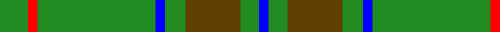
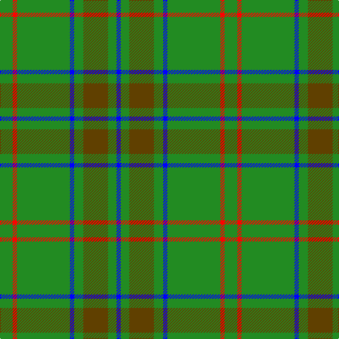

This page is one **sett** — a single exact thread-count. It belongs to the [tartan](/tartans/g18r6g75b6g13t35g12b6/)
(the same proportion at any scale), whose colour order is pattern [BGGGBGRG](/stripes/bgggbgrg/).

Sourced from register-of-tartans.  It is a [8 stripe tartan](/stripes/stripes8/).

Original link https://www.tartanregister.gov.uk/tartanDetails.aspx?ref=1422

## Also known as

This cloth is also recorded under:

- Glenlivet

## Register references

External register numbers recorded for this tartan.

- Scottish Register of Tartans: [1422](https://www.tartanregister.gov.uk/tartanDetails.aspx?ref=1422)
- Scottish Tartans Authority (ITI): 193
- Scottish Tartans World Register: 193

## Thread count
G/18 R6 G75 B6 G13 T35 G12 B/6

## Palette
Each colour and the base-6 reference it is a variant of.

| Colour | Shade | Base |
|---|---|---|
| B | <code style="background-color:#0000FF;">#0000FF</code> `oklch(45.2% 0.313 264.1)` <small>#0000FF</small> | B <code style="background-color:#2A418A;">#2A418A</code> |
| G | <code style="background-color:#228B22;">#228B22</code> `oklch(55.8% 0.169 142.9)` <small>#228B22</small> | G <code style="background-color:#006100;">#006100</code> |
| R | <code style="background-color:#FF0000;">#FF0000</code> `oklch(62.8% 0.258 29.2)` <small>#FF0000</small> | R <code style="background-color:#CC0000;">#CC0000</code> |
| T | <code style="background-color:#604000;">#604000</code> `oklch(39.8% 0.083 76.8)` <small>#604000</small> | G <code style="background-color:#006100;">#006100</code> |

# Sample pattern

## Nearest tartans

The nearest existing variants by ΔTartan distance, with this tartan at the top so the swatches line up against it.

ΔTartan

Tartan

Sett

—

<a href="/ttd/edit/#slug=g18r6g75b6g13dy35g12b6">Glenlivet</a> <a class="nn-out" href="/setts/s8/g18r6g75b6g13dy35g12b6/" title="open its dictionary page">↗</a>

0.58

<a href="/ttd/edit/#slug=g5o9g4w5g30r2g4r2~x2">Welsh Assembly (Fashion)</a> <a class="nn-out" href="/setts/s8/g5o9g4w5g30r2g4r2~x2/" title="open its dictionary page">↗</a>

0.63

<a href="/ttd/edit/#slug=g5y9g4w5g30r2g4r2~x2">Welsh Assembly</a> <a class="nn-out" href="/setts/s8/g5y9g4w5g30r2g4r2~x2/" title="open its dictionary page">↗</a>

1.04

<a href="/ttd/edit/#slug=db1r3g11r2db5g11ly1~x2">MacKintosh, hunting</a> <a class="nn-out" href="/setts/s7/db1r3g11r2db5g11ly1~x2/" title="open its dictionary page">↗</a>

1.13

<a href="/ttd/edit/#slug=g30t8g5lb4g5r2~x4">Annapolis Valley</a> <a class="nn-out" href="/setts/s6/g30t8g5lb4g5r2~x4/" title="open its dictionary page">↗</a>

1.23

<a href="/ttd/edit/#slug=r3g22db16g14r2g6ly1~x2">Scottish Scouts</a> <a class="nn-out" href="/setts/s7/r3g22db16g14r2g6ly1~x2/" title="open its dictionary page">↗</a>

1.24

<a href="/ttd/edit/#slug=g6g3g3g4g4k5g3k5g28r2g4r2~x2">Ross Hunting Clan Tartan Tartan Number: 756. Earliest known date: 1850 The threadcount is based on a sample from the MacGregor-Hastie collection of the Scottish Tartans Society. This version originally showed the light green overcheck having six stripes. BU noted irregularities in the threadcount, and suggests that 4 light green stripes would produce a more plausible kilting fabric. BU created the original transcription. Earliest historical reference. Other sources give Smith Museum, Stirling as the source. See products available Copyright © Blair Urquhart, Comrie, 2015</a> <a class="nn-out" href="/setts/s12/g6g3g3g4g4k5g3k5g28r2g4r2~x2/" title="open its dictionary page">↗</a>

1.25

<a href="/ttd/edit/#slug=o9g4w5g30r2g4r2g4r2g30w5g4o9g5~x2">Welsh Assembly</a> <a class="nn-out" href="/setts/s14/o9g4w5g30r2g4r2g4r2g30w5g4o9g5~x2/" title="open its dictionary page">↗</a>

1.31

<a href="/ttd/edit/#slug=r1g6ly1g6db1g1db1g1db2r1~x4">Ayrton, Laoch</a> <a class="nn-out" href="/setts/s10/r1g6ly1g6db1g1db1g1db2r1~x4/" title="open its dictionary page">↗</a>

1.36

<a href="/ttd/edit/#slug=dg10o1dg1o1lr2dg1o1~x4">Green Watch</a> <a class="nn-out" href="/setts/s7/dg10o1dg1o1lr2dg1o1~x4/" title="open its dictionary page">↗</a>

1.36

<a href="/ttd/edit/#slug=g4r1g15t5r1w5g4r1~x4">McGirr (Letterkenny) David, (Pers.)</a> <a class="nn-out" href="/setts/s8/g4r1g15t5r1w5g4r1~x4/" title="open its dictionary page">↗</a>

## Neighbour map

Every grey dot is one of 14299 variants placed by the first two principal components of the ΔTartan feature space (44% of its variance). Red is this tartan; blue dots are its nearest — click one to open its page.

<svg viewBox="0 0 640 380" role="img" style="max-width:100%;height:auto;border:1px solid #e0e0e0;border-radius:4px;display:block" xmlns="http://www.w3.org/2000/svg"><image href="/nn/cloud.v1.png" width="640" height="380"/><a href="/setts/s8/g5o9g4w5g30r2g4r2~x2/"><circle cx="434.0" cy="181.9" r="4" fill="#3465a4"><title>Welsh Assembly (Fashion)</title></circle></a><a href="/setts/s8/g5y9g4w5g30r2g4r2~x2/"><circle cx="442.1" cy="186.8" r="4" fill="#3465a4"><title>Welsh Assembly</title></circle></a><a href="/setts/s7/db1r3g11r2db5g11ly1~x2/"><circle cx="365.2" cy="217.4" r="4" fill="#3465a4"><title>MacKintosh, hunting</title></circle></a><a href="/setts/s6/g30t8g5lb4g5r2~x4/"><circle cx="478.3" cy="213.0" r="4" fill="#3465a4"><title>Annapolis Valley</title></circle></a><a href="/setts/s7/r3g22db16g14r2g6ly1~x2/"><circle cx="408.6" cy="202.2" r="4" fill="#3465a4"><title>Scottish Scouts</title></circle></a><a href="/setts/s12/g6g3g3g4g4k5g3k5g28r2g4r2~x2/"><circle cx="435.9" cy="179.8" r="4" fill="#3465a4"><title>Ross Hunting Clan Tartan Tartan Number: 756. Earliest known date: 1850 The threadcount is based on a sample from the MacGregor-Hastie collection of the Scottish Tartans Society. This version originally showed the light green overcheck having six stripes. BU noted irregularities in the threadcount, and suggests that 4 light green stripes would produce a more plausible kilting fabric. BU created the original transcription. Earliest historical reference. Other sources give Smith Museum, Stirling as the source. See products available Copyright © Blair Urquhart, Comrie, 2015</title></circle></a><a href="/setts/s14/o9g4w5g30r2g4r2g4r2g30w5g4o9g5~x2/"><circle cx="420.6" cy="160.7" r="4" fill="#3465a4"><title>Welsh Assembly</title></circle></a><a href="/setts/s10/r1g6ly1g6db1g1db1g1db2r1~x4/"><circle cx="355.6" cy="218.1" r="4" fill="#3465a4"><title>Ayrton, Laoch</title></circle></a><a href="/setts/s7/dg10o1dg1o1lr2dg1o1~x4/"><circle cx="459.3" cy="214.5" r="4" fill="#3465a4"><title>Green Watch</title></circle></a><a href="/setts/s8/g4r1g15t5r1w5g4r1~x4/"><circle cx="353.4" cy="180.5" r="4" fill="#3465a4"><title>McGirr (Letterkenny) David, (Pers.)</title></circle></a><circle cx="419.4" cy="199.9" r="5" fill="#c00000"/></svg>

ID: /setts/s8/g18r6g75b6g13dy35g12b6/
