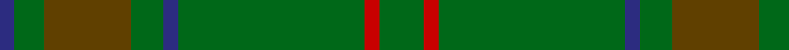
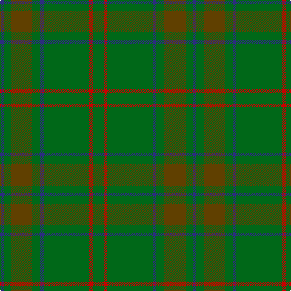

In pattern [BGGGBGRG](/patterns/bgggbgrg/).

This was sourced from house-of-tartan.  It is a [8 stripes tartan](/stripes/stripes8/).

Original link http://www.house-of-tartan.scotland.net/house/TartanViewjs.asp?colr=Def&tnam=193

## Thread count
DB/6 G12 T35 G13 DB6 G75 R6 G/18

## Palette
Each colour and its ΔE from the base-6 reference it is a variant of.

| Colour | Shade | Base | ΔE (OKLab) |
|---|---|---|---|
| DB | <code style="background-color:#2C2C80;">#2C2C80</code> `#2C2C80` | B <code style="background-color:#2A418A;">#2A418A</code> | 0.06 |
| G | <code style="background-color:#006818;">#006818</code> `#006818` | G <code style="background-color:#006100;">#006100</code> | 0.02 |
| R | <code style="background-color:#C80000;">#C80000</code> `#C80000` | R <code style="background-color:#CC0000;">#CC0000</code> | 0.01 |
| T | <code style="background-color:#604000;">#604000</code> `#604000` | G <code style="background-color:#006100;">#006100</code> | 0.14 |

# Sample pattern

## Nearest tartans

The nearest existing variants by ΔTartan distance.

1. [Glenlivet](/setts/s8/g18r6g75b6g13ra35g12b6~b304080-g008000-rc00000-ra806050/) — ΔT 1.13
1. [Glen Boig](/setts/s5/g37r9g3b9r3~b401000-g006020-r806050~x2/) — ΔT 1.45
1. [Montgomerie Artifact Tartan Tartan Number: 692. Earliest known date: c.1815 The sample does not show a complete sett. The broad mid green stripe is narrower in the weft. See products available Copyright © Blair Urquhart, Comrie, 2015](/setts/s12/g27ga39b3ga3b4ga3b3ga39b3ga3b4ga3~b2c2c80-g003820-ga006818~x2/) — ΔT 1.53
1. [INSEAD](/setts/s12/y3g15r2g2r6g2ga6g2ga2g23gb2g2~g00643c-ga002814-gb008b00-r880000-ybc8c00~x2/) — ΔT 1.82
1. [Gayre Bodyguard](/setts/s8/g18r6g75b6g13ga35g12b6~b2c4084-g005020-ga503c14-rdc0000/) — ΔT 1.87
1. [Irving of Bonshaw](/setts/s5/g27ga14b2ga2y2~b003c64-g006818-ga048888-ye8c000~x4/) — ΔT 1.88
1. [Hueg (Hunting) (Personal)](/setts/s10/b17g5b5g17b4g17k2ga2k2g5~b003c64-g006818-ga604000-k101010~x2/) — ΔT 1.93
1. [O'Brien (Scotch Corner)](/setts/s9/g36ga19g4ga31b2r3b2r3ga12~b1474b4-g5c6428-ga289c18-ra00000~x2/) — ΔT 1.95
1. [Huntsman](/setts/s8/g3ga3g4k4gb14k3g41gc2~g5c6428-ga604000-gb603800-gc408060-k101010~x2/) — ΔT 1.99
1. [New South Wales](/setts/s14/g3y1g3r1g14ga2g3ga1g3gb1g2gb1g2gb2~g006818-ga003820-gb408060-rc80000-yd09800~x4/) — ΔT 2.00

## Neighbour map

Every grey dot is one of 15726 variants placed by the first two principal components of the ΔTartan feature space (44% of its variance). Red is this tartan; blue dots are its nearest — click one to open its page.

<svg viewBox="0 0 640 380" role="img" style="max-width:100%;height:auto;border:1px solid #e0e0e0;border-radius:4px;display:block" xmlns="http://www.w3.org/2000/svg"><image href="/nn/cloud.v1.png" width="640" height="380"/><a href="/setts/s8/g18r6g75b6g13ra35g12b6~b304080-g008000-rc00000-ra806050/"><circle cx="471.5" cy="220.9" r="4" fill="#3465a4"><title>Glenlivet</title></circle></a><a href="/setts/s5/g37r9g3b9r3~b401000-g006020-r806050~x2/"><circle cx="491.8" cy="263.1" r="4" fill="#3465a4"><title>Glen Boig</title></circle></a><a href="/setts/s12/g27ga39b3ga3b4ga3b3ga39b3ga3b4ga3~b2c2c80-g003820-ga006818~x2/"><circle cx="497.2" cy="216.6" r="4" fill="#3465a4"><title>Montgomerie Artifact Tartan Tartan Number: 692. Earliest known date: c.1815 The sample does not show a complete sett. The broad mid green stripe is narrower in the weft. See products available Copyright © Blair Urquhart, Comrie, 2015</title></circle></a><a href="/setts/s12/y3g15r2g2r6g2ga6g2ga2g23gb2g2~g00643c-ga002814-gb008b00-r880000-ybc8c00~x2/"><circle cx="434.2" cy="180.9" r="4" fill="#3465a4"><title>INSEAD</title></circle></a><a href="/setts/s8/g18r6g75b6g13ga35g12b6~b2c4084-g005020-ga503c14-rdc0000/"><circle cx="540.9" cy="253.8" r="4" fill="#3465a4"><title>Gayre Bodyguard</title></circle></a><a href="/setts/s5/g27ga14b2ga2y2~b003c64-g006818-ga048888-ye8c000~x4/"><circle cx="422.8" cy="239.9" r="4" fill="#3465a4"><title>Irving of Bonshaw</title></circle></a><a href="/setts/s10/b17g5b5g17b4g17k2ga2k2g5~b003c64-g006818-ga604000-k101010~x2/"><circle cx="378.6" cy="245.4" r="4" fill="#3465a4"><title>Hueg (Hunting) (Personal)</title></circle></a><a href="/setts/s9/g36ga19g4ga31b2r3b2r3ga12~b1474b4-g5c6428-ga289c18-ra00000~x2/"><circle cx="409.5" cy="202.4" r="4" fill="#3465a4"><title>O'Brien (Scotch Corner)</title></circle></a><a href="/setts/s8/g3ga3g4k4gb14k3g41gc2~g5c6428-ga604000-gb603800-gc408060-k101010~x2/"><circle cx="499.8" cy="179.7" r="4" fill="#3465a4"><title>Huntsman</title></circle></a><a href="/setts/s14/g3y1g3r1g14ga2g3ga1g3gb1g2gb1g2gb2~g006818-ga003820-gb408060-rc80000-yd09800~x4/"><circle cx="553.3" cy="195.9" r="4" fill="#3465a4"><title>New South Wales</title></circle></a><circle cx="497.5" cy="233.4" r="5" fill="#c00000"/></svg>

ID: /setts/s8/g18r6g75b6g13ga35g12b6~b2c2c80-g006818-ga604000-rc80000/
