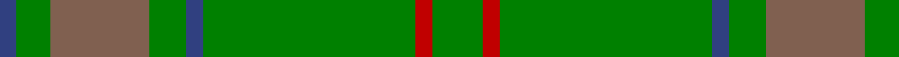
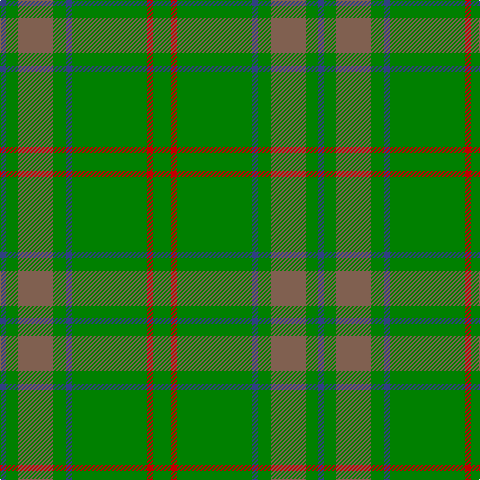

In pattern [BGRGBGRG](/patterns/bgrgbgrg/).

This was sourced from weddslist.  It is a [8 stripes tartan](/stripes/stripes8/).

Original link http://www.weddslist.com/cgi-bin/tartans/pg.pl?source=sts

## Thread count
B/6 G12 LT35 G13 B6 G75 R6 G/18

## Palette
Each colour and its ΔE from the base-6 reference it is a variant of.

| Colour | Shade | Base | ΔE (OKLab) |
|---|---|---|---|
| B | <code style="background-color:#304080;">#304080</code> `#304080` | B <code style="background-color:#2A418A;">#2A418A</code> | 0.02 |
| G | <code style="background-color:#008000;">#008000</code> `#008000` | G <code style="background-color:#006100;">#006100</code> | 0.10 |
| LT | <code style="background-color:#806050;">#806050</code> `#806050` | R <code style="background-color:#CC0000;">#CC0000</code> | 0.17 |
| R | <code style="background-color:#C00000;">#C00000</code> `#C00000` | R <code style="background-color:#CC0000;">#CC0000</code> | 0.03 |

# Sample pattern

## Nearest tartans

The nearest existing variants by ΔTartan distance.

1. [Glenlivet Corporate Tartan Tartan Number: 193. Earliest known date: 1989 Designed for Glenlivet Distilleries Ltd, Strathspey. See products available Copyright © Blair Urquhart, Comrie, 2015](/setts/s8/g18r6g75b6g13ga35g12b6~b2c2c80-g006818-ga604000-rc80000/) — ΔT 1.13
1. [St Andrews Links Corporate Tartan Tartan Number: 2391. Earliest known date: May 1997 Designed by Polly Wittering of the House of Edgar 1997. Corporate tartan for use on merchandise. Green lightened here to show the sett. See products available Copyright © Blair Urquhart, Comrie, 2015](/setts/s12/b16g4b3g3y2g24r2g24y2g3b3g4~b14283c-g006818-r880000-yd09800~x2/) — ΔT 1.63
1. [Pino Family (Pennsylvania) (Personal)](/setts/s13/g25ga7g25ga7y5g25ga7g25ga7y5r2w2r2~g006400-ga008b00-re3170d-wffffff-y86c67c~x2/) — ΔT 1.64
1. [O'Brien (Scotch Corner)](/setts/s9/g36ga19g4ga31b2r3b2r3ga12~b1474b4-g5c6428-ga289c18-ra00000~x2/) — ΔT 1.64
1. [INSEAD](/setts/s12/y3g15r2g2r6g2ga6g2ga2g23gb2g2~g00643c-ga002814-gb008b00-r880000-ybc8c00~x2/) — ΔT 1.68
1. [Campbell & Co (Beauly) (Corporate)](/setts/s9/g4r5g31r5g31y5g4y27ya3~g006818-rc8002c-ya08858-yafccc00~x2/) — ΔT 1.72
1. [Glen Boig](/setts/s5/g37r9g3b9r3~b401000-g006020-r806050~x2/) — ΔT 1.77
1. [Owen Welsh Name Tartan Tartan Number: 5750. Earliest known date: 2002 The tartan for this Welsh surname and its variations, Bowen, Ifan, is actually woven in Wales at the Cambrian Woollen Mill, weaving on the same site since 1830. This tartan differs from many traditional patterns in that the warp and weft differ, giving the finished worsted wool cloth more of a predominant stripe, vertically noticeable in the finished Kilt, or Cilt in Wales. See products available Copyright © Blair Urquhart, Comrie, 2015](/setts/s10/g3b1g2r1g3ba3g2ba2g18b2~b003c64-ba002048-g006818-rc80000~x2/) — ΔT 1.77
1. [Irving of Bonshaw](/setts/s5/g27ga14b2ga2y2~b003c64-g006818-ga048888-ye8c000~x4/) — ΔT 1.81
1. [Montgomerie Artifact Tartan Tartan Number: 692. Earliest known date: c.1815 The sample does not show a complete sett. The broad mid green stripe is narrower in the weft. See products available Copyright © Blair Urquhart, Comrie, 2015](/setts/s12/g27ga39b3ga3b4ga3b3ga39b3ga3b4ga3~b2c2c80-g003820-ga006818~x2/) — ΔT 1.81

## Neighbour map

Every grey dot is one of 15726 variants placed by the first two principal components of the ΔTartan feature space (44% of its variance). Red is this tartan; blue dots are its nearest — click one to open its page.

<svg viewBox="0 0 640 380" role="img" style="max-width:100%;height:auto;border:1px solid #e0e0e0;border-radius:4px;display:block" xmlns="http://www.w3.org/2000/svg"><image href="/nn/cloud.v1.png" width="640" height="380"/><a href="/setts/s8/g18r6g75b6g13ga35g12b6~b2c2c80-g006818-ga604000-rc80000/"><circle cx="497.5" cy="233.4" r="4" fill="#3465a4"><title>Glenlivet Corporate Tartan Tartan Number: 193. Earliest known date: 1989 Designed for Glenlivet Distilleries Ltd, Strathspey. See products available Copyright © Blair Urquhart, Comrie, 2015</title></circle></a><a href="/setts/s12/b16g4b3g3y2g24r2g24y2g3b3g4~b14283c-g006818-r880000-yd09800~x2/"><circle cx="446.1" cy="195.7" r="4" fill="#3465a4"><title>St Andrews Links Corporate Tartan Tartan Number: 2391. Earliest known date: May 1997 Designed by Polly Wittering of the House of Edgar 1997. Corporate tartan for use on merchandise. Green lightened here to show the sett. See products available Copyright © Blair Urquhart, Comrie, 2015</title></circle></a><a href="/setts/s13/g25ga7g25ga7y5g25ga7g25ga7y5r2w2r2~g006400-ga008b00-re3170d-wffffff-y86c67c~x2/"><circle cx="419.2" cy="197.9" r="4" fill="#3465a4"><title>Pino Family (Pennsylvania) (Personal)</title></circle></a><a href="/setts/s9/g36ga19g4ga31b2r3b2r3ga12~b1474b4-g5c6428-ga289c18-ra00000~x2/"><circle cx="409.5" cy="202.4" r="4" fill="#3465a4"><title>O'Brien (Scotch Corner)</title></circle></a><a href="/setts/s12/y3g15r2g2r6g2ga6g2ga2g23gb2g2~g00643c-ga002814-gb008b00-r880000-ybc8c00~x2/"><circle cx="434.2" cy="180.9" r="4" fill="#3465a4"><title>INSEAD</title></circle></a><a href="/setts/s9/g4r5g31r5g31y5g4y27ya3~g006818-rc8002c-ya08858-yafccc00~x2/"><circle cx="373.0" cy="207.9" r="4" fill="#3465a4"><title>Campbell &amp; Co (Beauly) (Corporate)</title></circle></a><a href="/setts/s5/g37r9g3b9r3~b401000-g006020-r806050~x2/"><circle cx="491.8" cy="263.1" r="4" fill="#3465a4"><title>Glen Boig</title></circle></a><a href="/setts/s10/g3b1g2r1g3ba3g2ba2g18b2~b003c64-ba002048-g006818-rc80000~x2/"><circle cx="535.0" cy="187.4" r="4" fill="#3465a4"><title>Owen Welsh Name Tartan Tartan Number: 5750. Earliest known date: 2002 The tartan for this Welsh surname and its variations, Bowen, Ifan, is actually woven in Wales at the Cambrian Woollen Mill, weaving on the same site since 1830. This tartan differs from many traditional patterns in that the warp and weft differ, giving the finished worsted wool cloth more of a predominant stripe, vertically noticeable in the finished Kilt, or Cilt in Wales. See products available Copyright © Blair Urquhart, Comrie, 2015</title></circle></a><a href="/setts/s5/g27ga14b2ga2y2~b003c64-g006818-ga048888-ye8c000~x4/"><circle cx="422.8" cy="239.9" r="4" fill="#3465a4"><title>Irving of Bonshaw</title></circle></a><a href="/setts/s12/g27ga39b3ga3b4ga3b3ga39b3ga3b4ga3~b2c2c80-g003820-ga006818~x2/"><circle cx="497.2" cy="216.6" r="4" fill="#3465a4"><title>Montgomerie Artifact Tartan Tartan Number: 692. Earliest known date: c.1815 The sample does not show a complete sett. The broad mid green stripe is narrower in the weft. See products available Copyright © Blair Urquhart, Comrie, 2015</title></circle></a><circle cx="471.5" cy="220.9" r="5" fill="#c00000"/></svg>

ID: /setts/s8/g18r6g75b6g13ra35g12b6~b304080-g008000-rc00000-ra806050/
