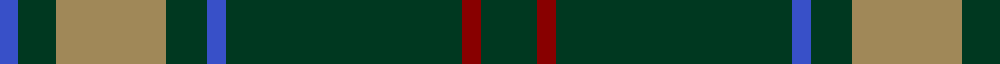

In pattern [BGYGBGRG](/patterns/bgygbgrg/).

This was sourced from tartans-authority.  It is a [8 stripes tartan](/stripes/stripes8/).

Original link http://www.tartansauthority.com/tartan-ferret/display/193/

## Thread count
B/6 DG12 LT35 DG13 B6 DG75 DR6 DG/18

## Palette
Each colour and its ΔE from the base-6 reference it is a variant of.

| Colour | Shade | Base | ΔE (OKLab) |
|---|---|---|---|
| B | <code style="background-color:#3850C8;">#3850C8</code> `#3850C8` | B <code style="background-color:#2A418A;">#2A418A</code> | 0.11 |
| DG | <code style="background-color:#003820;">#003820</code> `#003820` | G <code style="background-color:#006100;">#006100</code> | 0.15 |
| DR | <code style="background-color:#880000;">#880000</code> `#880000` | R <code style="background-color:#CC0000;">#CC0000</code> | 0.15 |
| LT | <code style="background-color:#A08858;">#A08858</code> `#A08858` | Y <code style="background-color:#F2BF00;">#F2BF00</code> | 0.21 |

# Sample pattern

## Nearest tartans

The nearest existing variants by ΔTartan distance.

1. [McCall, F W (Personal)](/setts/s9/g6b2r1g15r3b1g15ga6r1~b441800-g003c14-ga289c18-r9c68a4~x2/) — ΔT 0.98
1. [Scottish Scouts (1957) (Corporate)](/setts/s7/r3g22b16g14r2g6y2~b1c0070-g006818-r880000-yd09800~x2/) — ΔT 1.09
1. [Island Weavers (Corporate)](/setts/s10/g33b2g33r2b12r12g4r2g4w3~b1c0070-g006818-rc80000-we0e0e0~x2/) — ΔT 1.15
1. [MacKintosh Hunting Clan Tartan Tartan Number: 544. Earliest known date: 1951 This sett appears in D.C. Stewarts book, The Setts of the Scottish Tartans, with slightly different proportions. The Lyon Court Book No. 1 records the sett in relation to the narrowest stripe. ie Y 1, Vt (Vert meaning green) 10 1/2, Bu 5, etc. The rendering illustrated here multiplies the Lyon count by two. Commercially manufactured cloth may vary from these proportions. D.C. Stewart calls the sett "a modern arrangement". See products available Copyright © Blair Urquhart, Comrie, 2015](/setts/s7/b1r3g11r2b5g11y1~b2c2c80-g006818-rc80000-ye8c000~x2/) — ΔT 1.22
1. [Duke of York Hunting Royal Family Tartan Tartan Number: 745. Earliest known date: pre 2003 Kinloch Anderson Gift. See products available Copyright © Blair Urquhart, Comrie, 2015](/setts/s8/g99b20w8b30y8b10y8g46~b2c2c80-g006818-we0e0e0-ye8c000/) — ΔT 1.30
1. [Kinfauns Castle](/setts/s10/r4b12g2b2g24g2g2g16g2w1~b800080-g004010-rc00000-we0e0e0~x2/) — ΔT 1.31
1. [Scottish Scouts Corporate Tartan Tartan Number: 1463. Earliest known date: 1957 This tartan currently in use for Scottish Scouts is based upon the MacLaren, in honour of a MacLaren who gave an estate to the movement. On the blue and green base the strong red overcheck represents the Rover Scouts, the finer red lines, the Scouts and Senior Scouts and yellow the Wolf Cubs. See products available Copyright © Blair Urquhart, Comrie, 2015](/setts/s7/r3g22b16g14r2g6y1~b2c2c80-g006818-rc80000-ye8c000~x2/) — ΔT 1.34
1. [Childers Regimental Tartan Tartan Number: 1090. Earliest known date: 1907 1s Battalion, 1st Gurkha Rifles is recorded as using this tartan for plaids, ribbons and bag-covers. See products available Copyright © Blair Urquhart, Comrie, 2015](/setts/s6/k88g17k8ga28k8r6~g289c18-ga006818-k101010-rc80000~x2/) — ΔT 1.35
1. [Glenfeshie (Personal)](/setts/s9/r4g3b3g44b16g10w2g2b2~b6c0070-g006818-rc8002c-wfcfcfc~x2/) — ΔT 1.37
1. [Sarros, Terrence (USA) (Personal)](/setts/s8/k2w2b8k4g33r2g16w2~b0c4252-g052f14-k1c1714-rdd1212-wf9f5ef~x2/) — ΔT 1.37

## Neighbour map

Every grey dot is one of 15726 variants placed by the first two principal components of the ΔTartan feature space (44% of its variance). Red is this tartan; blue dots are its nearest — click one to open its page.

<svg viewBox="0 0 640 380" role="img" style="max-width:100%;height:auto;border:1px solid #e0e0e0;border-radius:4px;display:block" xmlns="http://www.w3.org/2000/svg"><image href="/nn/cloud.v1.png" width="640" height="380"/><a href="/setts/s9/g6b2r1g15r3b1g15ga6r1~b441800-g003c14-ga289c18-r9c68a4~x2/"><circle cx="451.3" cy="203.3" r="4" fill="#3465a4"><title>McCall, F W (Personal)</title></circle></a><a href="/setts/s7/r3g22b16g14r2g6y2~b1c0070-g006818-r880000-yd09800~x2/"><circle cx="363.4" cy="225.6" r="4" fill="#3465a4"><title>Scottish Scouts (1957) (Corporate)</title></circle></a><a href="/setts/s10/g33b2g33r2b12r12g4r2g4w3~b1c0070-g006818-rc80000-we0e0e0~x2/"><circle cx="412.6" cy="168.3" r="4" fill="#3465a4"><title>Island Weavers (Corporate)</title></circle></a><a href="/setts/s7/b1r3g11r2b5g11y1~b2c2c80-g006818-rc80000-ye8c000~x2/"><circle cx="367.5" cy="218.3" r="4" fill="#3465a4"><title>MacKintosh Hunting Clan Tartan Tartan Number: 544. Earliest known date: 1951 This sett appears in D.C. Stewarts book, The Setts of the Scottish Tartans, with slightly different proportions. The Lyon Court Book No. 1 records the sett in relation to the narrowest stripe. ie Y 1, Vt (Vert meaning green) 10 1/2, Bu 5, etc. The rendering illustrated here multiplies the Lyon count by two. Commercially manufactured cloth may vary from these proportions. D.C. Stewart calls the sett &quot;a modern arrangement&quot;. See products available Copyright © Blair Urquhart, Comrie, 2015</title></circle></a><a href="/setts/s8/g99b20w8b30y8b10y8g46~b2c2c80-g006818-we0e0e0-ye8c000/"><circle cx="359.3" cy="190.7" r="4" fill="#3465a4"><title>Duke of York Hunting Royal Family Tartan Tartan Number: 745. Earliest known date: pre 2003 Kinloch Anderson Gift. See products available Copyright © Blair Urquhart, Comrie, 2015</title></circle></a><a href="/setts/s10/r4b12g2b2g24g2g2g16g2w1~b800080-g004010-rc00000-we0e0e0~x2/"><circle cx="475.1" cy="163.6" r="4" fill="#3465a4"><title>Kinfauns Castle</title></circle></a><a href="/setts/s7/r3g22b16g14r2g6y1~b2c2c80-g006818-rc80000-ye8c000~x2/"><circle cx="413.1" cy="203.2" r="4" fill="#3465a4"><title>Scottish Scouts Corporate Tartan Tartan Number: 1463. Earliest known date: 1957 This tartan currently in use for Scottish Scouts is based upon the MacLaren, in honour of a MacLaren who gave an estate to the movement. On the blue and green base the strong red overcheck represents the Rover Scouts, the finer red lines, the Scouts and Senior Scouts and yellow the Wolf Cubs. See products available Copyright © Blair Urquhart, Comrie, 2015</title></circle></a><a href="/setts/s6/k88g17k8ga28k8r6~g289c18-ga006818-k101010-rc80000~x2/"><circle cx="407.2" cy="198.0" r="4" fill="#3465a4"><title>Childers Regimental Tartan Tartan Number: 1090. Earliest known date: 1907 1s Battalion, 1st Gurkha Rifles is recorded as using this tartan for plaids, ribbons and bag-covers. See products available Copyright © Blair Urquhart, Comrie, 2015</title></circle></a><a href="/setts/s9/r4g3b3g44b16g10w2g2b2~b6c0070-g006818-rc8002c-wfcfcfc~x2/"><circle cx="448.1" cy="148.5" r="4" fill="#3465a4"><title>Glenfeshie (Personal)</title></circle></a><a href="/setts/s8/k2w2b8k4g33r2g16w2~b0c4252-g052f14-k1c1714-rdd1212-wf9f5ef~x2/"><circle cx="428.8" cy="168.8" r="4" fill="#3465a4"><title>Sarros, Terrence (USA) (Personal)</title></circle></a><circle cx="422.2" cy="200.6" r="5" fill="#c00000"/></svg>

ID: /setts/s8/g18r6g75b6g13y35g12b6~b3850c8-g003820-r880000-ya08858/
