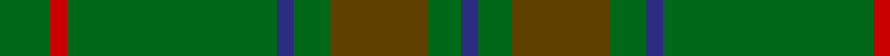

This page is one **sett** — a single exact thread-count. It belongs to the [tartan](/tartans/g18r6g75db6g13t35g12db6/)
(the same proportion at any scale), whose colour order is pattern [BGGGBGRG](/stripes/bgggbgrg/).

Sourced from house-of-tartan.  It is a [8 stripe tartan](/stripes/stripes8/).

Original link http://www.house-of-tartan.scotland.net/house/TartanViewjs.asp?colr=Def&tnam=193

## Thread count
G/18 R6 G75 DB6 G13 T35 G12 DB/6

## Palette
Each colour and the base-6 reference it is a variant of.

| Colour | Shade | Base |
|---|---|---|
| DB | <code style="background-color:#2C2C80;">#2C2C80</code> `oklch(35.0% 0.138 276.6)` <small>#2C2C80</small> | B <code style="background-color:#2A418A;">#2A418A</code> |
| G | <code style="background-color:#006818;">#006818</code> `oklch(45.0% 0.142 145.0)` <small>#006818</small> | G <code style="background-color:#006100;">#006100</code> |
| R | <code style="background-color:#C80000;">#C80000</code> `oklch(52.3% 0.215 29.2)` <small>#C80000</small> | R <code style="background-color:#CC0000;">#CC0000</code> |
| T | <code style="background-color:#604000;">#604000</code> `oklch(39.8% 0.083 76.8)` <small>#604000</small> | G <code style="background-color:#006100;">#006100</code> |

# Sample pattern

## Nearest tartans

The nearest existing variants by ΔTartan distance, with this tartan at the top so the swatches line up against it.

ΔTartan

Tartan

Sett

—

<a href="/ttd/edit/#slug=g18r6g75db6g13dy35g12db6">Glenlivet Corporate Tartan Tartan Number: 193. Earliest known date: 1989 Designed for Glenlivet Distilleries Ltd, Strathspey. See products available Copyright © Blair Urquhart, Comrie, 2015</a> <a class="nn-out" href="/setts/s8/g18r6g75db6g13dy35g12db6/" title="open its dictionary page">↗</a>

1.13

<a href="/ttd/edit/#slug=g18r6g75db6g13o35g12db6">Glenlivet</a> <a class="nn-out" href="/setts/s8/g18r6g75db6g13o35g12db6/" title="open its dictionary page">↗</a>

1.45

<a href="/ttd/edit/#slug=g37o9g3dr9o3~x2">Glen Boig</a> <a class="nn-out" href="/setts/s5/g37o9g3dr9o3~x2/" title="open its dictionary page">↗</a>

1.81

<a href="/ttd/edit/#slug=lo3g15r2g2r6g2dg6g2dg2g23g2g2~x2">INSEAD</a> <a class="nn-out" href="/setts/s12/lo3g15r2g2r6g2dg6g2dg2g23g2g2~x2/" title="open its dictionary page">↗</a>

1.86

<a href="/ttd/edit/#slug=dg18r6dg75db6dg13dy35dg12db6">Gayre Bodyguard</a> <a class="nn-out" href="/setts/s8/dg18r6dg75db6dg13dy35dg12db6/" title="open its dictionary page">↗</a>

1.88

<a href="/ttd/edit/#slug=g27g14dt2g2ly2~x4">Irving of Bonshaw</a> <a class="nn-out" href="/setts/s5/g27g14dt2g2ly2~x4/" title="open its dictionary page">↗</a>

1.92

<a href="/ttd/edit/#slug=dt17g5dt5g17dt4g17k2dy2k2g5~x2">Hueg (Hunting) (Personal)</a> <a class="nn-out" href="/setts/s10/dt17g5dt5g17dt4g17k2dy2k2g5~x2/" title="open its dictionary page">↗</a>

1.95

<a href="/ttd/edit/#slug=y36g19y4g31b2r3b2r3g12~x2">O'Brien (Scotch Corner)</a> <a class="nn-out" href="/setts/s9/y36g19y4g31b2r3b2r3g12~x2/" title="open its dictionary page">↗</a>

2.00

<a href="/ttd/edit/#slug=y3dy3y4k4dy14k3y41g2~x2">Huntsman</a> <a class="nn-out" href="/setts/s8/y3dy3y4k4dy14k3y41g2~x2/" title="open its dictionary page">↗</a>

2.00

<a href="/ttd/edit/#slug=g3lo1g3r1g14dg2g3dg1g3g1g2g1g2g2~x4">New South Wales</a> <a class="nn-out" href="/setts/s14/g3lo1g3r1g14dg2g3dg1g3g1g2g1g2g2~x4/" title="open its dictionary page">↗</a>

2.06

<a href="/ttd/edit/#slug=g3dt1g2r1g3db3g2db2g18dt2~x2">Owen Welsh Name Tartan Tartan Number: 5750. Earliest known date: 2002 The tartan for this Welsh surname and its variations, Bowen, Ifan, is actually woven in Wales at the Cambrian Woollen Mill, weaving on the same site since 1830. This tartan differs from many traditional patterns in that the warp and weft differ, giving the finished worsted wool cloth more of a predominant stripe, vertically noticeable in the finished Kilt, or Cilt in Wales. See products available Copyright © Blair Urquhart, Comrie, 2015</a> <a class="nn-out" href="/setts/s10/g3dt1g2r1g3db3g2db2g18dt2~x2/" title="open its dictionary page">↗</a>

## Neighbour map

Every grey dot is one of 14299 variants placed by the first two principal components of the ΔTartan feature space (44% of its variance). Red is this tartan; blue dots are its nearest — click one to open its page.

<svg viewBox="0 0 640 380" role="img" style="max-width:100%;height:auto;border:1px solid #e0e0e0;border-radius:4px;display:block" xmlns="http://www.w3.org/2000/svg"><image href="/nn/cloud.v1.png" width="640" height="380"/><a href="/setts/s8/g18r6g75db6g13o35g12db6/"><circle cx="472.6" cy="228.6" r="4" fill="#3465a4"><title>Glenlivet</title></circle></a><a href="/setts/s5/g37o9g3dr9o3~x2/"><circle cx="492.7" cy="271.4" r="4" fill="#3465a4"><title>Glen Boig</title></circle></a><a href="/setts/s12/lo3g15r2g2r6g2dg6g2dg2g23g2g2~x2/"><circle cx="435.7" cy="188.8" r="4" fill="#3465a4"><title>INSEAD</title></circle></a><a href="/setts/s8/dg18r6dg75db6dg13dy35dg12db6/"><circle cx="541.2" cy="270.1" r="4" fill="#3465a4"><title>Gayre Bodyguard</title></circle></a><a href="/setts/s5/g27g14dt2g2ly2~x4/"><circle cx="424.7" cy="250.5" r="4" fill="#3465a4"><title>Irving of Bonshaw</title></circle></a><a href="/setts/s10/dt17g5dt5g17dt4g17k2dy2k2g5~x2/"><circle cx="380.7" cy="256.0" r="4" fill="#3465a4"><title>Hueg (Hunting) (Personal)</title></circle></a><a href="/setts/s9/y36g19y4g31b2r3b2r3g12~x2/"><circle cx="410.7" cy="213.0" r="4" fill="#3465a4"><title>O'Brien (Scotch Corner)</title></circle></a><a href="/setts/s8/y3dy3y4k4dy14k3y41g2~x2/"><circle cx="499.9" cy="192.6" r="4" fill="#3465a4"><title>Huntsman</title></circle></a><a href="/setts/s14/g3lo1g3r1g14dg2g3dg1g3g1g2g1g2g2~x4/"><circle cx="554.0" cy="209.3" r="4" fill="#3465a4"><title>New South Wales</title></circle></a><a href="/setts/s10/g3dt1g2r1g3db3g2db2g18dt2~x2/"><circle cx="536.7" cy="193.3" r="4" fill="#3465a4"><title>Owen Welsh Name Tartan Tartan Number: 5750. Earliest known date: 2002 The tartan for this Welsh surname and its variations, Bowen, Ifan, is actually woven in Wales at the Cambrian Woollen Mill, weaving on the same site since 1830. This tartan differs from many traditional patterns in that the warp and weft differ, giving the finished worsted wool cloth more of a predominant stripe, vertically noticeable in the finished Kilt, or Cilt in Wales. See products available Copyright © Blair Urquhart, Comrie, 2015</title></circle></a><circle cx="498.3" cy="244.0" r="5" fill="#c00000"/></svg>

ID: /setts/s8/g18r6g75db6g13dy35g12db6/
