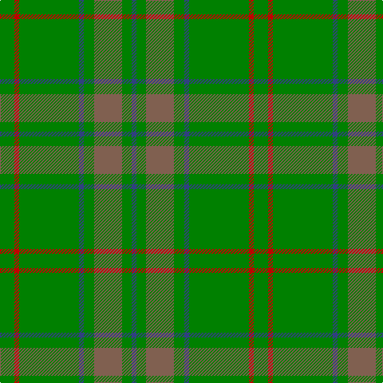

This page is one **sett** — a single exact thread-count. It belongs to the [tartan](/tartans/g18r6g75db6g13o35g12db6/)
(the same proportion at any scale), whose colour order is pattern [BGRGBGRG](/stripes/bgrgbgrg/).

Sourced from weddslist.  It is a [8 stripe tartan](/stripes/stripes8/).

Original link http://www.weddslist.com/cgi-bin/tartans/pg.pl?source=sts

## Thread count
G/18 R6 G75 B6 G13 LT35 G12 B/6

## Palette

Palette: <strong>custom</strong>
<table><thead><tr><th>Colour</th><th>Threads</th><th>Shade</th><th>Base</th><th>OKLCh</th></tr></thead><tbody><tr><td>G/</td><td style="text-align:right;font-variant-numeric:tabular-nums">18</td><td><code style="background-color:#008000;">#008000</code> <small style="color:#888">#008000</small></td><td>G <code style="background-color:#006100;">#006100</code></td><td><small style="color:#888">oklch(52.0% 0.177 142.5)</small></td></tr><tr><td>R</td><td style="text-align:right;font-variant-numeric:tabular-nums">6</td><td><code style="background-color:#C00000;">#C00000</code> <small style="color:#888">#C00000</small></td><td>R <code style="background-color:#CC0000;">#CC0000</code></td><td><small style="color:#888">oklch(50.7% 0.208 29.2)</small></td></tr><tr><td>G</td><td style="text-align:right;font-variant-numeric:tabular-nums">75</td><td><code style="background-color:#008000;">#008000</code> <small style="color:#888">#008000</small></td><td>G <code style="background-color:#006100;">#006100</code></td><td><small style="color:#888">oklch(52.0% 0.177 142.5)</small></td></tr><tr><td>B</td><td style="text-align:right;font-variant-numeric:tabular-nums">6</td><td><code style="background-color:#304080;">#304080</code> <small style="color:#888">#304080</small></td><td>B <code style="background-color:#2A418A;">#2A418A</code></td><td><small style="color:#888">oklch(39.4% 0.109 270.2)</small></td></tr><tr><td>G</td><td style="text-align:right;font-variant-numeric:tabular-nums">13</td><td><code style="background-color:#008000;">#008000</code> <small style="color:#888">#008000</small></td><td>G <code style="background-color:#006100;">#006100</code></td><td><small style="color:#888">oklch(52.0% 0.177 142.5)</small></td></tr><tr><td>LT</td><td style="text-align:right;font-variant-numeric:tabular-nums">35</td><td><code style="background-color:#806050;">#806050</code> <small style="color:#888">#806050</small></td><td>R <code style="background-color:#CC0000;">#CC0000</code></td><td><small style="color:#888">oklch(51.7% 0.049 47.8)</small></td></tr><tr><td>G</td><td style="text-align:right;font-variant-numeric:tabular-nums">12</td><td><code style="background-color:#008000;">#008000</code> <small style="color:#888">#008000</small></td><td>G <code style="background-color:#006100;">#006100</code></td><td><small style="color:#888">oklch(52.0% 0.177 142.5)</small></td></tr><tr><td>B/</td><td style="text-align:right;font-variant-numeric:tabular-nums">6</td><td><code style="background-color:#304080;">#304080</code> <small style="color:#888">#304080</small></td><td>B <code style="background-color:#2A418A;">#2A418A</code></td><td><small style="color:#888">oklch(39.4% 0.109 270.2)</small></td></tr></tbody></table>

# Sample pattern

## Nearest tartans

The nearest existing variants by ΔTartan distance, with this tartan at the top so the swatches line up against it.

ΔTartan

Tartan

Sett

—

<a href="/ttd/edit/#slug=g18r6g75db6g13o35g12db6">Glenlivet</a> <a class="nn-out" href="/setts/s8/g18r6g75db6g13o35g12db6/" title="open its dictionary page">↗</a>

1.12

<a href="/ttd/edit/#slug=g18r6g75db6g13dy35g12db6">Glenlivet Corporate Tartan Tartan Number: 193. Earliest known date: 1989 Designed for Glenlivet Distilleries Ltd, Strathspey. See products available Copyright © Blair Urquhart, Comrie, 2015</a> <a class="nn-out" href="/setts/s8/g18r6g75db6g13dy35g12db6/" title="open its dictionary page">↗</a>

1.62

<a href="/setts/s12/dt16g4dt3g3lo2g24r2~x2/">St Andrews Links Corporate Tartan Tartan Number: 2391. Earliest known date: May 1997 Designed by Polly Wittering of the House of Edgar 1997. Corporate tartan for use on merchandise. Green lightened here to show the sett. See products available Copyright © Blair Urquhart, Comrie, 2015</a>

1.64

<a href="/ttd/edit/#slug=y36g19y4g31b2r3b2r3g12~x2">O'Brien (Scotch Corner)</a> <a class="nn-out" href="/setts/s9/y36g19y4g31b2r3b2r3g12~x2/" title="open its dictionary page">↗</a>

1.64

<a href="/ttd/edit/#slug=gi25g7gi25g7lg5gi25g7gi25g7lg5r2w2r2~x2">Pino Family (Pennsylvania) (Personal)</a> <a class="nn-out" href="/setts/s13/gi25g7gi25g7lg5gi25g7gi25g7lg5r2w2r2~x2/" title="open its dictionary page">↗</a>

1.68

<a href="/ttd/edit/#slug=lo3gi15r2gi2r6gi2dg6gi2dg2gi23g2gi2~x2">INSEAD</a> <a class="nn-out" href="/setts/s12/lo3gi15r2gi2r6gi2dg6gi2dg2gi23g2gi2~x2/" title="open its dictionary page">↗</a>

1.72

<a href="/ttd/edit/#slug=g4r5g31r5g31lo5g4lo27ly3~x2">Campbell &amp; Co (Beauly) (Corporate)</a> <a class="nn-out" href="/setts/s9/g4r5g31r5g31lo5g4lo27ly3~x2/" title="open its dictionary page">↗</a>

1.77

<a href="/ttd/edit/#slug=g3dt1g2r1g3db3g2db2g18dt2~x2">Owen Welsh Name Tartan Tartan Number: 5750. Earliest known date: 2002 The tartan for this Welsh surname and its variations, Bowen, Ifan, is actually woven in Wales at the Cambrian Woollen Mill, weaving on the same site since 1830. This tartan differs from many traditional patterns in that the warp and weft differ, giving the finished worsted wool cloth more of a predominant stripe, vertically noticeable in the finished Kilt, or Cilt in Wales. See products available Copyright © Blair Urquhart, Comrie, 2015</a> <a class="nn-out" href="/setts/s10/g3dt1g2r1g3db3g2db2g18dt2~x2/" title="open its dictionary page">↗</a>

1.77

<a href="/ttd/edit/#slug=g37o9g3dr9o3~x2">Glen Boig</a> <a class="nn-out" href="/setts/s5/g37o9g3dr9o3~x2/" title="open its dictionary page">↗</a>

1.80

<a href="/ttd/edit/#slug=g27gi14dt2gi2ly2~x4">Irving of Bonshaw</a> <a class="nn-out" href="/setts/s5/g27gi14dt2gi2ly2~x4/" title="open its dictionary page">↗</a>

1.82

<a href="/ttd/edit/#slug=g5y9g4w5g30r2g4r2~x2">Welsh Assembly</a> <a class="nn-out" href="/setts/s8/g5y9g4w5g30r2g4r2~x2/" title="open its dictionary page">↗</a>

## Neighbour map

Every grey dot is one of 14359 variants placed by the first two principal components of the ΔTartan feature space (44% of its variance). Red is this tartan; blue dots are its nearest — click one to open its page.

<svg viewBox="0 0 640 380" role="img" style="max-width:100%;height:auto;border:1px solid #e0e0e0;border-radius:4px;display:block" xmlns="http://www.w3.org/2000/svg"><image href="/nn/cloud.v1.png" width="640" height="380"/><a href="/setts/s8/g18r6g75db6g13dy35g12db6/"><circle cx="498.1" cy="244.1" r="4" fill="#3465a4"><title>Glenlivet Corporate Tartan Tartan Number: 193. Earliest known date: 1989 Designed for Glenlivet Distilleries Ltd, Strathspey. See products available Copyright © Blair Urquhart, Comrie, 2015</title></circle></a><a href="/setts/s12/dt16g4dt3g3lo2g24r2~x2/"><circle cx="447.6" cy="201.3" r="4" fill="#3465a4"><title>St Andrews Links Corporate Tartan Tartan Number: 2391. Earliest known date: May 1997 Designed by Polly Wittering of the House of Edgar 1997. Corporate tartan for use on merchandise. Green lightened here to show the sett. See products available Copyright © Blair Urquhart, Comrie, 2015</title></circle></a><a href="/setts/s9/y36g19y4g31b2r3b2r3g12~x2/"><circle cx="410.4" cy="213.0" r="4" fill="#3465a4"><title>O'Brien (Scotch Corner)</title></circle></a><a href="/setts/s13/gi25g7gi25g7lg5gi25g7gi25g7lg5r2w2r2~x2/"><circle cx="420.2" cy="206.6" r="4" fill="#3465a4"><title>Pino Family (Pennsylvania) (Personal)</title></circle></a><a href="/setts/s12/lo3gi15r2gi2r6gi2dg6gi2dg2gi23g2gi2~x2/"><circle cx="435.3" cy="188.9" r="4" fill="#3465a4"><title>INSEAD</title></circle></a><a href="/setts/s9/g4r5g31r5g31lo5g4lo27ly3~x2/"><circle cx="373.7" cy="212.5" r="4" fill="#3465a4"><title>Campbell &amp; Co (Beauly) (Corporate)</title></circle></a><a href="/setts/s10/g3dt1g2r1g3db3g2db2g18dt2~x2/"><circle cx="536.1" cy="193.3" r="4" fill="#3465a4"><title>Owen Welsh Name Tartan Tartan Number: 5750. Earliest known date: 2002 The tartan for this Welsh surname and its variations, Bowen, Ifan, is actually woven in Wales at the Cambrian Woollen Mill, weaving on the same site since 1830. This tartan differs from many traditional patterns in that the warp and weft differ, giving the finished worsted wool cloth more of a predominant stripe, vertically noticeable in the finished Kilt, or Cilt in Wales. See products available Copyright © Blair Urquhart, Comrie, 2015</title></circle></a><a href="/setts/s5/g37o9g3dr9o3~x2/"><circle cx="492.4" cy="271.7" r="4" fill="#3465a4"><title>Glen Boig</title></circle></a><a href="/setts/s5/g27gi14dt2gi2ly2~x4/"><circle cx="424.6" cy="250.7" r="4" fill="#3465a4"><title>Irving of Bonshaw</title></circle></a><a href="/setts/s8/g5y9g4w5g30r2g4r2~x2/"><circle cx="441.2" cy="187.0" r="4" fill="#3465a4"><title>Welsh Assembly</title></circle></a><circle cx="472.1" cy="228.6" r="5" fill="#c00000"/></svg>

ID: /setts/s8/g18r6g75db6g13o35g12db6/
