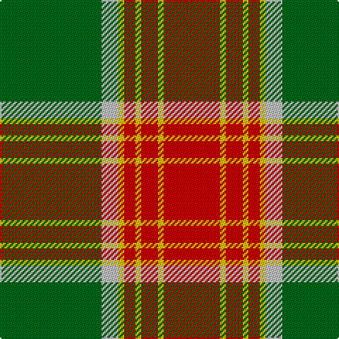

In pattern [GWYRYRYR](/patterns/gwyryryr/).

This was sourced from tartans-authority.  It is a [8 stripes tartan](/stripes/stripes8/).

Original link http://www.tartansauthority.com/tartan-ferret/display/6308/

## Thread count
G/72 N12 Y4 R8 Y4 R12 Y4 R/40

## Palette
Each colour and its ΔE from the base-6 reference it is a variant of.

| Colour | Shade | Base | ΔE (OKLab) |
|---|---|---|---|
| G | <code style="background-color:#006818;">#006818</code> `#006818` | G <code style="background-color:#006100;">#006100</code> | 0.02 |
| N | <code style="background-color:#C0C0C0;">#C0C0C0</code> `#C0C0C0` | W <code style="background-color:#F7F7F7;">#F7F7F7</code> | 0.17 |
| R | <code style="background-color:#C80000;">#C80000</code> `#C80000` | R <code style="background-color:#CC0000;">#CC0000</code> | 0.01 |
| Y | <code style="background-color:#E8C000;">#E8C000</code> `#E8C000` | Y <code style="background-color:#F2BF00;">#F2BF00</code> | 0.02 |

# Sample pattern

## Nearest tartans

The nearest existing variants by ΔTartan distance.

1. [Brisbane (Artefact)](/setts/s8/g18w3y1r2y1r3y1r10x4~g006818-rc80000-wffffff-ye8c000/) — ΔT 0.51
1. [MacDonald of Kingsburgh Clan Tartan Tartan Number: 1562. Earliest known date: 1746 D.W.Stewart recorded this pattern from a relic, worn by Prince Charles Edward, and hidden in a cleft of a rock, to be recovered later and eventually preserved in the Advocates' Library in Edinburgh. See products available Copyright © Blair Urquhart, Comrie, 2015](/setts/s9/r3g3y1r18w1g21y1g1y3x2~g006818-rc80000-we0e0e0-ye8c000/) — ΔT 0.57
1. [MacDonald of Kingsburgh](/setts/s9/r3g3y1r18w1g21y1g1y3x2~g008000-rc00000-we0e0e0-yf0c000/) — ΔT 0.73
1. [Glen Tilt](/setts/s10/w1g1r1g14r1b6r11g1r1w1x4~b304080-g008000-rc00000-we0e0e0/) — ΔT 0.95
1. [Connacht #2](/setts/s8/r1ra1g6ra15ga2ra1ga6w1x4~g005020-ga2a2303-rdc0000-rabe7832-we0e0e0/) — ΔT 1.06
1. [MacMillan Society of Glasgow](/setts/s9/r16k3r16g44k3g8k3y20k4x2~g006818-k101010-rc80000-yd8b000/) — ΔT 1.06
1. [Midpac Tissue (non woven)](/setts/s8/r5k2g1k2r5k2g18y3x2~g285800-k101010-rc80000-ybc8c00/) — ΔT 1.12
1. [Fort William (Fashion)](/setts/s11/r10w2y3w2b24w4b4r34b2w3b2x2~b381c0c-rb07430-w94acfc-y38c438/) — ΔT 1.15
1. [Scott, hunting](/setts/s8/r3ra14g8r2g2w2g2r1x2~g008000-rc00000-ra703000-we0e0e0/) — ΔT 1.15
1. [Cranston, dress](/setts/s8/r30b3r2b3r6b14g26ga6~b304080-g30a010-ga008000-rc00000/) — ΔT 1.16

## Neighbour map

Every grey dot is one of 15726 variants placed by the first two principal components of the ΔTartan feature space (44% of its variance). Red is this tartan; blue dots are its nearest — click one to open its page.

<svg viewBox="0 0 640 380" role="img" style="max-width:100%;height:auto;border:1px solid #e0e0e0;border-radius:4px;display:block" xmlns="http://www.w3.org/2000/svg"><image href="/nn/cloud.v1.png" width="640" height="380"/><a href="/setts/s8/g18w3y1r2y1r3y1r10x4~g006818-rc80000-wffffff-ye8c000/"><circle cx="281.6" cy="140.8" r="4" fill="#3465a4"><title>Brisbane (Artefact)</title></circle></a><a href="/setts/s9/r3g3y1r18w1g21y1g1y3x2~g006818-rc80000-we0e0e0-ye8c000/"><circle cx="326.5" cy="132.4" r="4" fill="#3465a4"><title>MacDonald of Kingsburgh Clan Tartan Tartan Number: 1562. Earliest known date: 1746 D.W.Stewart recorded this pattern from a relic, worn by Prince Charles Edward, and hidden in a cleft of a rock, to be recovered later and eventually preserved in the Advocates' Library in Edinburgh. See products available Copyright © Blair Urquhart, Comrie, 2015</title></circle></a><a href="/setts/s9/r3g3y1r18w1g21y1g1y3x2~g008000-rc00000-we0e0e0-yf0c000/"><circle cx="324.7" cy="132.1" r="4" fill="#3465a4"><title>MacDonald of Kingsburgh</title></circle></a><a href="/setts/s10/w1g1r1g14r1b6r11g1r1w1x4~b304080-g008000-rc00000-we0e0e0/"><circle cx="258.3" cy="144.0" r="4" fill="#3465a4"><title>Glen Tilt</title></circle></a><a href="/setts/s8/r1ra1g6ra15ga2ra1ga6w1x4~g005020-ga2a2303-rdc0000-rabe7832-we0e0e0/"><circle cx="283.3" cy="143.5" r="4" fill="#3465a4"><title>Connacht #2</title></circle></a><a href="/setts/s9/r16k3r16g44k3g8k3y20k4x2~g006818-k101010-rc80000-yd8b000/"><circle cx="235.9" cy="160.3" r="4" fill="#3465a4"><title>MacMillan Society of Glasgow</title></circle></a><a href="/setts/s8/r5k2g1k2r5k2g18y3x2~g285800-k101010-rc80000-ybc8c00/"><circle cx="307.8" cy="162.9" r="4" fill="#3465a4"><title>Midpac Tissue (non woven)</title></circle></a><a href="/setts/s11/r10w2y3w2b24w4b4r34b2w3b2x2~b381c0c-rb07430-w94acfc-y38c438/"><circle cx="297.0" cy="128.7" r="4" fill="#3465a4"><title>Fort William (Fashion)</title></circle></a><a href="/setts/s8/r3ra14g8r2g2w2g2r1x2~g008000-rc00000-ra703000-we0e0e0/"><circle cx="260.9" cy="176.3" r="4" fill="#3465a4"><title>Scott, hunting</title></circle></a><a href="/setts/s8/r30b3r2b3r6b14g26ga6~b304080-g30a010-ga008000-rc00000/"><circle cx="241.4" cy="169.8" r="4" fill="#3465a4"><title>Cranston, dress</title></circle></a><circle cx="296.8" cy="147.3" r="5" fill="#c00000"/></svg>

ID: /setts/s8/g18w3y1r2y1r3y1r10x4~g006818-rc80000-wc0c0c0-ye8c000/
