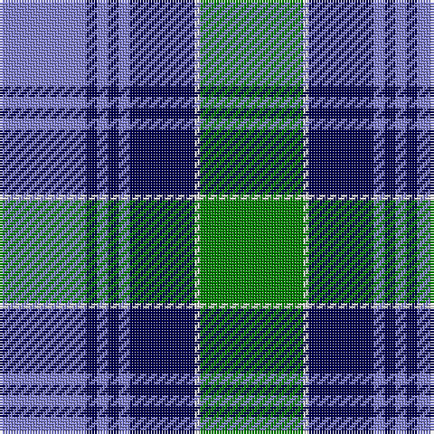

This page is one **sett** — a single exact thread-count. It belongs to the [tartan](/tartans/g19w1db12b2db2b2db2b16/)
(the same proportion at any scale), whose colour order is pattern [BBBBBBWG](/stripes/bbbbbbwg/).

Sourced from weddslist.  It is a [8 stripe tartan](/stripes/stripes8/).

Original link http://www.weddslist.com/cgi-bin/tartans/pg.pl?source=sts

## Thread count
G/38 LN2 DB24 B4 DB4 B4 DB4 B/32

## Palette

Palette: <strong>Tartan Dictionary</strong> <small style="color:#888">(1 of 4 colours)</small>
<table><thead><tr><th>Colour</th><th>Threads</th><th>Shade</th><th>Base</th><th>OKLCh</th></tr></thead><tbody><tr><td>G/</td><td style="text-align:right;font-variant-numeric:tabular-nums">38</td><td><code style="background-color:#008000;">#008000</code> <small style="color:#888">#008000</small></td><td>G <code style="background-color:#006100;">#006100</code></td><td><small style="color:#888">oklch(52.0% 0.177 142.5)</small></td></tr><tr><td>LN</td><td style="text-align:right;font-variant-numeric:tabular-nums">2</td><td><code style="background-color:#E0E0E0;">#E0E0E0</code> <small style="color:#888">#E0E0E0</small></td><td>W <code style="background-color:#F7F7F7;">#F7F7F7</code></td><td><small style="color:#888">oklch(90.7% 0.000 89.9)</small></td></tr><tr><td>DB</td><td style="text-align:right;font-variant-numeric:tabular-nums">24</td><td><code style="background-color:#000050;">#000050</code> <small style="color:#888">#000050</small></td><td>B <code style="background-color:#2A418A;">#2A418A</code></td><td><small style="color:#888">oklch(19.5% 0.135 264.1)</small></td></tr><tr><td>B</td><td style="text-align:right;font-variant-numeric:tabular-nums">4</td><td><code style="background-color:#8080D0;">#8080D0</code> <small style="color:#888">#8080D0</small></td><td>B <code style="background-color:#2A418A;">#2A418A</code></td><td><small style="color:#888">oklch(63.4% 0.119 282.5)</small></td></tr><tr><td>DB</td><td style="text-align:right;font-variant-numeric:tabular-nums">4</td><td><code style="background-color:#000050;">#000050</code> <small style="color:#888">#000050</small></td><td>B <code style="background-color:#2A418A;">#2A418A</code></td><td><small style="color:#888">oklch(19.5% 0.135 264.1)</small></td></tr><tr><td>B</td><td style="text-align:right;font-variant-numeric:tabular-nums">4</td><td><code style="background-color:#8080D0;">#8080D0</code> <small style="color:#888">#8080D0</small></td><td>B <code style="background-color:#2A418A;">#2A418A</code></td><td><small style="color:#888">oklch(63.4% 0.119 282.5)</small></td></tr><tr><td>DB</td><td style="text-align:right;font-variant-numeric:tabular-nums">4</td><td><code style="background-color:#000050;">#000050</code> <small style="color:#888">#000050</small></td><td>B <code style="background-color:#2A418A;">#2A418A</code></td><td><small style="color:#888">oklch(19.5% 0.135 264.1)</small></td></tr><tr><td>B/</td><td style="text-align:right;font-variant-numeric:tabular-nums">32</td><td><code style="background-color:#8080D0;">#8080D0</code> <small style="color:#888">#8080D0</small></td><td>B <code style="background-color:#2A418A;">#2A418A</code></td><td><small style="color:#888">oklch(63.4% 0.119 282.5)</small></td></tr></tbody></table>

# Sample pattern

## Nearest tartans

The nearest existing variants by ΔTartan distance, with this tartan at the top so the swatches line up against it.

ΔTartan

Tartan

Sett

—

<a href="/ttd/edit/#slug=g19w1db12b2db2b2db2b16~x2">Unnamed, No 52</a> <a class="nn-out" href="/setts/s8/g19w1db12b2db2b2db2b16~x2/" title="open its dictionary page">↗</a>

0.76

<a href="/ttd/edit/#slug=dg19w1db12b2db2b2db2b16~x2">Unidentified No 52</a> <a class="nn-out" href="/setts/s8/dg19w1db12b2db2b2db2b16~x2/" title="open its dictionary page">↗</a>

1.08

<a href="/ttd/edit/#slug=db2k3g5k9db21k2db5k2g20w1~x2">Pitceathly Chamberlain (Personal)</a> <a class="nn-out" href="/setts/s10/db2k3g5k9db21k2db5k2g20w1~x2/" title="open its dictionary page">↗</a>

1.13

<a href="/ttd/edit/#slug=g19w1db12t2db2t2db2t16~x2">Norwich No.052</a> <a class="nn-out" href="/setts/s8/g19w1db12t2db2t2db2t16~x2/" title="open its dictionary page">↗</a>

1.15

<a href="/ttd/edit/#slug=g2r1g16k12r1t16g1t2~x2">Lochaber District</a> <a class="nn-out" href="/setts/s8/g2r1g16k12r1t16g1t2~x2/" title="open its dictionary page">↗</a>

1.15

<a href="/ttd/edit/#slug=dt7w3dt2w6dt16t26r4~x2">Keela (Corporate)</a> <a class="nn-out" href="/setts/s7/dt7w3dt2w6dt16t26r4~x2/" title="open its dictionary page">↗</a>

1.24

<a href="/ttd/edit/#slug=db4k3db18k18g18db1g2w4~x2">Dress Watch</a> <a class="nn-out" href="/setts/s8/db4k3db18k18g18db1g2w4~x2/" title="open its dictionary page">↗</a>

1.24

<a href="/ttd/edit/#slug=w4n1ly2n22dt20w2dt4w2~x2">Gorman Blue (Personal)</a> <a class="nn-out" href="/setts/s8/w4n1ly2n22dt20w2dt4w2~x2/" title="open its dictionary page">↗</a>

1.28

<a href="/ttd/edit/#slug=db3dr2db18dr1w10o18dr2o3~x2">Bannockbane Silver</a> <a class="nn-out" href="/setts/s8/db3dr2db18dr1w10o18dr2o3~x2/" title="open its dictionary page">↗</a>

1.33

<a href="/ttd/edit/#slug=db10ly4db36g28w3g3w3g8ly6">MacOrrell</a> <a class="nn-out" href="/setts/s9/db10ly4db36g28w3g3w3g8ly6/" title="open its dictionary page">↗</a>

1.35

<a href="/ttd/edit/#slug=r3g2k1g20k9lb20k1lb2r3~x2">Ayrton (1978) (Personal)</a> <a class="nn-out" href="/setts/s9/r3g2k1g20k9lb20k1lb2r3~x2/" title="open its dictionary page">↗</a>

## Neighbour map

Every grey dot is one of 14359 variants placed by the first two principal components of the ΔTartan feature space (44% of its variance). Red is this tartan; blue dots are its nearest — click one to open its page.

<svg viewBox="0 0 640 380" role="img" style="max-width:100%;height:auto;border:1px solid #e0e0e0;border-radius:4px;display:block" xmlns="http://www.w3.org/2000/svg"><image href="/nn/cloud.v1.png" width="640" height="380"/><a href="/setts/s8/dg19w1db12b2db2b2db2b16~x2/"><circle cx="210.9" cy="168.0" r="4" fill="#3465a4"><title>Unidentified No 52</title></circle></a><a href="/setts/s10/db2k3g5k9db21k2db5k2g20w1~x2/"><circle cx="222.8" cy="152.9" r="4" fill="#3465a4"><title>Pitceathly Chamberlain (Personal)</title></circle></a><a href="/setts/s8/g19w1db12t2db2t2db2t16~x2/"><circle cx="236.1" cy="176.3" r="4" fill="#3465a4"><title>Norwich No.052</title></circle></a><a href="/setts/s8/g2r1g16k12r1t16g1t2~x2/"><circle cx="208.8" cy="167.4" r="4" fill="#3465a4"><title>Lochaber District</title></circle></a><a href="/setts/s7/dt7w3dt2w6dt16t26r4~x2/"><circle cx="213.0" cy="182.9" r="4" fill="#3465a4"><title>Keela (Corporate)</title></circle></a><a href="/setts/s8/db4k3db18k18g18db1g2w4~x2/"><circle cx="197.2" cy="181.0" r="4" fill="#3465a4"><title>Dress Watch</title></circle></a><a href="/setts/s8/w4n1ly2n22dt20w2dt4w2~x2/"><circle cx="277.8" cy="155.7" r="4" fill="#3465a4"><title>Gorman Blue (Personal)</title></circle></a><a href="/setts/s8/db3dr2db18dr1w10o18dr2o3~x2/"><circle cx="201.4" cy="153.2" r="4" fill="#3465a4"><title>Bannockbane Silver</title></circle></a><a href="/setts/s9/db10ly4db36g28w3g3w3g8ly6/"><circle cx="242.5" cy="171.4" r="4" fill="#3465a4"><title>MacOrrell</title></circle></a><a href="/setts/s9/r3g2k1g20k9lb20k1lb2r3~x2/"><circle cx="204.5" cy="136.2" r="4" fill="#3465a4"><title>Ayrton (1978) (Personal)</title></circle></a><circle cx="207.8" cy="161.1" r="5" fill="#c00000"/></svg>

ID: /setts/s8/g19w1db12b2db2b2db2b16~x2/
