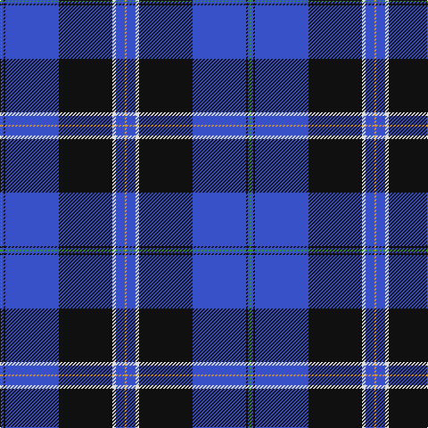

**Bands:** [YBWKBKBG](/stripes/ybwkbkbg/) · **Stripes:** [LO B W K B K B G](/stripes/stripes8/) LO B W K B K B G

This was sourced from tartans-authority.  It is a [8 band tartan](/bands/bands8/).

Original link http://www.tartansauthority.com/tartan-ferret/display/10728/

## Thread count
O/2 B10 LN4 K60 B60 K2 B2 G/2

## Palette
Each colour and its ΔE from the base-6 reference it is a variant of.

| Colour | Shade | Base | ΔE (OKLab) |
|---|---|---|---|
| B | <code style="background-color:#3850C8;">#3850C8</code> `#3850C8` | B <code style="background-color:#2A418A;">#2A418A</code> | 0.11 |
| G | <code style="background-color:#289C18;">#289C18</code> `#289C18` | G <code style="background-color:#006100;">#006100</code> | 0.19 |
| K | <code style="background-color:#101010;">#101010</code> `#101010` | K <code style="background-color:#000000;">#000000</code> | 0.17 |
| LN | <code style="background-color:#E0E0E0;">#E0E0E0</code> `#E0E0E0` | W <code style="background-color:#F7F7F7;">#F7F7F7</code> | 0.07 |
| O | <code style="background-color:#DC943C;">#DC943C</code> `#DC943C` | Y <code style="background-color:#F2BF00;">#F2BF00</code> | 0.12 |

# Sample pattern

## Nearest tartans

The nearest existing variants by ΔTartan distance.

1. [Raith Rovers F.C.](/setts/s8/db6w2g2w3db24r1db35r2~x2/) — ΔT 0.93
1. [Hill](/setts/s9/k4r2k28b31ly1b2ly1b2w3~x2/) — ΔT 0.96
1. [Binder Wedding (Personal)](/setts/s8/g1db1k1db30k30w2db5ly1~x2/) — ΔT 1.02
1. [Binder Wedding (Personal) Name Tartan Tartan Number: 10728. Earliest known date: 1 November 2012 Designed to celebrate the wedding of Anna Binder and Michael Slozga and to found a family tartan for their descendants. Anna and Michael are both pipers; they met through a pipe band and share a passion for Scottish traditional pipe band music. Registrant details: Mr Michael Szolga, 252/5 Waldegg, Waldegg, , Austria, 2754 See products available Copyright © Blair Urquhart, Comrie, 2015](/setts/s8/k1db5w2k30db30k1db1k1~x2/) — ΔT 1.08
1. [Hill (Name)](/setts/s9/w3db2ly1db2ly1db31k28r2k2~x2/) — ΔT 1.09
1. [Grahame Laurie Band (Corporate)](/setts/s7/k8ly2dp6ly2k36db84w7/) — ΔT 1.11
1. [Chestico](/setts/s7/db20o1db1o1dg8k1w3~x2/) — ΔT 1.21
1. [Blue Rust](/setts/s8/db21n2w1n2db1r2db1o6~x4/) — ΔT 1.27
1. [Fuller of Hopewell (Personal)](/setts/s7/k1w1k18db20w1r1lo1~x4/) — ΔT 1.27
1. [Musselburgh](/setts/s9/t14lb1t3lo2t3lb1t4db24r3~x4/) — ΔT 1.28

## Neighbour map

Every grey dot is one of 14299 variants placed by the first two principal components of the ΔTartan feature space (44% of its variance). Red is this tartan; blue dots are its nearest — click one to open its page.

<svg viewBox="0 0 640 380" role="img" style="max-width:100%;height:auto;border:1px solid #e0e0e0;border-radius:4px;display:block" xmlns="http://www.w3.org/2000/svg"><image href="/nn/cloud.v1.png" width="640" height="380"/><a href="/setts/s8/db6w2g2w3db24r1db35r2~x2/"><circle cx="315.0" cy="122.0" r="4" fill="#3465a4"><title>Raith Rovers F.C.</title></circle></a><a href="/setts/s9/k4r2k28b31ly1b2ly1b2w3~x2/"><circle cx="295.0" cy="96.0" r="4" fill="#3465a4"><title>Hill</title></circle></a><a href="/setts/s8/g1db1k1db30k30w2db5ly1~x2/"><circle cx="358.5" cy="127.2" r="4" fill="#3465a4"><title>Binder Wedding (Personal)</title></circle></a><a href="/setts/s8/k1db5w2k30db30k1db1k1~x2/"><circle cx="341.9" cy="125.4" r="4" fill="#3465a4"><title>Binder Wedding (Personal) Name Tartan Tartan Number: 10728. Earliest known date: 1 November 2012 Designed to celebrate the wedding of Anna Binder and Michael Slozga and to found a family tartan for their descendants. Anna and Michael are both pipers; they met through a pipe band and share a passion for Scottish traditional pipe band music. Registrant details: Mr Michael Szolga, 252/5 Waldegg, Waldegg, , Austria, 2754 See products available Copyright © Blair Urquhart, Comrie, 2015</title></circle></a><a href="/setts/s9/w3db2ly1db2ly1db31k28r2k2~x2/"><circle cx="337.8" cy="113.6" r="4" fill="#3465a4"><title>Hill (Name)</title></circle></a><a href="/setts/s7/k8ly2dp6ly2k36db84w7/"><circle cx="387.2" cy="118.1" r="4" fill="#3465a4"><title>Grahame Laurie Band (Corporate)</title></circle></a><a href="/setts/s7/db20o1db1o1dg8k1w3~x2/"><circle cx="331.9" cy="138.3" r="4" fill="#3465a4"><title>Chestico</title></circle></a><a href="/setts/s8/db21n2w1n2db1r2db1o6~x4/"><circle cx="383.4" cy="133.4" r="4" fill="#3465a4"><title>Blue Rust</title></circle></a><a href="/setts/s7/k1w1k18db20w1r1lo1~x4/"><circle cx="313.5" cy="144.1" r="4" fill="#3465a4"><title>Fuller of Hopewell (Personal)</title></circle></a><a href="/setts/s9/t14lb1t3lo2t3lb1t4db24r3~x4/"><circle cx="273.9" cy="122.6" r="4" fill="#3465a4"><title>Musselburgh</title></circle></a><circle cx="340.4" cy="117.0" r="5" fill="#c00000"/></svg>

ID: /setts/s8/g1b1k1b30k30w2b5lo1~x2/
