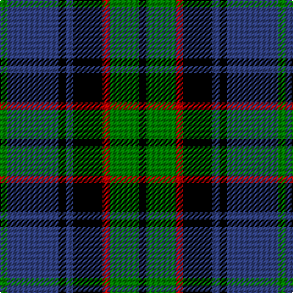

In pattern [GBKBKRGK](/patterns/gbkbkrgk/).

This was sourced from weddslist.  It is a [8 stripes tartan](/stripes/stripes8/).

Original link http://www.weddslist.com/cgi-bin/tartans/pg.pl?source=sts

## Thread count
G/6 B42 K6 B6 K24 R6 G24 K/6

## Palette
Each colour and its ΔE from the base-6 reference it is a variant of.

| Colour | Shade | Base | ΔE (OKLab) |
|---|---|---|---|
| B | <code style="background-color:#304080;">#304080</code> `#304080` | B <code style="background-color:#2A418A;">#2A418A</code> | 0.02 |
| G | <code style="background-color:#008000;">#008000</code> `#008000` | G <code style="background-color:#006100;">#006100</code> | 0.10 |
| K | <code style="background-color:#000000;">#000000</code> `#000000` | K <code style="background-color:#000000;">#000000</code> | 0.00 |
| R | <code style="background-color:#C00000;">#C00000</code> `#C00000` | R <code style="background-color:#CC0000;">#CC0000</code> | 0.03 |

# Sample pattern

## Nearest tartans

The nearest existing variants by ΔTartan distance.

1. [Forbes](/setts/s9/b8k2b2k2b2k8g7k1w1~b304080-g008000-k000000-we0e0e0~x2/) — ΔT 0.58
1. [Forbes](/setts/s7/b1k1b6k6g6k1w1~b304080-g008000-k000000-we0e0e0~x2/) — ΔT 0.68
1. [Alexander, hunting](/setts/s9/b12r2b4r4k15b4g4b2g12~b304080-g008000-k000000-rc00000~x2/) — ΔT 0.72
1. [Lamont](/setts/s8/b10k1b1k1b2k8g10w1~b304080-g008000-k000000-we0e0e0~x2/) — ΔT 0.74
1. [Gary/Garry (Name)](/setts/s8/b4g3b12k6b3ba6g24k4~b501464-ba00008c-g146400-k000000~x2/) — ΔT 0.75
1. [Urquhart](/setts/s9/r9b11k3b3k3b3k20g20k3~b304080-g008000-k000000-rc00000~x2/) — ΔT 0.80
1. [Reid Taylor, "House Check"](/setts/s7/b2k1r1b9k9g10k2~b304080-g008000-k000000-rc00000~x2/) — ΔT 0.81
1. [Murray](/setts/s6/b2k2b12k8g11r2~b304080-g008000-k000000-rc00000~x2/) — ΔT 0.88
1. [Fletcher](/setts/s7/b6k1b6k8r1g8k2~b304080-g008000-k000000-rc00000~x2/) — ΔT 0.90
1. [Baird](/setts/s8/b3k2b8k8g8ba1g1ba3~b304080-ba800080-g008000-k000000~x2/) — ΔT 0.93

## Neighbour map

Every grey dot is one of 15726 variants placed by the first two principal components of the ΔTartan feature space (44% of its variance). Red is this tartan; blue dots are its nearest — click one to open its page.

<svg viewBox="0 0 640 380" role="img" style="max-width:100%;height:auto;border:1px solid #e0e0e0;border-radius:4px;display:block" xmlns="http://www.w3.org/2000/svg"><image href="/nn/cloud.v1.png" width="640" height="380"/><a href="/setts/s9/b8k2b2k2b2k8g7k1w1~b304080-g008000-k000000-we0e0e0~x2/"><circle cx="167.4" cy="206.7" r="4" fill="#3465a4"><title>Forbes</title></circle></a><a href="/setts/s7/b1k1b6k6g6k1w1~b304080-g008000-k000000-we0e0e0~x2/"><circle cx="138.6" cy="223.6" r="4" fill="#3465a4"><title>Forbes</title></circle></a><a href="/setts/s9/b12r2b4r4k15b4g4b2g12~b304080-g008000-k000000-rc00000~x2/"><circle cx="141.9" cy="210.7" r="4" fill="#3465a4"><title>Alexander, hunting</title></circle></a><a href="/setts/s8/b10k1b1k1b2k8g10w1~b304080-g008000-k000000-we0e0e0~x2/"><circle cx="180.6" cy="189.4" r="4" fill="#3465a4"><title>Lamont</title></circle></a><a href="/setts/s8/b4g3b12k6b3ba6g24k4~b501464-ba00008c-g146400-k000000~x2/"><circle cx="210.5" cy="210.7" r="4" fill="#3465a4"><title>Gary/Garry (Name)</title></circle></a><a href="/setts/s9/r9b11k3b3k3b3k20g20k3~b304080-g008000-k000000-rc00000~x2/"><circle cx="146.4" cy="204.5" r="4" fill="#3465a4"><title>Urquhart</title></circle></a><a href="/setts/s7/b2k1r1b9k9g10k2~b304080-g008000-k000000-rc00000~x2/"><circle cx="166.2" cy="207.6" r="4" fill="#3465a4"><title>Reid Taylor, &quot;House Check&quot;</title></circle></a><a href="/setts/s6/b2k2b12k8g11r2~b304080-g008000-k000000-rc00000~x2/"><circle cx="148.6" cy="240.0" r="4" fill="#3465a4"><title>Murray</title></circle></a><a href="/setts/s7/b6k1b6k8r1g8k2~b304080-g008000-k000000-rc00000~x2/"><circle cx="154.4" cy="232.0" r="4" fill="#3465a4"><title>Fletcher</title></circle></a><a href="/setts/s8/b3k2b8k8g8ba1g1ba3~b304080-ba800080-g008000-k000000~x2/"><circle cx="125.7" cy="215.8" r="4" fill="#3465a4"><title>Baird</title></circle></a><circle cx="172.0" cy="210.3" r="5" fill="#c00000"/></svg>

ID: /setts/s8/g1b7k1b1k4r1g4k1~b304080-g008000-k000000-rc00000~x6/
