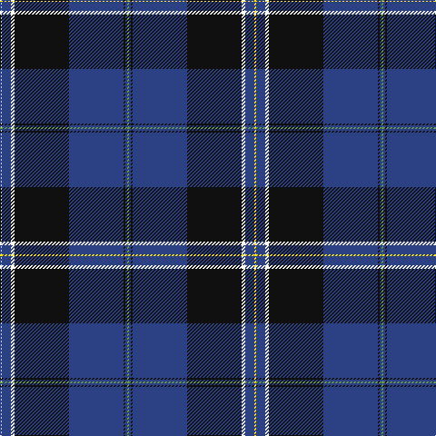

This page is one **sett** — a single exact thread-count. It belongs to the [tartan](/tartans/y1b5w2k30b30k1b1lg1/)
(the same proportion at any scale), whose colour order is pattern [GBKBKWBY](/stripes/gbkbkwby/).

Sourced from register-of-tartans.  It is a [8 stripe tartan](/stripes/stripes8/).

Original link https://www.tartanregister.gov.uk/tartanDetails.aspx?ref=10728

## Register references

External register numbers recorded for this tartan.

- Scottish Register of Tartans: [10728](https://www.tartanregister.gov.uk/tartanDetails.aspx?ref=10728)

## Thread count
Y/2 B10 W4 K60 B60 K2 B2 LG/2

## Palette
Each colour and the base-6 reference it is a variant of.

| Colour | Shade | Base |
|---|---|---|
| B | <code style="background-color:#2C4084;">#2C4084</code> `oklch(39.4% 0.117 268.3)` <small>#2C4084</small> | B <code style="background-color:#2A418A;">#2A418A</code> |
| K | <code style="background-color:#101010;">#101010</code> `oklch(17.3% 0.000 89.9)` <small>#101010</small> | K <code style="background-color:#000000;">#000000</code> |
| LG | <code style="background-color:#649848;">#649848</code> `oklch(62.4% 0.125 135.7)` <small>#649848</small> | G <code style="background-color:#006100;">#006100</code> |
| W | <code style="background-color:#FFFFFF;">#FFFFFF</code> `oklch(100.0% 0.000 89.9)` <small>#FFFFFF</small> | W <code style="background-color:#F7F7F7;">#F7F7F7</code> |
| Y | <code style="background-color:#FFE600;">#FFE600</code> `oklch(91.7% 0.192 101.4)` <small>#FFE600</small> | Y <code style="background-color:#F2BF00;">#F2BF00</code> |

# Sample pattern

## Nearest tartans

The nearest existing variants by ΔTartan distance, with this tartan at the top so the swatches line up against it.

ΔTartan

Tartan

Sett

—

<a href="/ttd/edit/#slug=g1db1k1db30k30w2db5ly1~x2">Binder Wedding (Personal)</a> <a class="nn-out" href="/setts/s8/g1db1k1db30k30w2db5ly1~x2/" title="open its dictionary page">↗</a>

0.61

<a href="/ttd/edit/#slug=w3db2ly1db2ly1db31k28r2k2~x2">Hill (Name)</a> <a class="nn-out" href="/setts/s9/w3db2ly1db2ly1db31k28r2k2~x2/" title="open its dictionary page">↗</a>

0.95

<a href="/ttd/edit/#slug=k1w1k18db20w1r1lo1~x4">Fuller of Hopewell (Personal)</a> <a class="nn-out" href="/setts/s7/k1w1k18db20w1r1lo1~x4/" title="open its dictionary page">↗</a>

0.99

<a href="/ttd/edit/#slug=k3r1k30w1db28r1db1w3~x2">Dunlop</a> <a class="nn-out" href="/setts/s8/k3r1k30w1db28r1db1w3~x2/" title="open its dictionary page">↗</a>

1.00

<a href="/ttd/edit/#slug=lb3k6lb2k6db2k2db32k2n1~x2">Nocken (Personal)</a> <a class="nn-out" href="/setts/s9/lb3k6lb2k6db2k2db32k2n1~x2/" title="open its dictionary page">↗</a>

1.02

<a href="/ttd/edit/#slug=g1b1k1b30k30w2b5lo1~x2">Binder Wedding (Personal)</a> <a class="nn-out" href="/setts/s8/g1b1k1b30k30w2b5lo1~x2/" title="open its dictionary page">↗</a>

1.05

<a href="/ttd/edit/#slug=k8ly2dp6ly2k36db84w7">Grahame Laurie Band (Corporate)</a> <a class="nn-out" href="/setts/s7/k8ly2dp6ly2k36db84w7/" title="open its dictionary page">↗</a>

1.08

<a href="/ttd/edit/#slug=k8ly1k1db28k12g2k1t2~x2">Hope-Weir / Weir</a> <a class="nn-out" href="/setts/s8/k8ly1k1db28k12g2k1t2~x2/" title="open its dictionary page">↗</a>

1.09

<a href="/ttd/edit/#slug=db42k6lo2k3lo2g10r7k2~x2">MacBeth (Fashion)</a> <a class="nn-out" href="/setts/s8/db42k6lo2k3lo2g10r7k2~x2/" title="open its dictionary page">↗</a>

1.09

<a href="/ttd/edit/#slug=k8ly1k1db28k12dg2k1t2~x2">Hope-Weir/Weir</a> <a class="nn-out" href="/setts/s8/k8ly1k1db28k12dg2k1t2~x2/" title="open its dictionary page">↗</a>

1.11

<a href="/ttd/edit/#slug=db20dy1db1dy1dg8k1w3~x2">Chestico</a> <a class="nn-out" href="/setts/s7/db20dy1db1dy1dg8k1w3~x2/" title="open its dictionary page">↗</a>

## Neighbour map

Every grey dot is one of 14299 variants placed by the first two principal components of the ΔTartan feature space (44% of its variance). Red is this tartan; blue dots are its nearest — click one to open its page.

<svg viewBox="0 0 640 380" role="img" style="max-width:100%;height:auto;border:1px solid #e0e0e0;border-radius:4px;display:block" xmlns="http://www.w3.org/2000/svg"><image href="/nn/cloud.v1.png" width="640" height="380"/><a href="/setts/s9/w3db2ly1db2ly1db31k28r2k2~x2/"><circle cx="337.8" cy="113.6" r="4" fill="#3465a4"><title>Hill (Name)</title></circle></a><a href="/setts/s7/k1w1k18db20w1r1lo1~x4/"><circle cx="313.5" cy="144.1" r="4" fill="#3465a4"><title>Fuller of Hopewell (Personal)</title></circle></a><a href="/setts/s8/k3r1k30w1db28r1db1w3~x2/"><circle cx="359.5" cy="139.2" r="4" fill="#3465a4"><title>Dunlop</title></circle></a><a href="/setts/s9/lb3k6lb2k6db2k2db32k2n1~x2/"><circle cx="407.1" cy="120.3" r="4" fill="#3465a4"><title>Nocken (Personal)</title></circle></a><a href="/setts/s8/g1b1k1b30k30w2b5lo1~x2/"><circle cx="340.4" cy="117.0" r="4" fill="#3465a4"><title>Binder Wedding (Personal)</title></circle></a><a href="/setts/s7/k8ly2dp6ly2k36db84w7/"><circle cx="387.2" cy="118.1" r="4" fill="#3465a4"><title>Grahame Laurie Band (Corporate)</title></circle></a><a href="/setts/s8/k8ly1k1db28k12g2k1t2~x2/"><circle cx="320.6" cy="125.7" r="4" fill="#3465a4"><title>Hope-Weir / Weir</title></circle></a><a href="/setts/s8/db42k6lo2k3lo2g10r7k2~x2/"><circle cx="343.2" cy="139.7" r="4" fill="#3465a4"><title>MacBeth (Fashion)</title></circle></a><a href="/setts/s8/k8ly1k1db28k12dg2k1t2~x2/"><circle cx="370.7" cy="149.7" r="4" fill="#3465a4"><title>Hope-Weir/Weir</title></circle></a><a href="/setts/s7/db20dy1db1dy1dg8k1w3~x2/"><circle cx="353.2" cy="144.6" r="4" fill="#3465a4"><title>Chestico</title></circle></a><circle cx="358.5" cy="127.2" r="5" fill="#c00000"/></svg>

ID: /setts/s8/g1db1k1db30k30w2db5ly1~x2/
