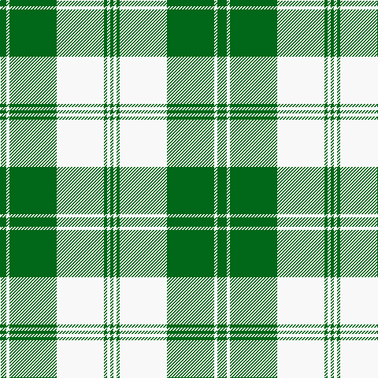

In pattern [GGWGWGWG](/patterns/ggwgwgwg/).

This was sourced from tartans-authority.  It is a [8 stripes tartan](/stripes/stripes8/).

Original link http://www.tartansauthority.com/tartan-ferret/display/9000/

## Thread count
Ga/4 G4 W4 G60 W60 G4 W4 Ga/4

## Palette
Each colour and its ΔE from the base-6 reference it is a variant of.

| Colour | Shade | Base | ΔE (OKLab) |
|---|---|---|---|
| G | <code style="background-color:#006818;">#006818</code> `#006818` | G <code style="background-color:#006100;">#006100</code> | 0.02 |
| Ga | <code style="background-color:#006818;">#006818</code> `#006818` | G <code style="background-color:#006100;">#006100</code> | 0.02 |
| W | <code style="background-color:#F8F8F8;">#F8F8F8</code> `#F8F8F8` | W <code style="background-color:#F7F7F7;">#F7F7F7</code> | 0.00 |

# Sample pattern

## Nearest tartans

The nearest existing variants by ΔTartan distance.

1. [Uist, Green (Dance)](/setts/s7/g3r2g27ga3w30ga2w3x2~g006818-ga003820-rc80000-wf0e0c8/) — ΔT 1.18
1. [Cunningham Dress Green (Dance)](/setts/s7/w5g2w34g34k2g2y4x2~g289c18-k101010-wf8f8f8-ye8c000/) — ΔT 1.39
1. [Longniddry Green (Dance)](/setts/s8/g42ga2w2ga2g5b12w32g4x2~b1c1c1c-g006818-ga289c18-wfcfcfc/) — ΔT 1.47
1. [Erskine, Green (Dance)](/setts/s6/g6w2g29w29g2w6x2~g006818-wfcfcfc/) — ΔT 1.51
1. [Erskine Green Clan Tartan Tartan Number: 941. Earliest known date: pre 2003 A sample of this tartan was recorded by the Scottish Tartans Society during the period 1970 to 1990. See products available Copyright © Blair Urquhart, Comrie, 2015](/setts/s6/g6w2g29w29g2w6x2~g006818-we0e0e0/) — ΔT 1.54
1. [Cunningham Dress Green (Dance) Fashion Tartan Tartan Number: 6532. Earliest known date: 01/01/1988 A dancers' tartan now woven by D C Dalgliesh of Selkirk /Threadcount and colours aren't 100% original. Generated manually./ See products available Copyright © Blair Urquhart, Comrie, 2015](/setts/s7/w2g1w20g20k1g1y2x4~g289c18-k101010-we0e0e0-ye8c000/) — ΔT 1.60
1. [Longniddry Green District Tartan Tartan Number: 764. Earliest known date: pre 1992 A dancers tartan from D.C. Dalgleish weavers of Selkirk See products available Copyright © Blair Urquhart, Comrie, 2015](/setts/s8/g42ga2w2ga2g5gb12w32g4x2~g006818-ga289c18-gb003820-we0e0e0/) — ΔT 1.62
1. [Lindsay, dress](/setts/s9/g33b4g4b4g4b12w33b3w6x2~b304080-g008000-we0e0e0/) — ΔT 1.64
1. [Erskine Green](/setts/s6/g6w2g29w29g2w6x2~g005020-we0e0e0/) — ΔT 1.64
1. [Scott Dress #2](/setts/s10/g7r3k3w54g24r5g5w5g5r5x2~g005020-k101010-rdc0000-we0e0e0/) — ΔT 1.64

## Neighbour map

Every grey dot is one of 15726 variants placed by the first two principal components of the ΔTartan feature space (44% of its variance). Red is this tartan; blue dots are its nearest — click one to open its page.

<svg viewBox="0 0 640 380" role="img" style="max-width:100%;height:auto;border:1px solid #e0e0e0;border-radius:4px;display:block" xmlns="http://www.w3.org/2000/svg"><image href="/nn/cloud.v1.png" width="640" height="380"/><a href="/setts/s7/g3r2g27ga3w30ga2w3x2~g006818-ga003820-rc80000-wf0e0c8/"><circle cx="265.1" cy="148.9" r="4" fill="#3465a4"><title>Uist, Green (Dance)</title></circle></a><a href="/setts/s7/w5g2w34g34k2g2y4x2~g289c18-k101010-wf8f8f8-ye8c000/"><circle cx="280.2" cy="143.8" r="4" fill="#3465a4"><title>Cunningham Dress Green (Dance)</title></circle></a><a href="/setts/s8/g42ga2w2ga2g5b12w32g4x2~b1c1c1c-g006818-ga289c18-wfcfcfc/"><circle cx="263.6" cy="132.9" r="4" fill="#3465a4"><title>Longniddry Green (Dance)</title></circle></a><a href="/setts/s6/g6w2g29w29g2w6x2~g006818-wfcfcfc/"><circle cx="317.7" cy="201.7" r="4" fill="#3465a4"><title>Erskine, Green (Dance)</title></circle></a><a href="/setts/s6/g6w2g29w29g2w6x2~g006818-we0e0e0/"><circle cx="330.7" cy="208.3" r="4" fill="#3465a4"><title>Erskine Green Clan Tartan Tartan Number: 941. Earliest known date: pre 2003 A sample of this tartan was recorded by the Scottish Tartans Society during the period 1970 to 1990. See products available Copyright © Blair Urquhart, Comrie, 2015</title></circle></a><a href="/setts/s7/w2g1w20g20k1g1y2x4~g289c18-k101010-we0e0e0-ye8c000/"><circle cx="309.3" cy="142.9" r="4" fill="#3465a4"><title>Cunningham Dress Green (Dance) Fashion Tartan Tartan Number: 6532. Earliest known date: 01/01/1988 A dancers' tartan now woven by D C Dalgliesh of Selkirk /Threadcount and colours aren't 100% original. Generated manually./ See products available Copyright © Blair Urquhart, Comrie, 2015</title></circle></a><a href="/setts/s8/g42ga2w2ga2g5gb12w32g4x2~g006818-ga289c18-gb003820-we0e0e0/"><circle cx="277.6" cy="140.3" r="4" fill="#3465a4"><title>Longniddry Green District Tartan Tartan Number: 764. Earliest known date: pre 1992 A dancers tartan from D.C. Dalgleish weavers of Selkirk See products available Copyright © Blair Urquhart, Comrie, 2015</title></circle></a><a href="/setts/s9/g33b4g4b4g4b12w33b3w6x2~b304080-g008000-we0e0e0/"><circle cx="213.2" cy="176.0" r="4" fill="#3465a4"><title>Lindsay, dress</title></circle></a><a href="/setts/s6/g6w2g29w29g2w6x2~g005020-we0e0e0/"><circle cx="324.6" cy="206.2" r="4" fill="#3465a4"><title>Erskine Green</title></circle></a><a href="/setts/s10/g7r3k3w54g24r5g5w5g5r5x2~g005020-k101010-rdc0000-we0e0e0/"><circle cx="277.3" cy="113.3" r="4" fill="#3465a4"><title>Scott Dress #2</title></circle></a><circle cx="293.2" cy="148.7" r="5" fill="#c00000"/></svg>

ID: /setts/s8/g1g1w1g15w15g1w1g1x4~g006818-wf8f8f8/
