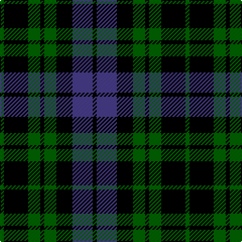

In pattern [GKGKGKBK](/patterns/gkgkgkbk/).

This was sourced from register-of-tartans.  It is a [8 stripes tartan](/stripes/stripes8/).

Original link https://www.tartanregister.gov.uk/tartanDetails.aspx?ref=10011

## Thread count
G/4 K24 G12 K4 G12 K16 B20 K/4

## Palette
Each colour and its ΔE from the base-6 reference it is a variant of.

| Colour | Shade | Base | ΔE (OKLab) |
|---|---|---|---|
| B | <code style="background-color:#483D8B;">#483D8B</code> `#483D8B` | B <code style="background-color:#2A418A;">#2A418A</code> | 0.04 |
| G | <code style="background-color:#006400;">#006400</code> `#006400` | G <code style="background-color:#006100;">#006100</code> | 0.01 |
| K | <code style="background-color:#000000;">#000000</code> `#000000` | K <code style="background-color:#000000;">#000000</code> | 0.00 |

# Sample pattern

## Nearest tartans

The nearest existing variants by ΔTartan distance.

1. [Strathspey](/setts/s7/k1g5k5b5k1b1k1~b304080-g008000-k000000~x4/) — ΔT 1.08
1. [Forbes Ancient](/setts/s7/b1k6b6k6g6k1w1~b304080-g008000-k000000-we0e0e0~x2/) — ΔT 1.11
1. [Black Watch](/setts/s6/k5g23k18b21k33b3~b304080-g008000-k000000~x2/) — ΔT 1.18
1. [Clergy, (Clark)](/setts/s11/g2b5g2b3g2k10g2k10b10g2k2~b304080-g008000-k000000~x2/) — ΔT 1.18
1. [Forbes LC](/setts/s7/b1k6b6k6g6k1w1~b00004c-g004c00-k000000-wd0d0d0/) — ΔT 1.20
1. [MacCallum](/setts/s7/g8k2w1g4k6b6k1~b00004c-g004c00-k000000-wd0d0d0~x2/) — ΔT 1.33
1. [Murray](/setts/s6/b3k16g16k16ba3b3~b5480b0-ba304080-g008000-k000000~x2/) — ΔT 1.39
1. [Wilson's, No 108](/setts/s8/k7g7k1g7k7b1ba7k1~b5480b0-ba800080-g008000-k000000~x4/) — ΔT 1.40
1. [Forbes LC](/setts/s7/b1k6b6k6g6k1y1~b000052-g11450d-k000000-yaaaaaa~x2/) — ΔT 1.40
1. [Forbes LC](/setts/s7/b1k6b6k6g6k1y1~b000052-g11450d-k000000-yaaaaaa/) — ΔT 1.40

## Neighbour map

Every grey dot is one of 15726 variants placed by the first two principal components of the ΔTartan feature space (44% of its variance). Red is this tartan; blue dots are its nearest — click one to open its page.

<svg viewBox="0 0 640 380" role="img" style="max-width:100%;height:auto;border:1px solid #e0e0e0;border-radius:4px;display:block" xmlns="http://www.w3.org/2000/svg"><image href="/nn/cloud.v1.png" width="640" height="380"/><a href="/setts/s7/k1g5k5b5k1b1k1~b304080-g008000-k000000~x4/"><circle cx="184.9" cy="258.4" r="4" fill="#3465a4"><title>Strathspey</title></circle></a><a href="/setts/s7/b1k6b6k6g6k1w1~b304080-g008000-k000000-we0e0e0~x2/"><circle cx="180.6" cy="242.4" r="4" fill="#3465a4"><title>Forbes Ancient</title></circle></a><a href="/setts/s6/k5g23k18b21k33b3~b304080-g008000-k000000~x2/"><circle cx="267.3" cy="255.4" r="4" fill="#3465a4"><title>Black Watch</title></circle></a><a href="/setts/s11/g2b5g2b3g2k10g2k10b10g2k2~b304080-g008000-k000000~x2/"><circle cx="194.7" cy="238.3" r="4" fill="#3465a4"><title>Clergy, (Clark)</title></circle></a><a href="/setts/s7/b1k6b6k6g6k1w1~b00004c-g004c00-k000000-wd0d0d0/"><circle cx="208.8" cy="257.2" r="4" fill="#3465a4"><title>Forbes LC</title></circle></a><a href="/setts/s7/g8k2w1g4k6b6k1~b00004c-g004c00-k000000-wd0d0d0~x2/"><circle cx="190.5" cy="243.2" r="4" fill="#3465a4"><title>MacCallum</title></circle></a><a href="/setts/s6/b3k16g16k16ba3b3~b5480b0-ba304080-g008000-k000000~x2/"><circle cx="230.7" cy="253.7" r="4" fill="#3465a4"><title>Murray</title></circle></a><a href="/setts/s8/k7g7k1g7k7b1ba7k1~b5480b0-ba800080-g008000-k000000~x4/"><circle cx="160.3" cy="230.2" r="4" fill="#3465a4"><title>Wilson's, No 108</title></circle></a><a href="/setts/s7/b1k6b6k6g6k1y1~b000052-g11450d-k000000-yaaaaaa~x2/"><circle cx="219.3" cy="261.1" r="4" fill="#3465a4"><title>Forbes LC</title></circle></a><a href="/setts/s7/b1k6b6k6g6k1y1~b000052-g11450d-k000000-yaaaaaa/"><circle cx="219.3" cy="261.1" r="4" fill="#3465a4"><title>Forbes LC</title></circle></a><circle cx="222.8" cy="264.9" r="5" fill="#c00000"/></svg>

ID: /setts/s8/g1k6g3k1g3k4b5k1~b483d8b-g006400-k000000~x4/
