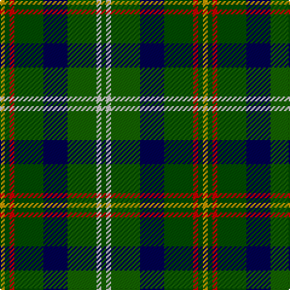

This page is one **sett** — a single exact thread-count. It belongs to the [tartan](/tartans/dy1ga1r1ga6db5g6n1g1/)
(the same proportion at any scale), whose colour order is pattern [GWGBGRGY](/stripes/gwgbgrgy/).

Sourced from register-of-tartans.  It is a [8 stripe tartan](/stripes/stripes8/).

Original link https://www.tartanregister.gov.uk/tartanDetails.aspx?ref=4449

## Also known as

This cloth is also recorded under:

- Vermont District USA

2 attestations — the source records this cloth was collapsed from (oldest owns this page)

<ul>
<li>01/01/1994 — Vermont (register-of-tartans, <a href="https://www.tartanregister.gov.uk/tartanDetails.aspx?ref=4449">record</a>)</li>
<li>undated — Vermont District USA Tartan Tartan Number: 2261. Earliest known date: 1994 Designed by Lilias MacBean Hart in 1994 in conjunction with Andrew Elliot of Elliots of Selkirk and marketed by the Quaigh Shop, Wilmington, Vermont. Registered with TECA 11th October 1994. See products available Copyright © Blair Urquhart, Comrie, 2015 (house-of-tartan, <a href="http://www.house-of-tartan.scotland.net/house/TartanViewjs.asp?colr=Def&tnam=2261">record</a>)</li>
</ul>

## Register references

External register numbers recorded for this tartan.

- Scottish Register of Tartans: [4449](https://www.tartanregister.gov.uk/tartanDetails.aspx?ref=4449)
- Scottish Tartans Authority (ITI): 2261
- Scottish Tartans World Register: 2261

## Thread count
DY/4 Ga4 R4 Ga24 DB20 G24 N4 G/4

## Palette
Each colour and the base-6 reference it is a variant of.

| Colour | Shade | Base |
|---|---|---|
| DB | <code style="background-color:#000050;">#000050</code> `oklch(19.5% 0.135 264.1)` <small>#000050</small> | B <code style="background-color:#2A418A;">#2A418A</code> |
| DR | <code style="background-color:#8C0000;">#8C0000</code> `oklch(40.2% 0.165 29.2)` <small>#8C0000</small> | R <code style="background-color:#CC0000;">#CC0000</code> |
| DY | <code style="background-color:#C89800;">#C89800</code> `oklch(70.6% 0.144 85.9)` <small>#C89800</small> | Y <code style="background-color:#F2BF00;">#F2BF00</code> |
| G | <code style="background-color:#146400;">#146400</code> `oklch(43.9% 0.144 140.9)` <small>#146400</small> | G <code style="background-color:#006100;">#006100</code> |
| Ga | <code style="background-color:#004C00;">#004C00</code> `oklch(36.1% 0.123 142.5)` <small>#004C00</small> | G <code style="background-color:#006100;">#006100</code> |
| N | <code style="background-color:#C8C8C8;">#C8C8C8</code> `oklch(83.3% 0.000 89.9)` <small>#C8C8C8</small> | W <code style="background-color:#F7F7F7;">#F7F7F7</code> |
| R | <code style="background-color:#C80000;">#C80000</code> `oklch(52.3% 0.215 29.2)` <small>#C80000</small> | R <code style="background-color:#CC0000;">#CC0000</code> |

# Sample pattern

## Nearest tartans

The nearest existing variants by ΔTartan distance, with this tartan at the top so the swatches line up against it.

ΔTartan

Tartan

Sett

—

<a href="/ttd/edit/#slug=g1lb1g6db5dg6r1dg1ly1~x4">Vermont</a> <a class="nn-out" href="/setts/s8/g1lb1g6db5dg6r1dg1ly1~x4/" title="open its dictionary page">↗</a>

1.18

<a href="/ttd/edit/#slug=k3db10k2w1k2g10k2dg10r1dg2~x4">Rutledge (Name)</a> <a class="nn-out" href="/setts/s10/k3db10k2w1k2g10k2dg10r1dg2~x4/" title="open its dictionary page">↗</a>

1.22

<a href="/ttd/edit/#slug=ly3g15r2db8t2r8g8r2dg15r2dg2t2~x2">Gordonstoun</a> <a class="nn-out" href="/setts/s12/ly3g15r2db8t2r8g8r2dg15r2dg2t2~x2/" title="open its dictionary page">↗</a>

1.24

<a href="/ttd/edit/#slug=r3g3db4g17k13dt26w3~x2">Royal Burgh of Peebles (District)</a> <a class="nn-out" href="/setts/s7/r3g3db4g17k13dt26w3~x2/" title="open its dictionary page">↗</a>

1.28

<a href="/ttd/edit/#slug=r3m3dt16k2dt2g16r3g2w2~x2">Chinzei Keiai School</a> <a class="nn-out" href="/setts/s9/r3m3dt16k2dt2g16r3g2w2~x2/" title="open its dictionary page">↗</a>

1.31

<a href="/ttd/edit/#slug=r1dy7db3g1o3g1db3g7w1~x4">Adamson (Personal)</a> <a class="nn-out" href="/setts/s9/r1dy7db3g1o3g1db3g7w1~x4/" title="open its dictionary page">↗</a>

1.34

<a href="/ttd/edit/#slug=dp4dp4dp2dp14dg6g3dg6g2g4g2g15o3~x2">Kinloch Anderson Heather (Corporate)</a> <a class="nn-out" href="/setts/s12/dp4dp4dp2dp14dg6g3dg6g2g4g2g15o3~x2/" title="open its dictionary page">↗</a>

1.35

<a href="/ttd/edit/#slug=k3db10k2w1k2g10k2dg10r1dg1~x4">Rutledge</a> <a class="nn-out" href="/setts/s10/k3db10k2w1k2g10k2dg10r1dg1~x4/" title="open its dictionary page">↗</a>

1.36

<a href="/ttd/edit/#slug=r2dt3b12k11g11ly2~x2">Huntly Gordon 2000 (Commem)</a> <a class="nn-out" href="/setts/s6/r2dt3b12k11g11ly2~x2/" title="open its dictionary page">↗</a>

1.38

<a href="/ttd/edit/#slug=dg24k4dg6r4dg6k19dt22w5~x2">MacRae Hunting</a> <a class="nn-out" href="/setts/s8/dg24k4dg6r4dg6k19dt22w5~x2/" title="open its dictionary page">↗</a>

1.39

<a href="/ttd/edit/#slug=g10db42r5dg42g42ly5g10">New Mexico</a> <a class="nn-out" href="/setts/s7/g10db42r5dg42g42ly5g10/" title="open its dictionary page">↗</a>

## Neighbour map

Every grey dot is one of 14299 variants placed by the first two principal components of the ΔTartan feature space (44% of its variance). Red is this tartan; blue dots are its nearest — click one to open its page.

<svg viewBox="0 0 640 380" role="img" style="max-width:100%;height:auto;border:1px solid #e0e0e0;border-radius:4px;display:block" xmlns="http://www.w3.org/2000/svg"><image href="/nn/cloud.v1.png" width="640" height="380"/><a href="/setts/s10/k3db10k2w1k2g10k2dg10r1dg2~x4/"><circle cx="100.9" cy="164.5" r="4" fill="#3465a4"><title>Rutledge (Name)</title></circle></a><a href="/setts/s12/ly3g15r2db8t2r8g8r2dg15r2dg2t2~x2/"><circle cx="108.1" cy="165.6" r="4" fill="#3465a4"><title>Gordonstoun</title></circle></a><a href="/setts/s7/r3g3db4g17k13dt26w3~x2/"><circle cx="155.6" cy="190.3" r="4" fill="#3465a4"><title>Royal Burgh of Peebles (District)</title></circle></a><a href="/setts/s9/r3m3dt16k2dt2g16r3g2w2~x2/"><circle cx="169.9" cy="166.5" r="4" fill="#3465a4"><title>Chinzei Keiai School</title></circle></a><a href="/setts/s9/r1dy7db3g1o3g1db3g7w1~x4/"><circle cx="130.1" cy="196.3" r="4" fill="#3465a4"><title>Adamson (Personal)</title></circle></a><a href="/setts/s12/dp4dp4dp2dp14dg6g3dg6g2g4g2g15o3~x2/"><circle cx="97.6" cy="164.5" r="4" fill="#3465a4"><title>Kinloch Anderson Heather (Corporate)</title></circle></a><a href="/setts/s10/k3db10k2w1k2g10k2dg10r1dg1~x4/"><circle cx="93.2" cy="158.1" r="4" fill="#3465a4"><title>Rutledge</title></circle></a><a href="/setts/s6/r2dt3b12k11g11ly2~x2/"><circle cx="76.0" cy="217.4" r="4" fill="#3465a4"><title>Huntly Gordon 2000 (Commem)</title></circle></a><a href="/setts/s8/dg24k4dg6r4dg6k19dt22w5~x2/"><circle cx="156.9" cy="221.2" r="4" fill="#3465a4"><title>MacRae Hunting</title></circle></a><a href="/setts/s7/g10db42r5dg42g42ly5g10/"><circle cx="187.9" cy="218.1" r="4" fill="#3465a4"><title>New Mexico</title></circle></a><circle cx="110.7" cy="199.4" r="5" fill="#c00000"/></svg>

ID: /setts/s8/g1lb1g6db5dg6r1dg1ly1~x4/
