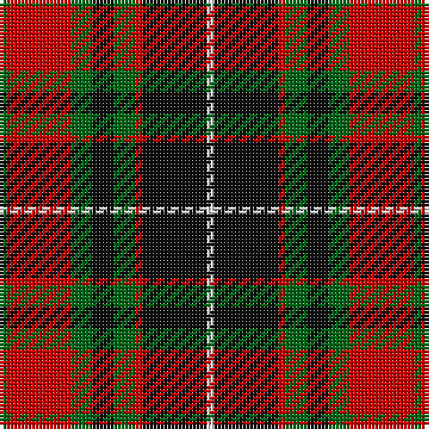

In pattern [GRGKGRKW](/patterns/grgkgrkw/).

This was sourced from house-of-tartan.  It is a [8 stripes tartan](/stripes/stripes8/).

Original link http://www.house-of-tartan.scotland.net/house/TartanViewjs.asp?colr=Def&tnam=987

## Thread count
G/2 R18 G6 K6 G6 R2 K18 LN/2

## Palette
Each colour and its ΔE from the base-6 reference it is a variant of.

| Colour | Shade | Base | ΔE (OKLab) |
|---|---|---|---|
| G | <code style="background-color:#006818;">#006818</code> `#006818` | G <code style="background-color:#006100;">#006100</code> | 0.02 |
| K | <code style="background-color:#101010;">#101010</code> `#101010` | K <code style="background-color:#000000;">#000000</code> | 0.17 |
| LN | <code style="background-color:#E0E0E0;">#E0E0E0</code> `#E0E0E0` | W <code style="background-color:#F7F7F7;">#F7F7F7</code> | 0.07 |
| R | <code style="background-color:#C80000;">#C80000</code> `#C80000` | R <code style="background-color:#CC0000;">#CC0000</code> | 0.01 |

# Sample pattern

## Nearest tartans

The nearest existing variants by ΔTartan distance.

1. [Dickie](/setts/s8/g8r2g12k6g3b6r24k4~b00008c-g146400-k000000-rc82800~x2/) — ΔT 0.56
1. [Earle's Flame](/setts/s8/k10g24r3g3r24ga3g6k6~g845c00-ga285800-k000000-r880000~x2/) — ΔT 0.82
1. [Private SA Club](/setts/s8/k3r8k3r8y19r7b36r3~b14283c-k101010-r880000-yd8a028~x2/) — ΔT 0.82
1. [Wcwm 1062](/setts/s7/g3r20g16k22y6k3g2~g006818-k101010-rc80000-yd09800~x2/) — ΔT 0.84
1. [Montrose](/setts/s9/b2k2r14g15k8b7r14k2b2~b4367ae-g11450d-k000000-raa0000~x2/) — ΔT 0.85
1. [Montrose](/setts/s9/b2k2r14g15k8b7r14k2b2~b4367ae-g11450d-k000000-raa0000/) — ΔT 0.85
1. [O'Neill (District)](/setts/s9/w2r12k4r2k2r2k6g5w2~g006818-k101010-r880000-wc0c0c0~x2/) — ΔT 0.85
1. [MacMillan - 2002 (Black - Unofficial](/setts/s6/g3k31r17g6y18k3~g004810-k101010-r880000-ybc8c00~x2/) — ΔT 0.86
1. [Blackstock Red (Dress)](/setts/s7/y2g7k6r11k1r1y2~g285800-k000000-rb00000-yc89800~x4/) — ΔT 0.87
1. [Daks](/setts/s8/r3k7r2w2ra12k2ra2r3~k000000-r806050-ra906030-we0e0e0~x2/) — ΔT 0.89

## Neighbour map

Every grey dot is one of 15726 variants placed by the first two principal components of the ΔTartan feature space (44% of its variance). Red is this tartan; blue dots are its nearest — click one to open its page.

<svg viewBox="0 0 640 380" role="img" style="max-width:100%;height:auto;border:1px solid #e0e0e0;border-radius:4px;display:block" xmlns="http://www.w3.org/2000/svg"><image href="/nn/cloud.v1.png" width="640" height="380"/><a href="/setts/s8/g8r2g12k6g3b6r24k4~b00008c-g146400-k000000-rc82800~x2/"><circle cx="198.6" cy="182.2" r="4" fill="#3465a4"><title>Dickie</title></circle></a><a href="/setts/s8/k10g24r3g3r24ga3g6k6~g845c00-ga285800-k000000-r880000~x2/"><circle cx="224.4" cy="201.8" r="4" fill="#3465a4"><title>Earle's Flame</title></circle></a><a href="/setts/s8/k3r8k3r8y19r7b36r3~b14283c-k101010-r880000-yd8a028~x2/"><circle cx="227.7" cy="173.5" r="4" fill="#3465a4"><title>Private SA Club</title></circle></a><a href="/setts/s7/g3r20g16k22y6k3g2~g006818-k101010-rc80000-yd09800~x2/"><circle cx="177.6" cy="197.1" r="4" fill="#3465a4"><title>Wcwm 1062</title></circle></a><a href="/setts/s9/b2k2r14g15k8b7r14k2b2~b4367ae-g11450d-k000000-raa0000~x2/"><circle cx="182.2" cy="203.9" r="4" fill="#3465a4"><title>Montrose</title></circle></a><a href="/setts/s9/b2k2r14g15k8b7r14k2b2~b4367ae-g11450d-k000000-raa0000/"><circle cx="182.2" cy="203.9" r="4" fill="#3465a4"><title>Montrose</title></circle></a><a href="/setts/s9/w2r12k4r2k2r2k6g5w2~g006818-k101010-r880000-wc0c0c0~x2/"><circle cx="195.3" cy="212.1" r="4" fill="#3465a4"><title>O'Neill (District)</title></circle></a><a href="/setts/s6/g3k31r17g6y18k3~g004810-k101010-r880000-ybc8c00~x2/"><circle cx="216.2" cy="211.2" r="4" fill="#3465a4"><title>MacMillan - 2002 (Black - Unofficial</title></circle></a><a href="/setts/s7/y2g7k6r11k1r1y2~g285800-k000000-rb00000-yc89800~x4/"><circle cx="186.9" cy="185.7" r="4" fill="#3465a4"><title>Blackstock Red (Dress)</title></circle></a><a href="/setts/s8/r3k7r2w2ra12k2ra2r3~k000000-r806050-ra906030-we0e0e0~x2/"><circle cx="172.5" cy="204.8" r="4" fill="#3465a4"><title>Daks</title></circle></a><circle cx="201.3" cy="193.7" r="5" fill="#c00000"/></svg>

ID: /setts/s8/g1r9g3k3g3r1k9w1~g006818-k101010-rc80000-we0e0e0~x2/
