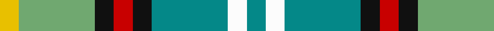

In pattern [GWGKRKYY](/stripes/gwgkrkyy/).

This was sourced from register-of-tartans.  It is a [8 stripe tartan](/stripes/stripes8/).

Original link https://www.tartanregister.gov.uk/tartanDetails.aspx?ref=1041

## Attestations

This cloth appears in 2 source records; the oldest owns this page.

- 01/01/1988 — Dunedin (NZ) (register-of-tartans, [record](https://www.tartanregister.gov.uk/tartanDetails.aspx?ref=1041))
- 1988 — Dunedin (NZ) (District) (tartans-authority, [record](http://www.tartansauthority.com/tartan-ferret/display/2114/))

## Register references

External register numbers recorded for this tartan.

- Scottish Register of Tartans: [1041](https://www.tartanregister.gov.uk/tartanDetails.aspx?ref=1041)
- Scottish Tartans Authority (ITI): 2114
- Scottish Tartans World Register: 2114

## Thread count
Y/8 LG32 K8 R8 K8 B32 W8 B/8

## Palette
Each colour and its ΔE from the base-6 reference it is a variant of.

| Colour | Shade | Base | ΔE (OKLab) |
|---|---|---|---|
| B | <code style="background-color:#048888;">#048888</code> `#048888` | G <code style="background-color:#006100;">#006100</code> | 0.18 |
| K | <code style="background-color:#101010;">#101010</code> `#101010` | K <code style="background-color:#000000;">#000000</code> | 0.17 |
| LG | <code style="background-color:#70A870;">#70A870</code> `#70A870` | Y <code style="background-color:#F2BF00;">#F2BF00</code> | 0.20 |
| R | <code style="background-color:#C80000;">#C80000</code> `#C80000` | R <code style="background-color:#CC0000;">#CC0000</code> | 0.01 |
| W | <code style="background-color:#FCFCFC;">#FCFCFC</code> `#FCFCFC` | W <code style="background-color:#F7F7F7;">#F7F7F7</code> | 0.01 |
| Y | <code style="background-color:#E8C000;">#E8C000</code> `#E8C000` | Y <code style="background-color:#F2BF00;">#F2BF00</code> | 0.02 |

# Sample pattern

## Nearest tartans

The nearest existing variants by ΔTartan distance.

1. [Northern College](/setts/s10/g10db6t6g10w8ly3t2ly3db2r2/) — ΔT 0.92
1. [Northern College (Ontario)](/setts/s10/g5db3t3g5w4ly2t1ly2db1r1~x6/) — ΔT 1.19
1. [Mounth The.. Corporate Tartan Tartan Number: 120. Earliest known date: 1988 Designed for Kincardine & Deeside branch of the National Trust for Scotland. Blue is a muted sky blue. Green is a dark pine green. See products available Copyright © Blair Urquhart, Comrie, 2015](/setts/s9/dg2o13dg12w3lb10w3lb12g13r2~x2/) — ΔT 1.23
1. [Mitsukoshi Sendai](/setts/s10/o4k1w1k1w1k1o4n2dg6r1~x6/) — ΔT 1.38
1. [Vermont Dress](/setts/s8/g1w1g6db5w6r1g1lo1~x4/) — ΔT 1.41
1. [Equorian Olympic](/setts/s8/db2y1o1dg6w3o3o1y1/) — ΔT 1.41
1. [Labrador Club of Scotland (Corporate](/setts/s8/o21ly4dy5ly4o5k21g21lo5~x2/) — ΔT 1.42
1. [MacLellan Dress (Personal)](/setts/s11/k4ly2lg13k8r2w13r2w13k2g12ly4~x2/) — ΔT 1.42
1. [Vasseur Mignon (Personal)](/setts/s11/r2ly2r2ly2g5lb5g11n11g5lb11ly2~x2/) — ΔT 1.43
1. [Ontario Northern Canadian District Tartan Tartan Number: 956. Earliest known date: 1967 The six colours represent the nickel bearing rocks (grey), the snow (white), the sky and the lakes (blue), gold, the forests and fields (green), and the Indian Nation (red brown). See products available Copyright © Blair Urquhart, Comrie, 2015](/setts/s7/dy17o5db2w12db2ly4g7~x2/) — ΔT 1.45

## Neighbour map

Every grey dot is one of 14299 variants placed by the first two principal components of the ΔTartan feature space (44% of its variance). Red is this tartan; blue dots are its nearest — click one to open its page.

<svg viewBox="0 0 640 380" role="img" style="max-width:100%;height:auto;border:1px solid #e0e0e0;border-radius:4px;display:block" xmlns="http://www.w3.org/2000/svg"><image href="/nn/cloud.v1.png" width="640" height="380"/><a href="/setts/s10/g10db6t6g10w8ly3t2ly3db2r2/"><circle cx="64.9" cy="194.0" r="4" fill="#3465a4"><title>Northern College</title></circle></a><a href="/setts/s10/g5db3t3g5w4ly2t1ly2db1r1~x6/"><circle cx="52.0" cy="194.1" r="4" fill="#3465a4"><title>Northern College (Ontario)</title></circle></a><a href="/setts/s9/dg2o13dg12w3lb10w3lb12g13r2~x2/"><circle cx="54.6" cy="186.1" r="4" fill="#3465a4"><title>Mounth The.. Corporate Tartan Tartan Number: 120. Earliest known date: 1988 Designed for Kincardine &amp; Deeside branch of the National Trust for Scotland. Blue is a muted sky blue. Green is a dark pine green. See products available Copyright © Blair Urquhart, Comrie, 2015</title></circle></a><a href="/setts/s10/o4k1w1k1w1k1o4n2dg6r1~x6/"><circle cx="79.2" cy="165.4" r="4" fill="#3465a4"><title>Mitsukoshi Sendai</title></circle></a><a href="/setts/s8/g1w1g6db5w6r1g1lo1~x4/"><circle cx="111.0" cy="180.0" r="4" fill="#3465a4"><title>Vermont Dress</title></circle></a><a href="/setts/s8/db2y1o1dg6w3o3o1y1/"><circle cx="96.1" cy="194.6" r="4" fill="#3465a4"><title>Equorian Olympic</title></circle></a><a href="/setts/s8/o21ly4dy5ly4o5k21g21lo5~x2/"><circle cx="70.7" cy="192.2" r="4" fill="#3465a4"><title>Labrador Club of Scotland (Corporate</title></circle></a><a href="/setts/s11/k4ly2lg13k8r2w13r2w13k2g12ly4~x2/"><circle cx="44.6" cy="151.5" r="4" fill="#3465a4"><title>MacLellan Dress (Personal)</title></circle></a><a href="/setts/s11/r2ly2r2ly2g5lb5g11n11g5lb11ly2~x2/"><circle cx="115.1" cy="195.8" r="4" fill="#3465a4"><title>Vasseur Mignon (Personal)</title></circle></a><a href="/setts/s7/dy17o5db2w12db2ly4g7~x2/"><circle cx="87.7" cy="166.4" r="4" fill="#3465a4"><title>Ontario Northern Canadian District Tartan Tartan Number: 956. Earliest known date: 1967 The six colours represent the nickel bearing rocks (grey), the snow (white), the sky and the lakes (blue), gold, the forests and fields (green), and the Indian Nation (red brown). See products available Copyright © Blair Urquhart, Comrie, 2015</title></circle></a><circle cx="68.6" cy="195.2" r="5" fill="#c00000"/></svg>

ID: /setts/s8/g1w1g4k1r1k1lg4ly1~x8/
