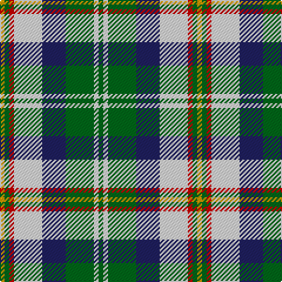

In pattern [GWGBWRGY](/patterns/gwgbwrgy/).

This was sourced from register-of-tartans.  It is a [8 stripes tartan](/stripes/stripes8/).

Original link https://www.tartanregister.gov.uk/tartanDetails.aspx?ref=4450

## Attestations

This cloth appears in 2 source records; the oldest owns this page.

- 01/01/1996 — Vermont Dress (register-of-tartans, [record](https://www.tartanregister.gov.uk/tartanDetails.aspx?ref=4450))
- pre 1996 — Vermont Dress (US State) (tartans-authority, [record](http://www.tartansauthority.com/tartan-ferret/display/4348/))

## Thread count
DY/4 G4 R4 LN24 DB20 G24 LN4 G/4

## Palette
Each colour and its ΔE from the base-6 reference it is a variant of.

| Colour | Shade | Base | ΔE (OKLab) |
|---|---|---|---|
| DB | <code style="background-color:#202060;">#202060</code> `#202060` | B <code style="background-color:#2A418A;">#2A418A</code> | 0.11 |
| DR | <code style="background-color:#880000;">#880000</code> `#880000` | R <code style="background-color:#CC0000;">#CC0000</code> | 0.15 |
| DY | <code style="background-color:#D09800;">#D09800</code> `#D09800` | Y <code style="background-color:#F2BF00;">#F2BF00</code> | 0.12 |
| G | <code style="background-color:#006818;">#006818</code> `#006818` | G <code style="background-color:#006100;">#006100</code> | 0.02 |
| LN | <code style="background-color:#E0E0E0;">#E0E0E0</code> `#E0E0E0` | W <code style="background-color:#F7F7F7;">#F7F7F7</code> | 0.07 |
| N | <code style="background-color:#C0C0C0;">#C0C0C0</code> `#C0C0C0` | W <code style="background-color:#F7F7F7;">#F7F7F7</code> | 0.17 |
| R | <code style="background-color:#C80000;">#C80000</code> `#C80000` | R <code style="background-color:#CC0000;">#CC0000</code> | 0.01 |

# Sample pattern

## Nearest tartans

The nearest existing variants by ΔTartan distance.

1. [Idaho, Centennial](/setts/s8/b12r2b2r2b2g10w12ra3x2~b304080-g008000-rc00000-ra806050-we0e0e0/) — ΔT 0.72
1. [Bannockbane Dark Green](/setts/s7/g4ga3g24w15y21gb3y4x2~g003820-ga289c18-gb006818-we0e0e0-ya08858/) — ΔT 0.88
1. [Fitzpatrick](/setts/s11/w6y2w2y3w11g11b2k12b3k6w2x2~b1474b4-g207c58-k101010-we0e0e0-ye8c000/) — ΔT 0.91
1. [Ship Hector](/setts/s8/k4b9y6b22g4w20g6w4~b304080-g008000-k000000-we0e0e0-yf0c000/) — ΔT 0.92
1. [Alexander Brothers - 2007? (Corp.)](/setts/s8/g5y2b20w2k20w20k2w5x2~b5c8ca8-g289c18-k101010-we0e0e0-ye8c000/) — ΔT 0.94
1. [Hackett, William (Coatbridge) (Personal)](/setts/s8/k20w4r4w20g20w5g2ga2x2~g015c16-ga278f1c-k101010-rce1422-wffffff/) — ΔT 0.98
1. [Northern Ontario](/setts/s7/g17ga5b2w12b2y4ga7x4~b1c0070-g603800-ga408060-wf8f8f8-ye8c000/) — ΔT 1.00
1. [Lindley-Highfield of Ballumbie Castle](/setts/s7/g7b3w1y2g1wa2b1x8~b800080-g006400-wffffff-wadda0dd-y32cd32/) — ΔT 1.04
1. [Barbour - Ancient](/setts/s7/w4k2w18k11b2g18y2x2~b202060-g606000-k101010-wfcfcfc-yfccc00/) — ΔT 1.05
1. [MacRobart Dress (Personal)](/setts/s7/b8w33k15g17ba3g17ba3x2~b2c2c80-ba5c8ca8-g285800-k101010-we0e0e0/) — ΔT 1.08

## Neighbour map

Every grey dot is one of 15726 variants placed by the first two principal components of the ΔTartan feature space (44% of its variance). Red is this tartan; blue dots are its nearest — click one to open its page.

<svg viewBox="0 0 640 380" role="img" style="max-width:100%;height:auto;border:1px solid #e0e0e0;border-radius:4px;display:block" xmlns="http://www.w3.org/2000/svg"><image href="/nn/cloud.v1.png" width="640" height="380"/><a href="/setts/s8/b12r2b2r2b2g10w12ra3x2~b304080-g008000-rc00000-ra806050-we0e0e0/"><circle cx="103.1" cy="185.2" r="4" fill="#3465a4"><title>Idaho, Centennial</title></circle></a><a href="/setts/s7/g4ga3g24w15y21gb3y4x2~g003820-ga289c18-gb006818-we0e0e0-ya08858/"><circle cx="142.0" cy="184.7" r="4" fill="#3465a4"><title>Bannockbane Dark Green</title></circle></a><a href="/setts/s11/w6y2w2y3w11g11b2k12b3k6w2x2~b1474b4-g207c58-k101010-we0e0e0-ye8c000/"><circle cx="66.7" cy="172.4" r="4" fill="#3465a4"><title>Fitzpatrick</title></circle></a><a href="/setts/s8/k4b9y6b22g4w20g6w4~b304080-g008000-k000000-we0e0e0-yf0c000/"><circle cx="112.1" cy="190.1" r="4" fill="#3465a4"><title>Ship Hector</title></circle></a><a href="/setts/s8/g5y2b20w2k20w20k2w5x2~b5c8ca8-g289c18-k101010-we0e0e0-ye8c000/"><circle cx="117.5" cy="155.3" r="4" fill="#3465a4"><title>Alexander Brothers - 2007? (Corp.)</title></circle></a><a href="/setts/s8/k20w4r4w20g20w5g2ga2x2~g015c16-ga278f1c-k101010-rce1422-wffffff/"><circle cx="119.6" cy="155.3" r="4" fill="#3465a4"><title>Hackett, William (Coatbridge) (Personal)</title></circle></a><a href="/setts/s7/g17ga5b2w12b2y4ga7x4~b1c0070-g603800-ga408060-wf8f8f8-ye8c000/"><circle cx="100.8" cy="177.1" r="4" fill="#3465a4"><title>Northern Ontario</title></circle></a><a href="/setts/s7/g7b3w1y2g1wa2b1x8~b800080-g006400-wffffff-wadda0dd-y32cd32/"><circle cx="167.7" cy="188.3" r="4" fill="#3465a4"><title>Lindley-Highfield of Ballumbie Castle</title></circle></a><a href="/setts/s7/w4k2w18k11b2g18y2x2~b202060-g606000-k101010-wfcfcfc-yfccc00/"><circle cx="127.8" cy="162.1" r="4" fill="#3465a4"><title>Barbour - Ancient</title></circle></a><a href="/setts/s7/b8w33k15g17ba3g17ba3x2~b2c2c80-ba5c8ca8-g285800-k101010-we0e0e0/"><circle cx="111.6" cy="176.1" r="4" fill="#3465a4"><title>MacRobart Dress (Personal)</title></circle></a><circle cx="107.9" cy="181.1" r="5" fill="#c00000"/></svg>

ID: /setts/s8/g1w1g6b5w6r1g1y1x4~b202060-g006818-rc80000-we0e0e0-yd09800/
