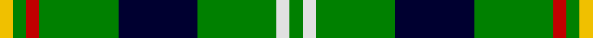
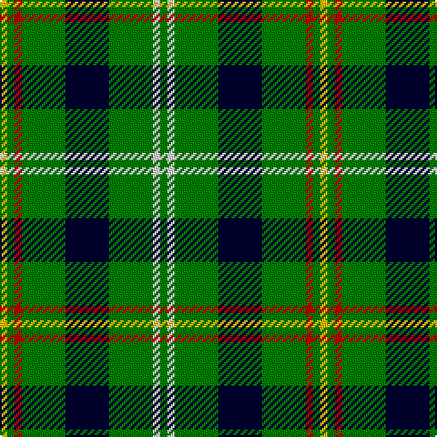

In pattern [GWGKGRGY](/stripes/gwgkgrgy/).

This was sourced from weddslist.  It is a [8 stripe tartan](/stripes/stripes8/).

Original link http://www.weddslist.com/cgi-bin/tartans/pg.pl?source=sts

## Thread count
Y/4 G4 R4 G24 DB24 G24 LN4 G/4

## Palette
Each colour and the base-6 reference it is a variant of.

| Colour | Shade | Base |
|---|---|---|
| DB | <code style="background-color:#000030;">#000030</code> `oklch(14.0% 0.097 264.1)` <small>#000030</small> | K <code style="background-color:#000000;">#000000</code> |
| G | <code style="background-color:#008000;">#008000</code> `oklch(52.0% 0.177 142.5)` <small>#008000</small> | G <code style="background-color:#006100;">#006100</code> |
| LN | <code style="background-color:#E0E0E0;">#E0E0E0</code> `oklch(90.7% 0.000 89.9)` <small>#E0E0E0</small> | W <code style="background-color:#F7F7F7;">#F7F7F7</code> |
| R | <code style="background-color:#C00000;">#C00000</code> `oklch(50.7% 0.208 29.2)` <small>#C00000</small> | R <code style="background-color:#CC0000;">#CC0000</code> |
| Y | <code style="background-color:#F0C000;">#F0C000</code> `oklch(82.7% 0.169 90.5)` <small>#F0C000</small> | Y <code style="background-color:#F2BF00;">#F2BF00</code> |

# Sample pattern

## Nearest tartans

The nearest existing variants by ΔTartan distance.

1. [Moore Caledonian (Personal)](/setts/s6/r1k6g6ly1g6ly1~x6/) — ΔT 1.43
1. [Pinder, Nigel (Personal)](/setts/s7/g12k4g12w1b6w1ly4~x4/) — ΔT 1.45
1. [Carrick, hunting](/setts/s8/g13p1g1p1g3db5k4ly2~x2/) — ΔT 1.49
1. [Manx Ellan Vannin](/setts/s10/dg14w2db3lg7dg2lg7db3w2dg14t2~x4/) — ΔT 1.51
1. [MacIver Hunting](/setts/s9/w2g12k3g3k16g3k3g12ly2~x2/) — ΔT 1.51
1. [Lévesque, Pascal (Personal)](/setts/s10/dg8r2lb3ly2dg4lb4dg14db2lb2db2~x2/) — ΔT 1.52
1. [Casey of West Virginia (Personal)](/setts/s9/g4lo1dt1lo1dt2g9r1dt6w1~x4/) — ΔT 1.55
1. [Paton](/setts/s7/r3g24k28g19ly3g3ly3~x2/) — ΔT 1.55
1. [Marshall Field](/setts/s8/g10db1w1db1ly1db6g8r1~x8/) — ΔT 1.55
1. [Brown, George](/setts/s9/w3r3k4r6g22r4k18g24ly3~x2/) — ΔT 1.57

## Neighbour map

Every grey dot is one of 14299 variants placed by the first two principal components of the ΔTartan feature space (44% of its variance). Red is this tartan; blue dots are its nearest — click one to open its page.

<svg viewBox="0 0 640 380" role="img" style="max-width:100%;height:auto;border:1px solid #e0e0e0;border-radius:4px;display:block" xmlns="http://www.w3.org/2000/svg"><image href="/nn/cloud.v1.png" width="640" height="380"/><a href="/setts/s6/r1k6g6ly1g6ly1~x6/"><circle cx="262.6" cy="243.2" r="4" fill="#3465a4"><title>Moore Caledonian (Personal)</title></circle></a><a href="/setts/s7/g12k4g12w1b6w1ly4~x4/"><circle cx="276.8" cy="195.9" r="4" fill="#3465a4"><title>Pinder, Nigel (Personal)</title></circle></a><a href="/setts/s8/g13p1g1p1g3db5k4ly2~x2/"><circle cx="260.2" cy="159.0" r="4" fill="#3465a4"><title>Carrick, hunting</title></circle></a><a href="/setts/s10/dg14w2db3lg7dg2lg7db3w2dg14t2~x4/"><circle cx="210.1" cy="184.4" r="4" fill="#3465a4"><title>Manx Ellan Vannin</title></circle></a><a href="/setts/s9/w2g12k3g3k16g3k3g12ly2~x2/"><circle cx="273.8" cy="205.1" r="4" fill="#3465a4"><title>MacIver Hunting</title></circle></a><a href="/setts/s10/dg8r2lb3ly2dg4lb4dg14db2lb2db2~x2/"><circle cx="227.6" cy="163.3" r="4" fill="#3465a4"><title>Lévesque, Pascal (Personal)</title></circle></a><a href="/setts/s9/g4lo1dt1lo1dt2g9r1dt6w1~x4/"><circle cx="240.5" cy="180.4" r="4" fill="#3465a4"><title>Casey of West Virginia (Personal)</title></circle></a><a href="/setts/s7/r3g24k28g19ly3g3ly3~x2/"><circle cx="263.1" cy="198.7" r="4" fill="#3465a4"><title>Paton</title></circle></a><a href="/setts/s8/g10db1w1db1ly1db6g8r1~x8/"><circle cx="326.4" cy="186.3" r="4" fill="#3465a4"><title>Marshall Field</title></circle></a><a href="/setts/s9/w3r3k4r6g22r4k18g24ly3~x2/"><circle cx="230.5" cy="181.9" r="4" fill="#3465a4"><title>Brown, George</title></circle></a><circle cx="254.5" cy="200.1" r="5" fill="#c00000"/></svg>

ID: /setts/s8/g1w1g6k6g6r1g1ly1~x4/
