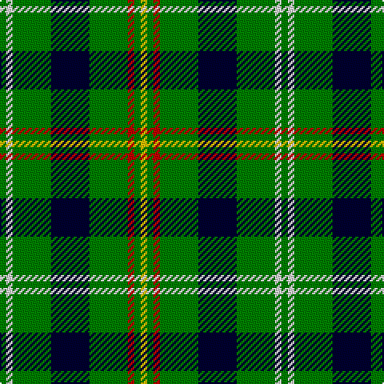

In pattern [GWGKGRGY](/patterns/gwgkgrgy/).

This was sourced from weddslist.  It is a [8 stripes tartan](/stripes/stripes8/).

Original link http://www.weddslist.com/cgi-bin/tartans/pg.pl?source=sts

## Thread count
G/4 LN4 G24 DB24 G24 R4 G4 Y/4

## Palette
Each colour and its ΔE from the base-6 reference it is a variant of.

| Colour | Shade | Base | ΔE (OKLab) |
|---|---|---|---|
| DB | <code style="background-color:#000030;">#000030</code> `#000030` | K <code style="background-color:#000000;">#000000</code> | 0.17 |
| G | <code style="background-color:#008000;">#008000</code> `#008000` | G <code style="background-color:#006100;">#006100</code> | 0.10 |
| LN | <code style="background-color:#E0E0E0;">#E0E0E0</code> `#E0E0E0` | W <code style="background-color:#F7F7F7;">#F7F7F7</code> | 0.07 |
| R | <code style="background-color:#C00000;">#C00000</code> `#C00000` | R <code style="background-color:#CC0000;">#CC0000</code> | 0.03 |
| Y | <code style="background-color:#F0C000;">#F0C000</code> `#F0C000` | Y <code style="background-color:#F2BF00;">#F2BF00</code> | 0.00 |

# Sample pattern

## Nearest tartans

The nearest existing variants by ΔTartan distance.

1. [Duncan, or Leslie of Wardis](/setts/s6/k4g21w3g21b21r4~b304080-g008000-k000000-rc00000-we0e0e0~x2/) — ΔT 1.24
1. [Lauder](/setts/s6/g3b8g3k4g15r2~b304080-g008000-k000000-rc00000~x2/) — ΔT 1.27
1. [Moore Caledonian (Personal)](/setts/s6/r1k6g6y1g6y1~g006818-k101010-rc8002c-yfccc00~x6/) — ΔT 1.42
1. [Pinder, Nigel (Personal)](/setts/s7/g12k4g12w1b6w1y4~b1474b4-g006818-k101010-we0e0e0-ye8c000~x4/) — ΔT 1.45
1. [Carrick, hunting](/setts/s8/g13b1g1b1g3ba5k4y2~b800080-ba304080-g008000-k000000-yf0c000~x2/) — ΔT 1.49
1. [MacIver Hunting](/setts/s9/w2g12k3g3k16g3k3g12y2~g507830-k101010-we0e0e0-yd8b000~x2/) — ΔT 1.50
1. [Manx Ellan Vannin](/setts/s10/g14w2b3y7g2y7b3w2g14ba2~b202060-ba5c8ca8-g003820-we0e0e0-y98b480~x4/) — ΔT 1.51
1. [Lévesque, Pascal (Personal)](/setts/s10/g8r2w3y2g4wa4g14b2wa2b2~b0000cd-g005020-rff0000-w98c8e8-wac8c8c8-yfccc00~x2/) — ΔT 1.52
1. [Paton](/setts/s7/r3g24k28g19y3g3y3~g008000-k000000-rc00000-yf0c000~x2/) — ΔT 1.55
1. [St. Patrick's Krewe (Corporate)](/setts/s8/g50r5g8w10g8b8g8y21~b2c2c80-g003820-rc80000-wfcfcfc-ydc943c~x2/) — ΔT 1.55

## Neighbour map

Every grey dot is one of 15726 variants placed by the first two principal components of the ΔTartan feature space (44% of its variance). Red is this tartan; blue dots are its nearest — click one to open its page.

<svg viewBox="0 0 640 380" role="img" style="max-width:100%;height:auto;border:1px solid #e0e0e0;border-radius:4px;display:block" xmlns="http://www.w3.org/2000/svg"><image href="/nn/cloud.v1.png" width="640" height="380"/><a href="/setts/s6/k4g21w3g21b21r4~b304080-g008000-k000000-rc00000-we0e0e0~x2/"><circle cx="245.2" cy="226.0" r="4" fill="#3465a4"><title>Duncan, or Leslie of Wardis</title></circle></a><a href="/setts/s6/g3b8g3k4g15r2~b304080-g008000-k000000-rc00000~x2/"><circle cx="285.5" cy="234.4" r="4" fill="#3465a4"><title>Lauder</title></circle></a><a href="/setts/s6/r1k6g6y1g6y1~g006818-k101010-rc8002c-yfccc00~x6/"><circle cx="260.0" cy="244.9" r="4" fill="#3465a4"><title>Moore Caledonian (Personal)</title></circle></a><a href="/setts/s7/g12k4g12w1b6w1y4~b1474b4-g006818-k101010-we0e0e0-ye8c000~x4/"><circle cx="274.1" cy="195.4" r="4" fill="#3465a4"><title>Pinder, Nigel (Personal)</title></circle></a><a href="/setts/s8/g13b1g1b1g3ba5k4y2~b800080-ba304080-g008000-k000000-yf0c000~x2/"><circle cx="257.1" cy="159.9" r="4" fill="#3465a4"><title>Carrick, hunting</title></circle></a><a href="/setts/s9/w2g12k3g3k16g3k3g12y2~g507830-k101010-we0e0e0-yd8b000~x2/"><circle cx="271.2" cy="206.6" r="4" fill="#3465a4"><title>MacIver Hunting</title></circle></a><a href="/setts/s10/g14w2b3y7g2y7b3w2g14ba2~b202060-ba5c8ca8-g003820-we0e0e0-y98b480~x4/"><circle cx="207.0" cy="184.7" r="4" fill="#3465a4"><title>Manx Ellan Vannin</title></circle></a><a href="/setts/s10/g8r2w3y2g4wa4g14b2wa2b2~b0000cd-g005020-rff0000-w98c8e8-wac8c8c8-yfccc00~x2/"><circle cx="224.8" cy="164.1" r="4" fill="#3465a4"><title>Lévesque, Pascal (Personal)</title></circle></a><a href="/setts/s7/r3g24k28g19y3g3y3~g008000-k000000-rc00000-yf0c000~x2/"><circle cx="259.9" cy="202.4" r="4" fill="#3465a4"><title>Paton</title></circle></a><a href="/setts/s8/g50r5g8w10g8b8g8y21~b2c2c80-g003820-rc80000-wfcfcfc-ydc943c~x2/"><circle cx="289.8" cy="170.2" r="4" fill="#3465a4"><title>St. Patrick's Krewe (Corporate)</title></circle></a><circle cx="251.4" cy="202.2" r="5" fill="#c00000"/></svg>

ID: /setts/s8/g1w1g6k6g6r1g1y1~g008000-k000030-rc00000-we0e0e0-yf0c000~x4/
