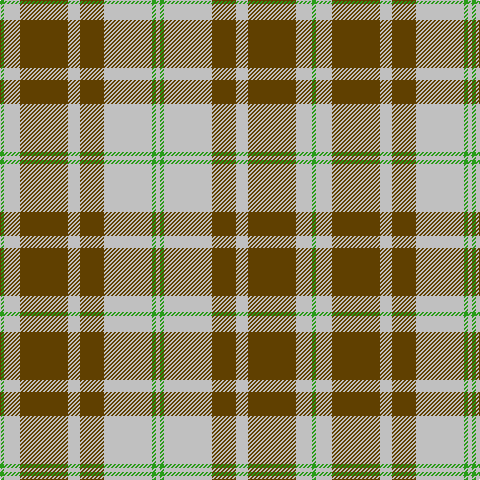

In pattern [GWGWGWGW](/patterns/gwgwgwgw/).

This was sourced from tartans-authority.  It is a [8 stripes tartan](/stripes/stripes8/).

Original link http://www.tartansauthority.com/tartan-ferret/display/5538/

## Thread count
G/4 N16 T48 N12 T24 N48 G4 N/4

## Palette
Each colour and its ΔE from the base-6 reference it is a variant of.

| Colour | Shade | Base | ΔE (OKLab) |
|---|---|---|---|
| G | <code style="background-color:#289C18;">#289C18</code> `#289C18` | G <code style="background-color:#006100;">#006100</code> | 0.19 |
| N | <code style="background-color:#C0C0C0;">#C0C0C0</code> `#C0C0C0` | W <code style="background-color:#F7F7F7;">#F7F7F7</code> | 0.17 |
| T | <code style="background-color:#604000;">#604000</code> `#604000` | G <code style="background-color:#006100;">#006100</code> | 0.14 |

# Sample pattern

## Nearest tartans

The nearest existing variants by ΔTartan distance.

1. [Lister (Misty Mountain)](/setts/s7/g8y29g8ya3g8y8ya3x2~g5d321f-yccbaaf-yae0a126/) — ΔT 0.89
1. [Gleneagles USA (Dalgleish)](/setts/s6/g4w31g7r14g11r3x2~g006818-r880000-wc0c0c0/) — ΔT 1.26
1. [Pollock (Name)](/setts/s7/g6y2g32k8w6y20g5x2~g408060-k101010-wf8f8f8-yec8048/) — ΔT 1.29
1. [Stutterheim](/setts/s6/k4y18b44k3y10k4~b565c76-k101010-yecdc8e/) — ΔT 1.34
1. [Blackberry (Fashion)](/setts/s7/r8y6k11y6k11y30r3x2~k101010-ra80000-yc8bc9c/) — ΔT 1.34
1. [Tilburg Hunting (District)](/setts/s7/b6k3b37y41w3y6w3x2~b1068a4-k101010-we0e0e0-yd8a810/) — ΔT 1.36
1. [Forget Family (Yonne)](/setts/s6/g8y1g8y12r1y1x4~g124b24-rca2625-ye0a126/) — ΔT 1.38
1. [O'Neill](/setts/s9/w2g1w2r6w10g6w2r1w2x2~g008000-r806050-we0e0e0/) — ΔT 1.41
1. [Burns Battalion (Fashion)](/setts/s10/g22b2g3y4g3b2g12b4w19g3x2~b1474b4-g604000-wf8f4d0-ye8c000/) — ΔT 1.43
1. [O'Neill Pipe Band 1999/ Oliver dress](/setts/s9/w2g1w2r6w10g6w2r1w2x4~g289c18-rc80028-we0e0e0/) — ΔT 1.44

## Neighbour map

Every grey dot is one of 15726 variants placed by the first two principal components of the ΔTartan feature space (44% of its variance). Red is this tartan; blue dots are its nearest — click one to open its page.

<svg viewBox="0 0 640 380" role="img" style="max-width:100%;height:auto;border:1px solid #e0e0e0;border-radius:4px;display:block" xmlns="http://www.w3.org/2000/svg"><image href="/nn/cloud.v1.png" width="640" height="380"/><a href="/setts/s7/g8y29g8ya3g8y8ya3x2~g5d321f-yccbaaf-yae0a126/"><circle cx="311.4" cy="204.9" r="4" fill="#3465a4"><title>Lister (Misty Mountain)</title></circle></a><a href="/setts/s6/g4w31g7r14g11r3x2~g006818-r880000-wc0c0c0/"><circle cx="238.4" cy="213.2" r="4" fill="#3465a4"><title>Gleneagles USA (Dalgleish)</title></circle></a><a href="/setts/s7/g6y2g32k8w6y20g5x2~g408060-k101010-wf8f8f8-yec8048/"><circle cx="292.3" cy="176.0" r="4" fill="#3465a4"><title>Pollock (Name)</title></circle></a><a href="/setts/s6/k4y18b44k3y10k4~b565c76-k101010-yecdc8e/"><circle cx="303.8" cy="182.6" r="4" fill="#3465a4"><title>Stutterheim</title></circle></a><a href="/setts/s7/r8y6k11y6k11y30r3x2~k101010-ra80000-yc8bc9c/"><circle cx="276.1" cy="204.9" r="4" fill="#3465a4"><title>Blackberry (Fashion)</title></circle></a><a href="/setts/s7/b6k3b37y41w3y6w3x2~b1068a4-k101010-we0e0e0-yd8a810/"><circle cx="286.1" cy="163.3" r="4" fill="#3465a4"><title>Tilburg Hunting (District)</title></circle></a><a href="/setts/s6/g8y1g8y12r1y1x4~g124b24-rca2625-ye0a126/"><circle cx="320.1" cy="215.5" r="4" fill="#3465a4"><title>Forget Family (Yonne)</title></circle></a><a href="/setts/s9/w2g1w2r6w10g6w2r1w2x2~g008000-r806050-we0e0e0/"><circle cx="284.9" cy="195.1" r="4" fill="#3465a4"><title>O'Neill</title></circle></a><a href="/setts/s10/g22b2g3y4g3b2g12b4w19g3x2~b1474b4-g604000-wf8f4d0-ye8c000/"><circle cx="280.6" cy="159.1" r="4" fill="#3465a4"><title>Burns Battalion (Fashion)</title></circle></a><a href="/setts/s9/w2g1w2r6w10g6w2r1w2x4~g289c18-rc80028-we0e0e0/"><circle cx="286.4" cy="188.8" r="4" fill="#3465a4"><title>O'Neill Pipe Band 1999/ Oliver dress</title></circle></a><circle cx="302.8" cy="195.1" r="5" fill="#c00000"/></svg>

ID: /setts/s8/g1w4ga12w3ga6w12g1w1x4~g289c18-ga604000-wc0c0c0/
