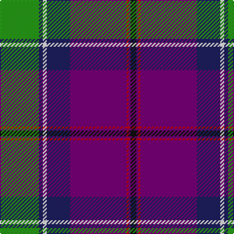

In pattern [GBWBBRBK](/patterns/gbwbbrbk/).

This was sourced from register-of-tartans.  It is a [8 stripes tartan](/stripes/stripes8/).

Original link https://www.tartanregister.gov.uk/tartanDetails.aspx?ref=2202

## Attestations

This cloth appears in 2 source records; the oldest owns this page.

- 01/05/2005 — Longhaugh Primary School (register-of-tartans, [record](https://www.tartanregister.gov.uk/tartanDetails.aspx?ref=2202))
- May 2005 — Longhaugh Primary School (Corporate) (tartans-authority, [record](http://www.tartansauthority.com/tartan-ferret/display/6645/))

## Register references

External register numbers recorded for this tartan.

- Scottish Register of Tartans: [2202](https://www.tartanregister.gov.uk/tartanDetails.aspx?ref=2202)
- Scottish Tartans Authority (ITI): 6645

## Thread count
G/40 DB4 W4 DB24 P58 R2 P2 K/6

## Palette
Each colour and its ΔE from the base-6 reference it is a variant of.

| Colour | Shade | Base | ΔE (OKLab) |
|---|---|---|---|
| DB | <code style="background-color:#202060;">#202060</code> `#202060` | B <code style="background-color:#2A418A;">#2A418A</code> | 0.11 |
| G | <code style="background-color:#289C18;">#289C18</code> `#289C18` | G <code style="background-color:#006100;">#006100</code> | 0.19 |
| K | <code style="background-color:#101010;">#101010</code> `#101010` | K <code style="background-color:#000000;">#000000</code> | 0.17 |
| P | <code style="background-color:#780078;">#780078</code> `#780078` | B <code style="background-color:#2A418A;">#2A418A</code> | 0.17 |
| R | <code style="background-color:#C80000;">#C80000</code> `#C80000` | R <code style="background-color:#CC0000;">#CC0000</code> | 0.01 |
| W | <code style="background-color:#FCFCFC;">#FCFCFC</code> `#FCFCFC` | W <code style="background-color:#F7F7F7;">#F7F7F7</code> | 0.01 |

# Sample pattern

## Nearest tartans

The nearest existing variants by ΔTartan distance.

1. [Bell Rock Lighthouse 200th Aniversar](/setts/s10/w5wa7b4wa2b25k13r1k2r4ra3~b202060-k101010-ra00000-rac80000-wfcfcfc-waa8ace8~x2/) — ΔT 0.95
1. [Vienna Highlander (Fashion)](/setts/s8/y3k2r15k10b23ra2b1w2~b14283c-k101010-r888888-rac8002c-wfcfcfc-yd09800~x2/) — ΔT 0.99
1. [Clinton Wedding](/setts/s12/w5b6r20k6ba5k3b26r2y1r2b3w3~b082c54-ba486488-k101010-re01c18-we8e8e8-yf4bc3c~x2/) — ΔT 1.11
1. [Clinton Wedding (Personal)](/setts/s12/w5b6r20k6ba5k3b26r2y1r2b3w3~b2c2c80-ba5c788c-k101010-rc8002c-we0e0e0-yc4bc68~x2/) — ΔT 1.12
1. [Vinther, Niels Christian (Personal)](/setts/s8/w3r14wa1k2g2k16b20w1~b5c8ca8-g649848-k101010-ra00048-we8ccb8-waf0e0c8~x2/) — ΔT 1.13
1. [Glenn](/setts/s8/g4b2ba18r2k4r6b1w1~b2888c4-ba2c2c80-g003820-k101010-rc80000-wfcfcfc~x4/) — ΔT 1.13
1. [Colours of Hope](/setts/s11/b3ba28w2y2ba1g4b8w3r4y10b2~b1c1c1c-ba2c4084-g004c00-ra00000-we0e0e0-ye8c000~x2/) — ΔT 1.14
1. [Climb, The](/setts/s8/y2g9k16r2b30y3g6w1~b5f749c-g23321b-k000000-rca2625-wf9f5ef-yb7d38b~x2/) — ΔT 1.14
1. [Scottish Association for N.S. (Corp)](/setts/s9/b46y4b4y4b6k16r66w11ra6~b2c2c80-k101010-r888888-rac80000-we0e0e0-ye8c000/) — ΔT 1.14
1. [George Heriot's School](/setts/s7/w3k1b24ba10r24k1y3~b2c2c80-ba1c1c50-k101010-r888888-we0e0e0-ye8c000~x2/) — ΔT 1.15

## Neighbour map

Every grey dot is one of 15726 variants placed by the first two principal components of the ΔTartan feature space (44% of its variance). Red is this tartan; blue dots are its nearest — click one to open its page.

<svg viewBox="0 0 640 380" role="img" style="max-width:100%;height:auto;border:1px solid #e0e0e0;border-radius:4px;display:block" xmlns="http://www.w3.org/2000/svg"><image href="/nn/cloud.v1.png" width="640" height="380"/><a href="/setts/s10/w5wa7b4wa2b25k13r1k2r4ra3~b202060-k101010-ra00000-rac80000-wfcfcfc-waa8ace8~x2/"><circle cx="191.2" cy="96.1" r="4" fill="#3465a4"><title>Bell Rock Lighthouse 200th Aniversar</title></circle></a><a href="/setts/s8/y3k2r15k10b23ra2b1w2~b14283c-k101010-r888888-rac8002c-wfcfcfc-yd09800~x2/"><circle cx="198.9" cy="117.3" r="4" fill="#3465a4"><title>Vienna Highlander (Fashion)</title></circle></a><a href="/setts/s12/w5b6r20k6ba5k3b26r2y1r2b3w3~b082c54-ba486488-k101010-re01c18-we8e8e8-yf4bc3c~x2/"><circle cx="199.3" cy="80.1" r="4" fill="#3465a4"><title>Clinton Wedding</title></circle></a><a href="/setts/s12/w5b6r20k6ba5k3b26r2y1r2b3w3~b2c2c80-ba5c788c-k101010-rc8002c-we0e0e0-yc4bc68~x2/"><circle cx="208.7" cy="82.1" r="4" fill="#3465a4"><title>Clinton Wedding (Personal)</title></circle></a><a href="/setts/s8/w3r14wa1k2g2k16b20w1~b5c8ca8-g649848-k101010-ra00048-we8ccb8-waf0e0c8~x2/"><circle cx="155.4" cy="114.1" r="4" fill="#3465a4"><title>Vinther, Niels Christian (Personal)</title></circle></a><a href="/setts/s8/g4b2ba18r2k4r6b1w1~b2888c4-ba2c2c80-g003820-k101010-rc80000-wfcfcfc~x4/"><circle cx="234.9" cy="125.2" r="4" fill="#3465a4"><title>Glenn</title></circle></a><a href="/setts/s11/b3ba28w2y2ba1g4b8w3r4y10b2~b1c1c1c-ba2c4084-g004c00-ra00000-we0e0e0-ye8c000~x2/"><circle cx="195.6" cy="76.2" r="4" fill="#3465a4"><title>Colours of Hope</title></circle></a><a href="/setts/s8/y2g9k16r2b30y3g6w1~b5f749c-g23321b-k000000-rca2625-wf9f5ef-yb7d38b~x2/"><circle cx="203.3" cy="100.3" r="4" fill="#3465a4"><title>Climb, The</title></circle></a><a href="/setts/s9/b46y4b4y4b6k16r66w11ra6~b2c2c80-k101010-r888888-rac80000-we0e0e0-ye8c000/"><circle cx="191.8" cy="109.6" r="4" fill="#3465a4"><title>Scottish Association for N.S. (Corp)</title></circle></a><a href="/setts/s7/w3k1b24ba10r24k1y3~b2c2c80-ba1c1c50-k101010-r888888-we0e0e0-ye8c000~x2/"><circle cx="193.5" cy="122.5" r="4" fill="#3465a4"><title>George Heriot's School</title></circle></a><circle cx="227.0" cy="98.1" r="5" fill="#c00000"/></svg>

ID: /setts/s8/g20b2w2b12ba29r1ba1k3~b202060-ba780078-g289c18-k101010-rc80000-wfcfcfc~x2/
